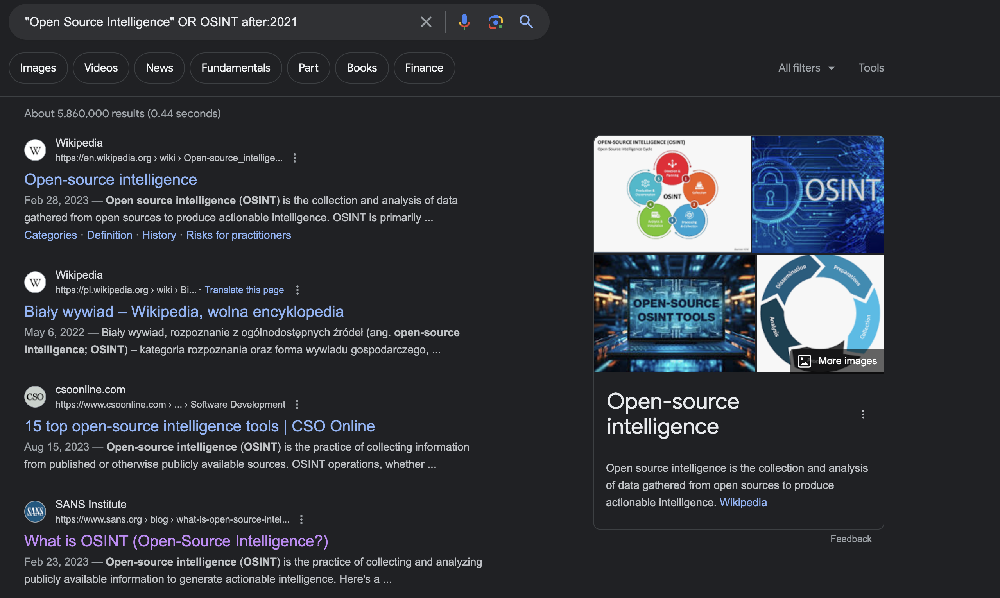
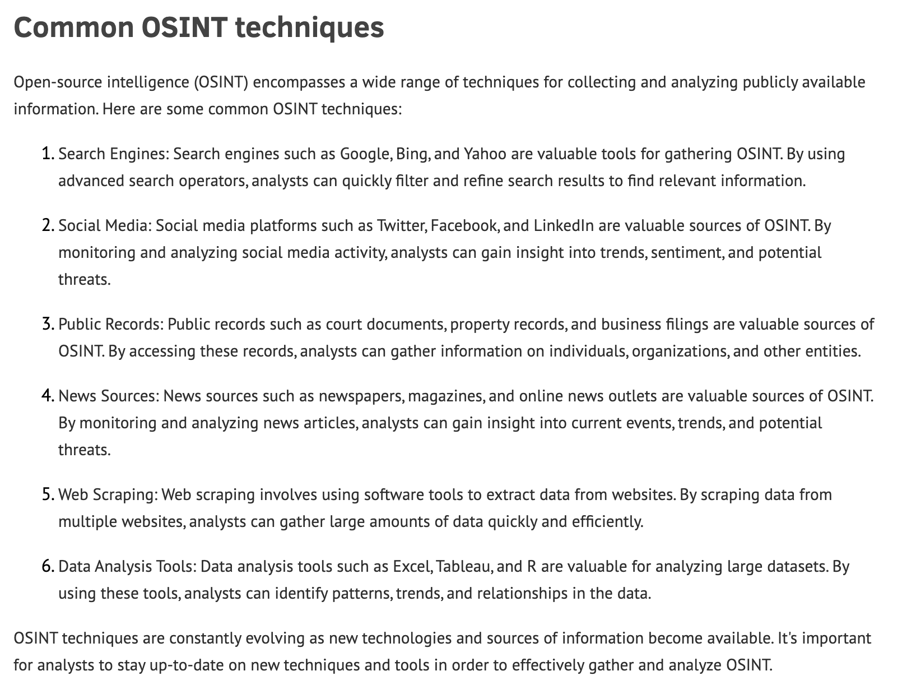
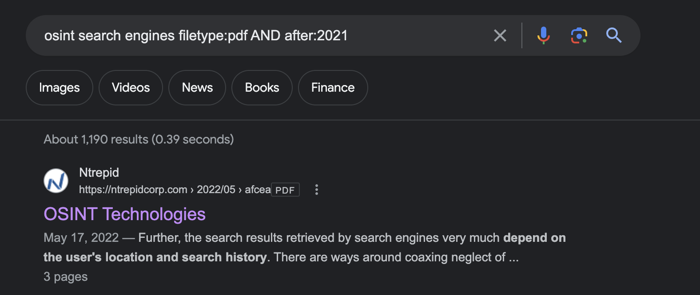
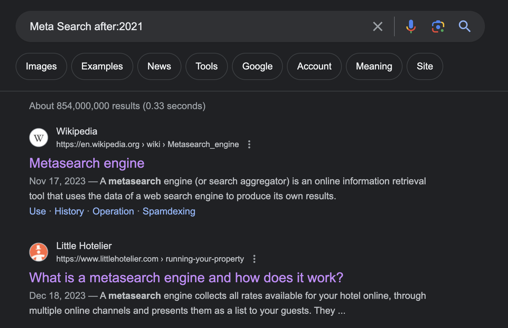
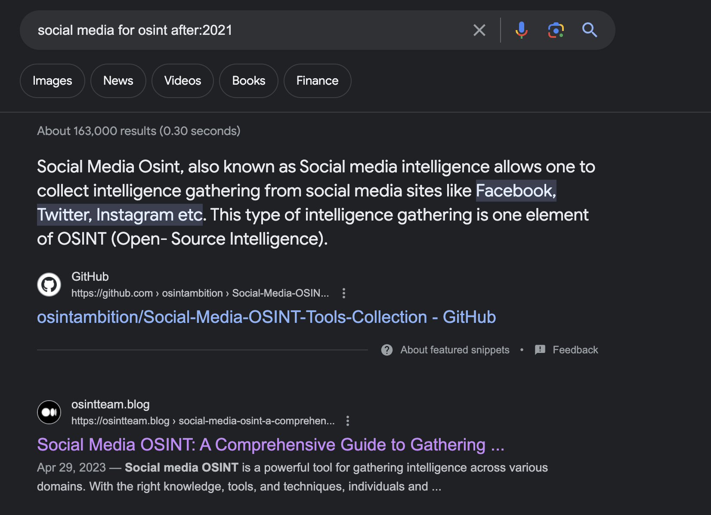
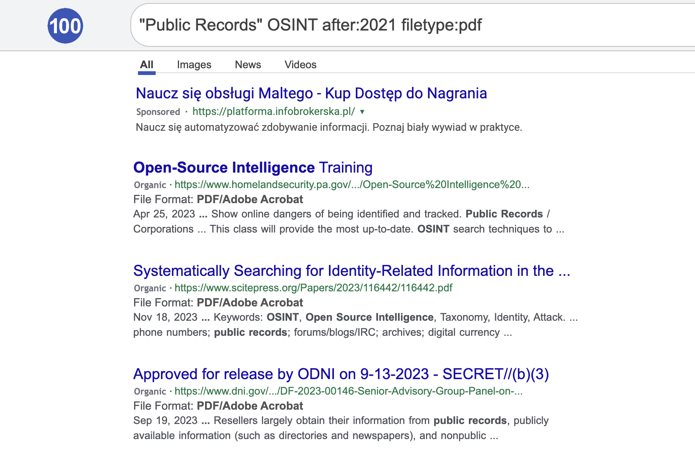

# Лабораторна робота №1

## Тема

Дослідження ПЗ MindManager та пошук інформації про новітні технології OSINT.

## Виконання

Зробімо запит, про OSINT, та додадемо до нього `after:2021` щоб отримувати тільки нові посилання. Повний запит виглядає наступним чином `"Open Source Intelligence" OR OSINT after:2021`

&nbsp;

&nbsp;

Бачимо дату публікації сторінок під їх назвами, всі вони 23 та 22 років, тому можемо їх додати до інтеллект картки.

Під час перегляду одної зі сторінок, я знайшов список OSINT технологій, які я далі зможу розглянути детальніше.

Я намагався знайти опис технології звичайного пошуку, але тут доволі складно щось таке загальне знайти.

В джерелах було згадано про Metasearch, додамо його

Наступним розглянемо Social media

Розглянемо Public Records та що про нього є.

Та наостанок про новини

Посилання на самі інструменти я брав з книги та фреймворку, переконавшись, що останнє оновлення сайту було не пізніше шіж 3 роки.

## Висновок

На цій лабораторній роботі я дізнався про різні технології OSINT та інструменти які можна використовувати при роботі з ними. Застосував ці інструменти для пошуку інформації про інші інструменти та технології