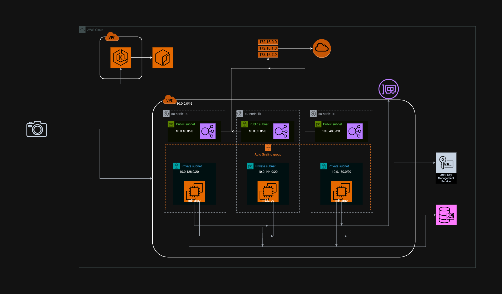

# Контрольна робота з Інфраструктура інформаційних технологій

## Завдання

Інфраструктура для системи відеоспостереження на дорогах, яка є повністю автоматизованою і забезпечує збереження всіх зібраних даних. Кількість запитів до системи становить ~50000 на секунду. Також враховані можливі аварійні ситуації для забезпечення надійності та безпеки системи.

## Аналіз завдання

В завданні вказано, що система повинна бути повністю автоматизованою і забезпечувати збереження всіх даних. Тобто з мінімальними втручаннями людини працювати, та зберігати відео дані. Кількість запитів 50 тис. на секунду, це доволі багато навіть для простих запитів до REST сервісів, а у нас робота з відео, давайте проаналізуємо запити та що в них буде.

### Аналіз запитів

У нас відеоспостереження на дорогах, тому ці запити будуть запити з машинами на дорогах. Така велика кількість запитів може значити що в нас дуже багато камер які періодично надсилають зібрані дані. Припустимо що камери працюють 24/7 та кожну хвилину надсилають записану інформацію.

Тоді виходить що при 50 тис. запитів на секнуду в нас буде приблизно 600 тис. камер, кожна з яких надсилає запит кожну хвилину. Припустимо що в нас нема ніякого аналізу що на цих відео буде, і нам потрібно просто зберігати їх у тому ж форматі що і надійшли. Умовно ми будемо мати файл номерКамери_дата_час.mp4.

Проаналізуємо якість відео, нехай в нас відео з 1 кадром на секунду та з мінімальною якістю, типу 640x480. Одна хвилина такого відео за моїми розрахунками буде важити 27 мегабайт. Це доволі мало, але в нас 600 тис камер, тобто це приблизно 16 гігабайт за хвилину, що неймовірно велика кількість даних. За день роботи це 23328 терабайт.

Після підрахунків в AWS Calculator, це виходить 13 мільйонів долларів за рік для зберігання цих даних та цих запитів. Скоріше за все я просто неправильно зрозумів завдання, бо так багато даних ніде не вийде зребегти.

Припустимо, що ці запити - прості запити з, наприклад, кількістю машин кожну секунду, які бачить камера, тоді це виходить що в нас 50 тис. камер, які щосекунди надсилають кількість машин, що вони бачать. Тоді в нас вийде хоча б уявити таку кількість даних.

Це знову будуть gRPC запити від камер, які будуть числом вказувати кількість машин, і нам їх потрібно буде зберегти.

### Аналіз надійності та безпеки

Припустимо, що ця система камер в Україні, тоді в нас буде виликий шанс відключення світла в серверного центра, або офісу компанії, та ніхто не виключав снаряди та влучання, що може повністю зруйнувати інфраструктуру.

Тому оптимальним буде рішення розмістити інфрастуктуру за межами України, або використати хмарного провайдера, де ми зможемо задати регіон.

Щодо безпеки, оскільки в нас система збирання даних, я не думаю, що її будуть використовувати для отримання цих даних. Скоріше за все вони будуть використовуватись для статистики чи потім для машинного навчання, тобто в системи немає потреби надавати ці данні, тільки збирати, тому нам не потрібно мати акаути адміністраторів і всяке таке, бо наш застосунок не буде взаємодіяти з користувачами.

Оскільки інформація про кількість машин на дорозі не дуже приватна та на потребує надзвичайної безпеки, звичайне шифрування за допомогою сертифікату TSL, буде достатнім для забезпечення необхідної безпеки.

Але можлива ситуація, коли сторонні люди та хакери спробують "прикинутись" іншими камерами. Розгляньмо це детальніше. Оскільки камера - це не користувач, ми не можемо просто створити аккаунт для камери та зробити так, щоб камера там реєструвалась, нам необхідно зробити спосіб ідентифікувати наші камери, та не допускати сторонніх даних в нашу систему.

### Аналіз компанії

Оскільки не вказано компанію яка це використовує, я припущу що це або мала компанія, або студенти, що роблять дослідження, тобто малий бізнес без свого офісу.

## Побудова серверної інфрастуктури

### Клаудне рішення

Оскільки в нас мала компанія без офісу, я вважаю, що найкращим рішенням буде використання клауд провайдера для створення інфрастуктури. Для цього завадання оберемо AWS, вони надають IaaS (infrastructure as a service), що дозволить нам створити нашу інфрастуктуру в клауді.

Цей вибір є оптимальним для нас, бо нам не потрібно робити капітальні витрати на закупівлю серверного обладнання, також нам не потрібно буде чекати довго для отримання та налаштування всього обладнання, ми зможемо повністю створити інфрастуктуру за можливо годину і одразу її використовувати.

Також це вирішує нашу проблему з надійністю, бо ми зможемо розмітити інфраструктуру за межами України та в різних AZ (availability zone), що дозволить нашому сервісу працювати навіть коли пів регіону вийде з ладу.

### Опис Virtual Private Cloud

Для цього проетку, необхідно створити VPC (virtual private cloud), не ніби умовне угрупування всередині AWS, що дозволить відокремити всі ресурси, що належать цій інфрастуктурі від можливо інших інфрастуктур цієї компанії, які не відносяться до збору даних про кількість машин на дорогах.

Під час створення EKS кластеру, сама control panel сториться в окремому VPC, який належить AWS та ми не можемо ним керувати. Це серце нашого кластеру, саме ця контрол панель буде керувати всім іншим.

Але нам все одно необхідно створити наші підмережі для worker нодів. Загалом кластер вимагає викорстання хоча б двох AZ (availability zones), але для більшої надійності ми використаємо більше.

В кожній AZ, ми створимо 2 підмережі, одну публічну та одну приватну. Приватна мережа буде використовуватись для розгортання саме нодів кластера де буде наш застосунок, але до них не буде доступу ззовні нашої vpc, тому kubernetes для нас автоматично розгорне load balancer у публічній мережі та буде передавати трафік до оптимального ноду.

Доступ до cluster endpoint-у буде приватним. Це значить, що до контрол панелі кластеру можна будет потрапити тільки зсередини vpc, це ще більше посилить приватність та безпеку кластеру. В приватному режимі роботи ендпоінту, весь трафік буде надхотити тільки зсередини vpc, за допомогою X-ENI, які будуть забезпечувати комунікацію між моєю vpc та vpc від aws.

Після виконання скріпту, кожен нод буде намагатись досягти ендпоінт кластеру за допомогою відповідного X-ENI, та зареєструватись. Нод отримає інструкції від ендпоінту, буде надсилати туди hearbeat сигнал та виконувати його вказівки.

Для простоти, ми будемо використовувати IPv4 за замовчуванням, та в VPC задамо 10.0.0.0/16 як CIDR (Classless Inter-Domain Routing) блок. Оскільки в нас нема так багато різних VPC, в нас не будуть проблеми з початком адреси (10.0) та маска у 16, надасть 65000 ip адресів для речей всередині vpc, що дозволить нам мати по суті необмежену кількість вільних адресів(ми ніколи не наберем 65 тисяч). Але важливо що в нас буде запас, щоб в нас не стались проблеми коли будемо розширюватись горизонтально(scale out).

Насупне, створити CIDR для підмереж, ми використаємо 3 AZ всередині регіону eu-north-1, по 2 підмережі, і ми отримуємо 6 необхідних підмежер для створення. Для них необхідно створити свої CIDR блоки, ми могли б збільшити маску на 3 для них, та мати блоки типу 10.0.0.0/19, 10.0.32.0/19, 10.0.64.0/19, але мати всього 2 вільних адреси для інших підмереж, це трохи страшно, бо при найменшому розширенні системи, в нас закінчаться адреси, тому візьмемо маску 20, щоб було достатньо місця і для можливих додаткових підмереж, та 4096 адрес для нодів кластеру буде предостатньо.

Також для кожної публічної підмережі необхідно буде створити рутингову таблицю, яка буде направляти весь трафік (0.0.0.0/0) до Internet Gateway.

### Деталізація кластеру

Вже було описано як саме буде виглядати vpc та підмережі всередині. Тому тут оберемо чисто як виглядає кластер.

Під час вибору кластеру не треба дуже багато думати, для створення кластеру треба просто задати ролі, підмережі та по суті все, про ролі буде пізніше, тому створення самого кластеру по суті все, а ось нод групи.

Для кластеру треба створити нод групу, вказати тип інстансів які будуть використані, мінімальну кількість нодів, максимальну, та бажану. Давайте розбиратись з найліпшим вибором.

В нас вся робота застосунку зводиться до перевірки ключа камери, перевірка правильності дати та даних в середині, щоб ми не робити дані за 19 сторіччя де в нас -3 машини, та занесення їх до бази даних. Все це не дуже інтенсивні операції, які не потребують великої кількості пам'яті та cpu, що робить рішення доволі складним.

Я буду обирати інстанс за допомогою <https://aws.amazon.com/ec2/instance-types/> цих типів, з офіційного сайту aws.

Оскільки в нас передбачуване постійне навантаження, використовувати інстанси типу `t`, недоцільно, бо як вказано "Amazon EC2 T3 instances are the next generation burstable general-purpose instance type that provide a baseline level of CPU performance with the ability to burst CPU usage at any time for as long as required." Нам не потрібно мати ability to burst, бо в нас навантаження однакове.

Я звернув увагу на інстанси типу M5. Як вказано у вищезгаданому інтернет ресурсі, "Amazon EC2 M5 instances are the latest generation of General Purpose Instances powered by Intel Xeon® Platinum 8175M or 8259CL processors. These instances provide a balance of compute, memory, and network resources, and is a good choice for many applications." Тобто в них збалансовано cpu, пам'ять та швидкість трафіку, що ідеально підходить для нашого застосунку.

В нас багато простих запитів, з малими розрахунками та витратами на пам'ять, тому ми зможемо обробляти багато запитів паралельно одночасно на кожному інстансі, бо більшість часу ми будемо чекати на відповіді бази даних та менеджера ключей.

Щодо розміру інстансу, я обрав m5.large. В ньому 2 віртуальних процесора, 8 GiB пам'яті, Up to 10 Gbps швидкість інтернету, що повинно підійти.

Чесно, я не знаю скільки таких нам потрібно буде, тому я покладусь на autoscaler, який автоматично розгорне більше інстансів, якщо їх буде занадто мало, тому щодо налаштувань групи, в нас мінімум повинно бути 5, рекомендовано 10 та максимум 100. Можливо потрібно буде відредагувати ці значення, бо я не знаю як прикинути скільки таких мені потрібно.

Отже, в мене нод група на максимум 100 інстансів типу m5.large яка буде повністю використана EKS кластером.

### Використання менеджера ключів

Для забезпечення безпеки даних, я використаю один з ресурсів aws, а саме keymanager, він дозволяє створювати та зберігати ключі доступу до api, я зможу його викликати для отримання ключа та під час обробки запипу, з мого застосунку, зробити до нього запит та перевірити автентичність ключа, що надійшов в запиті, щоб перевірити чи камера частина системи чи ні.

### Timestream для зберігання даних

Оскільки мої дані можна назвати даними time-series, тобто дані які змінюються протягом певного проміжку часу, тобто оптимальною буде база даних яка спеціалізована для роботи з time-series даними. AWS надає Amazon Timestream, це time-series database, вона дозволяє вставляти більше 10 гігабайд даних за хвилину та надалі швидко з ними працювати, що є оптимальним для нашого проекту. Вона підходить і за вимогами швидкодії, і дозволить проводити дослідження над зібраними даними, та доступна всередині aws, а ми і так там, тобто використати її буде неймовірно просто.

### Створення ролей

Для коректної роботи контрол панелі кластеру, щоб ноди могли доєднуватись, переглядати ключі та використовувати базу даних timestream, потрібно налаштувати спеціальні ролі(roles) всередині aws.

Для кластеру нам необхідно додати наступні policy AmazonEKSVPCResourceController, AmazonEKSServicePolicy та AmazonEKSClusterPolicy для його коректнох роботи. Ці policy мають всі необхідні кластеру права, тому з ними кластер зможе виконувати його повсякденні завдання, такі як роздача команд нодам, створення control api, та інше.

Для нод групи потрібно щоб ноди могли доєднуватись до api який надає панель керування, потрібно мати доступ до container registry щоб звідти отримувати контейнери з нашими застосунками, також потрібно мати дозвіл на використання менеджера ключів та timestream, а це ще додаткові дозволи.

## Структурна схема системи

Для створення структурної схеми я використаю <https://app.diagrams.net/> з заздалегідь встановленими модулями від AWS, тобто мені буде дуже просто створити схему моєї інфраструктури, бо все що мені знадобиться коли я буду її малювати, в мене є.

На рисунку 1 зображена приблизна структурна схема моєї інфраструктури. Давайте розглянемо її детальніше

В нас є великий блок з AWS Cloud, де знаходиться більша частина інфрастуктури, камери з яких ми беремо дані зображені ззовні цього блоку, бо вони не належать до клауда.

В клауді в нас можна умовно можна розділити все на 3 групи, VPC від aws, де знаходить EKS контрол панель, VPC наша, яку ми зробили та де знаходяться наші інстанси, та зовнішні ресурси, які не належать до VPC, але є частиною AWS, це типу ресурси різні.

EKS, який знаходиться у VPC від aws - це контрол панель нашого кластеру, яка відповідає за керуванням нодами, роздача їм завдань, перевірка чи вони ще живі, старт нових нодів, і все таке.

Біля EKS, знаходиться Elastic Container Registry, це там де ми будемо зберігати контейнери нашого застосунку, щоб EKS міг їх завантажити та запустити на нових нодах/перезапустити і всяке таке. Коли в нас вийде нова версія застосунку, вона забілдиться та потрапить сюди і далі кластер буде її звідси діставати.

Праворуч від ECR, в нас зображена Route table для публічних мереж та Internet Gateway, що забезпечують доступ до інтернету з публічних мереж. Route table перенаправляє весь трафік (0.0.0.0/0) до Internet Gateway, щоб мати доступ до інтернету.

Також ми використовуємо Key Management Service, щоб зберігати ключі від камер та щоб перевіряти що це дійсно наша. Цей ресурс від aws ідеально підходить до нашої ситуації, де треба ідентифікувати багато камер.

Також зазначена база даних Timestream, це база даних від aws спеціально для завдань з data stream, саме таке в нас і є, бо камери щосекунди доносять інформацію.

А тепер розглянемо нашу VPC. В неї CIDR 10.0.0.0/16, та вона має 6 підмереж в 3 різних AZ, по одній приватній та публічній підмережі на AZ. Для підмереж було виділено 4 біти адреси, тому їх маска 20. Для публічних груп, адреси ідуть з меншим бітом, тобто 0000, 0001, 0010, з адресами типу 10.0.0.0/20, 10.0.16.0/20, 10.0.32.0/20... А для приватних груп я використав додатковий код, тобто їх адреси 1000, 1001, 1010...

В приватних мережах буде розгорнуто Auto Scale групу, яка буде мати воркерні ноди кластеру. Їх тип - m5.large, бо нам потрібні збалансовані ресурси для кожного ноду, але нам не потрібно мати burst для cpu. Цю група зможе автоматично рости до 100 інстансів. Я сподіваюсь, що нам вистачить 100, але скоріше за все нам треба буде приблизно 50.

В публічних мережах будуть розгорнуті ingress ресурси, такі як load balancer, до якого будуть надходити запити ззовні нашої системи від камер, та він буде перенаправляти їх до найменш завантаженого ноду.

Оскільки в нас ендпоінт кластеру розгорнутий в приватному режимі, тобто він не має публічної ip адреси, щоб інші не могли пробувати доєднати їх ноди но кластеру, моїм справжнім нодам необхідно використовувати X-ENI, щоб забезпечити з'єднання нодів до менеджмент ноду. X-ENI зображено вгорі від VPC, та ноди до неї доєднані.

Також Ноди мають доступ до Timestream та AWS Key manager, щоб наш застосунок розгорнутий всередині також мав права їх використовувати.

## Автоматизація роботи системи

Оскільки в умові було сказано автоматизована система, я думаю, що можна додати про те як саме система буде оновлюватись. Ця частина буде про Github Actions, Terraform, Terraform Cloud, Helm charts, тому якщо це не потрібно було писати, можете пропустити, але мені все одно цікаво це розписати.

### Використання Github Actions

Для написання CI/CD пайплайнів які автоматично зможуть тестувати, білдити та деплоїти код, можна використати Github Actions, це PaaS, який дозволяє запускати первний код для виконання. За допомогою Github Actions ми зможемо протестувати код при створення кожного Pull Request-у та якщо відбулись помилки при тестуванні, ми заблокуємо мердж до мейну, через помилки в коді, щоб в нас працював тільки правильний код.

Також коли Pull Request все ж таки пройде, ми зможемо забілдити докер імедж, та додати його до Container Registry, за допомогою сікретів.

Ще одне важливе використання, це створення самої інфрастуктуи. Ми можемо створити репозиторій з чисто Terraform кодом. Terraform - це Infrastructure as a code, що дозволяє описати всю інфрастуктуру в спеціальних тераформ файлах, та потім однією командою повністю її створити, також ці файлі можуть знаходитись в репозиторії, тому вся інформація про інфрастуктуру буде знаходитись не в одного розробника в голові та будь-які зміни ніде не будуть фіксуватись, а у репозиторії, де всі члени команди можуть бачити її.

За допомогою Github Actions ми зможемо запускати автоматичне виконання тераформу, та при змінах в коді того репозиторію, відповідно зміниться інфрастуктура.

### Використання Terraform Cloud

Teraform Cloud дозволяє виконувати Terraform код в них на серверах та буде за нас зберігати тераформ файли стану. Після використання тераформу, створюються файли поточного стану інфрастуктури, які будуть використані потім в разі змін, щоб розуміти що зараз є та як треба змінити поточну інфрастуктуру щоб досягти нової.

Вказавши сіктери від aws, тераформ клауд зможе запускати тераформацію воркспейсів, та крок за кроком створювати VPC, EKS, деплоїти хелм чарти та багато іншого.

Спеціальний сікрет від тераформ клауду ми помістимо до гітхаб сікретів, щоб github actions могли викликати terraform cloud.

### Використання Helm

Один з найкращих способів деплоїти застосунки до kubernetes - використання helm чартів. Helm дозволяє описати, інсталювати та оновляти найскладніші кубернетіс застосунки.

Ми опишемо за допомогою хелм чартів всі застосунки які повинні бути запущені в нашому кластері, зазвичай можна використати вже існуючі хелм чарти, але для саме нашого застосунка, треба буде писати свій, та вказувати, що докер імедж який необхідно взяти знаходиться в ECR.

За допомогою Хелму та тераформу ми зможемо оновлювати наш сервіс без необхідності зупиняти кластер, просто перенаправивши запити до нового застосунку, та почекати доки всі старі завершуть свою роботу.

## Висновок

Під час виконання цієї контрольної роботи, я розробив інфрастуктуру для малої компанії, в якої завдання збирати інформацію з дорожніх камер. Для забезпечення надійності було обрано cloud провайдера AWS. Оскільки в нас запити малі але їх багато, ми використали кластерне рішення. Кластер зможе автоматично збільшити свої розміри до оптимального, щоб ідеально забезпечити обробку всіх запитів. Також кластерне рішення дозволяє збільшити відмовостійкість системи, через реконфігурацію кластеру та наявність багатьох реплік застосунку на різних нодах. Для захисту від стихійних лих, кластер розгорнуто в трьох AZ, що дозволяє йому працювати навіть коли будуть масові вимкнення світла.

Під час розробки інфрастуктури в клауді, ми прописали адресні простори підмереж, використали приватні підмережі для забезпечення безпеки нодів кластеру, менеджмент ендпоінт контрол панелі, до якої під'єднуються ноди зробили приватним та доступ до нього можливий тільки за допомогою X-ENI, що підвищує безпеку.

Для безпеки даних, що передаються ми використовуємо tls сертифікат, що шифрує з'єднання, та в камер з яких ми збираємо інформацію є секретні ключі, які наш застосунок буде перевіряти, щоб знати що цій камері можна довіряти.

Дані зберігатимуться в Timestream, це timestamp база даних від aws, що дозволить зберігати велику кількість даних пов'язаних з часом як у нас в завданні.

Для автоматизації роботи системи я використав Terraform, Github actions, terraform cloud та Helm, що дозволяє швидко впроваджувати зміни в інфрастуктуру, оновлювати застосунок та завжди бачити поточну інфраструктуру як код.
