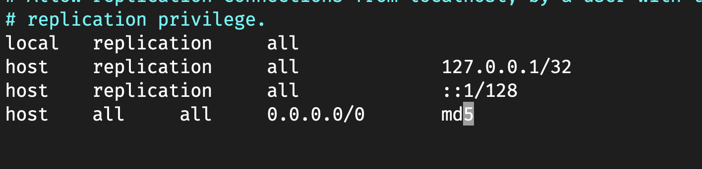

# Лабораторна робота №1

## Тема

ВІРТУАЛІЗАЦІЯ. VIRTUALBOX. HYPER-V

## Виконання

### Створення віртуальної машини

Оскільки моя операційна система - не Windows, я використав Parallels Desktops для встановлення віртуальної машини.

### Налаштування SSH

Для налаштування ssh, за іншим портом окрім звичайного, потрібно відредагувати файл `/etc/ssh/sshd_config` та змінити частину про порт, а саме прибрати `#` щоб це не було коментарем, та задати новий порт окрім звичайного 22-го. Я використав `vim` щоб редагувати файл та змінив порт на 23-ій.

Далі потрібно або перезавантажити віртуалку, або просто перезапустити сервіс ssh командою `sudo systemctl restart sshd`, тепер щоб під'єднатись потрібно в команді ssh задати порт за допомогою флажочку `-p`

### Shared folder

Я хотів по красивому зробити з термінала за допомогою команди `sshfs`, але вона вже depricated, тому я просто використаю Parallels.

Я додав свою диркеторію для проектів всередині лінуксу, та можемо редагвати файли в цій папці з обох сторін.

### Встановлення бази даних

Встановимо все необхідне для роботи postgresql за допомогою команди `sudo apt install postgresql postgresql-contrib`.

Далі можемо запустити сервіс посгресу `sudo systemctl start postgresql.service`

Налаштуємо постгрес щоб він приймав з'єднання з будь-якого хоста, для цього потрібно змінити його конфігурацію

Дозволяємо будь-які хости

Також додати ще одне налаштування в іншому файлі

Тепер можна під'єднуватись, бо в мене вимкнено фаервол.

Як видно, використавши ip віртуальної машини, ми змогли під'єднатись до бази даних вказашви пароль та логін за замовчуванням.

## Висновок

На цій лабораторній роботі я повторив використання віртуалізації та налаштування ssh. Також я зробив спільну директорією між хост машиною та віртуальною машиною. На віртуальну машину я встановий базу даних postgresql та за допомогою застосунку datagrip зміг до неї під'єднатися
