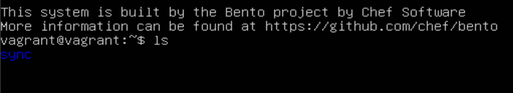

# Лабораторна робота № 2

## Тема

ВІРТУАЛІЗАЦІЯ. VAGRANT

## Виконання

### Встановлення Vagrant

Оскільки в мене MacOS, в мене є пакетний менеджер `brew` та встановити Vagrant можна за допомогою команди `brew install -cask vagrant`, після цієї команди brew встановить вагрант та після перевірки, бачимо що він встановлений

### Ініціалізація та простий запуск

Для хелоу ворлд варіанту запустимо голу убунту.

Оскільки в мене M1 чіп, я використаю образ `bento/ubuntu-22.04-arm64`, який буде правильно працювати. Та ще поставимо плагін для підтримки мого Parallels

Перевіримо за допомогою статусу чи вона запущена.

Переглянемо чи є віртуальна машина в Parallels.

### Створення конфігурації та всяких приколів

Спочатку переналаштуємо порт ssh, нам потрібно змінити файл але тільки одну частину(бо інші налаштування нам потрібні такі самі). І це треба ще і як одна команда а не самому в редакторі лізди. Для цього існує sed, дуже страшна команад яка може регулярними виразами змінювати файли. Ось так `sed -i.bak 's/^#Port 22/Port 23/' "$SSHD_CONFIG"` можна змінити закоментований порт 22 на порт 23, далі перзапускаємо та порт офіційно налагоджено. Також я зробив форвард порту 22 на 23 з моєї машини до віртуалки щоб використовувати цей новий порт та не міняти нічого ззовні.

А тепер щоб запустити свій сервіс треба туди файли передати, тому я зробив shared folder, частина якої тут а друга в віртуалці.

Зробимо та перенесемо туди простий застосунок на gRPC.