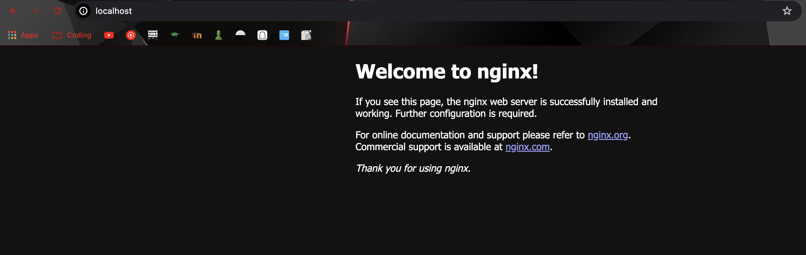

# Лабораторна робота №3

## Тема

КОНТЕЙНЕРИЗАЦІЯ. DOCKER

## Виконання

Код можна знайти за посиланням <https://github.com/kiIIer/kpi-6/tree/main/iit/lab/lab-03-07.03.2024>

### На базі Alpine

Тут доволі все просто... Все що треба зробити - один рядок у докерфайлі. Він повинен виглядати так

```Dockerfile
FROM alpine:latest
```

Та щоб зробити та назвати його правильно, треба виконати команду `docker build -t lab03_1_teamspm .`

Отримуємо наступне.


### Команди докеру

Для перегляду всіх імеджерй можна використати команду `docker images`, як це було зроблено вище.

Для перегляду запущених контейнерів можна використати `docker ps`

Для запуску контейнеру за певним імеджем, можна використати `docker run -d --name my_nginx lab03_1_teamSPM` `-d` це в детач моді, щоб термінал не займав, та надати свою назву за допомогою `--name`, щоб потім не загубити його, та наостанок треба обрати імедж.

Але в нас побачити імедж буде неможливо так, бо він одразу вийде, бо в нас не вказано що йому робити, переглянемо його за допомогою `docker ps -a` щоб побачити всі контейнери.


Щоб зупинити контейнер можна використати `docker stop my_nginx`. Протестуємо це на іншому контейнері, який не виходить одразу.


