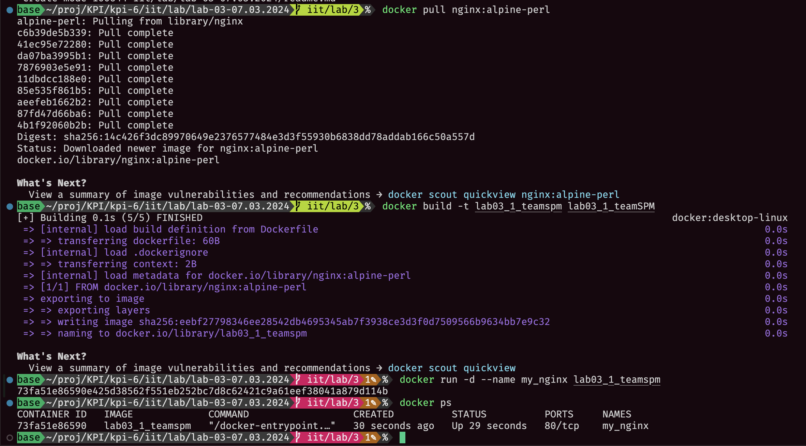

# Лабораторна робота №3

## Тема

КОНТЕЙНЕРИЗАЦІЯ. DOCKER

## Виконання

Код можна знайти за посиланням <https://github.com/kiIIer/kpi-6/tree/main/iit/lab/lab-03-07.03.2024>

### На базі Alpine

Тут доволі все просто... Все що треба зробити - один рядок у докерфайлі. Він повинен виглядати так

```Dockerfile
FROM nginx:alpine-perl
```

Та щоб зробити та назвати його правильно, треба виконати команду `docker build -t lab03_1_teamspm .`

Отримуємо наступне.



### Команди докеру

Для перегляду всіх імеджерй можна використати команду `docker images`, як це було зроблено вище.

Для перегляду запущених контейнерів можна використати `docker ps`

Для запуску контейнеру за певним імеджем, можна використати `docker run -d --name my_nginx lab03_1_teamSPM` `-d` це в детач моді, щоб термінал не займав, та надати свою назву за допомогою `--name`, щоб потім не загубити його, та наостанок треба обрати імедж.

Результат виконання можна переглянути на рисунку 1.

Щоб зупинити контейнер можна використати `docker stop my_nginx`.

Та щоб переглянути всі контейнери можна зробити `docker ps -a`


### Прокидання портів

Щоб зайти на сторінку nginx, треба перейти на порт 80, але це в контейнері, щоб зайти на цю сторінку ззовні, треба прокинути порти, це можна зробити за допомогою флажочка `-p` щоб передати порти.

Запустимо той самий імедж за допомогою нової команди `docker run -d -p 80:80 --name ported-nginx lab03_1_teamSPM`


### Зміна контенту за замовченням

Щоб змінити що саме буде на тому сайти показуватись, треба змінити файл `index.html` з яким працює nginx. Зробимо це. Та замінимо файл за замовчуванням. Докерфайл буде виглядати так:

```Dockerfile
FROM lab03_1_teamspm

RUN rm /usr/share/nginx/html/index.html

COPY index.html /usr/share/nginx/html/index.html
```

Запустимо це та переглянимо


### Монтування директорії

Зазвичай монтування роблять не в докерфайлі, а через команду, щоб можна було легко міняти що саме монтувати для ci/cd, тому я буду монтувати саме так.

За допомогою команди `docker run -d -p 82:80 --name mounted-nginx -v $(pwd)/lab01:/usr/share/nginx/html lab03_1_teamspm`


Як видно на сторінці на порті 82, ми дійсно замінили контент за замовченням за допомогою монтування тієї директорії.

### Докер компоуз

Створимо свій супер секретний компоуз для компанії, де сайт вміє з базою даних розмовляти!!!

```yml
version: "3.8"
services:
  backend:
    build: .
    image: lab03_1_teamSPM
    ports:
      - "83:80"
    volumes:
      - ./lab01:/usr/share/nginx/html
    depends_on:
      - db
    environment:
      - PGHOST=db
      - PGUSER=postgres
      - PGPASSWORD=example
      - PGDATABASE=postgres
      - PGPORT=5432
    restart: on-failure

  db:
    image: postgres:latest
    environment:
      POSTGRES_PASSWORD: example
    restart: on-failure

```

Нам треба наш бекенд але який типу фронт енд, тому робимо його як сервіс. В ньому в замінних оточення додали як саме під'єднуватись до бази даних, далі прокинули порти, обрали імедж та вмонтували директорію. Зробили так що він запуститься після запуску іншого сервісу та що він буде перезапускатись після помилок.

Так само зробили і базу даних, щоб перезапускалась та через змінну задали пароль.

## Висновок

На цій лабораторній роботі ми познайомились з докером для керування контейнерами. Створили прості імеджи та проетстували деякі прості команди. Також прокидували порти, монтували директорії та працювали з налаштуваннями nginx. Також створили докер компоуз файл для деякого абстрактного застосунку.
