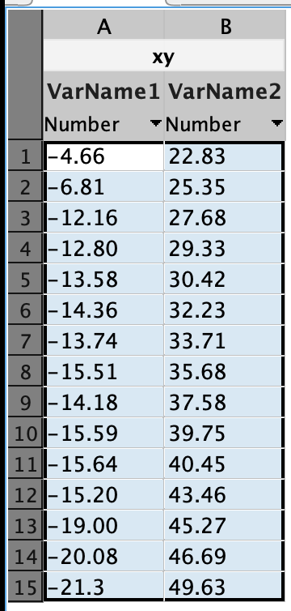
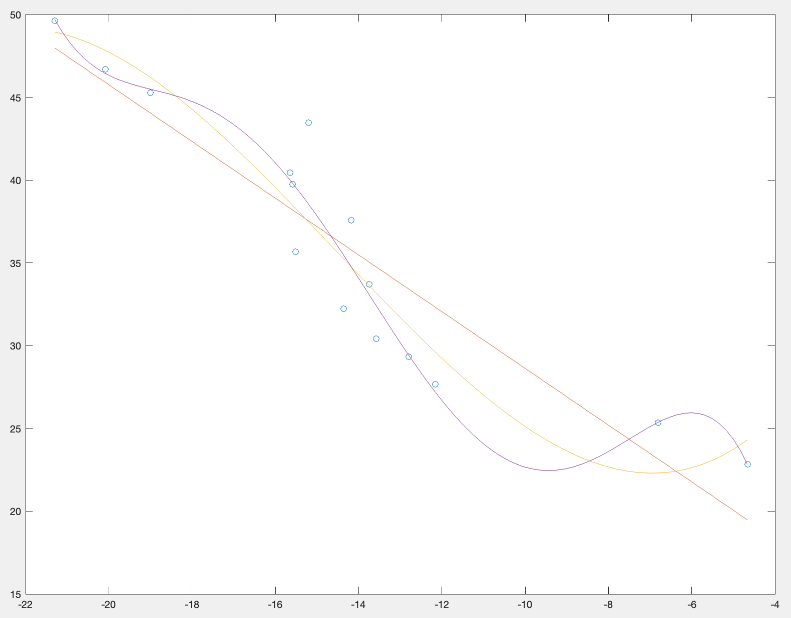

# Лабораторна робота №1

## Тема

Визначення статичних характеристик об'єкта керування

## Мета

Побудувати та дослідити просту регресійну модель об'єкта керування

## Хід роботи

### Варіант

Варіант № 16

| X      | Y     |
| ------ | ----- |
| -4,66  | 22,83 |
| -6,81  | 25,35 |
| -12,16 | 27,68 |
| -12,80 | 29,33 |
| -13,58 | 30,42 |
| -14,36 | 32,23 |
| -13,74 | 33,71 |
| -15,51 | 35,68 |
| -14,18 | 37,58 |
| -15,59 | 39,75 |
| -15,64 | 40,45 |
| -15,20 | 43,46 |
| -19,00 | 45,27 |
| -20,08 | 46,69 |
| -21,3  | 49,63 |



За умовою сепені полінома лінійної регресійної моделі обираю рівним 1, 3, 5

### Обрахунок регресійної моделі

Обрахуємо лінійну регресійну модель, що може прогнозувати значення у за відповідними значеннями х з поліномами 1, 3 та 5 степенів.

Використаємо функцію матлаба polyfit

```matlab
p1 = polyfit(x, y, 1)

p3 = polyfit(x, y, 3)

p5 = polyfit(x, y, 5)

>>>

p1 =

   -1.7132   11.4931


p3 =

    0.0153    0.6679    7.0648   44.2772


p5 =

   -0.0008   -0.0534   -1.3434  -15.5559  -82.5941 -136.7685
```

Отримали відповідні коефіцієнти поліномів.

### Побудова графіків

Для побудови графіків, створимо масив тестових значень для х та за допомогою пліномів отримаємо відповідні значення у за якими і побудується графік

```matlab
xes = linspace(x(1), x(end), 100)

yes1 = polyval(p1, xes)

yes3 = polyval(p3, xes)

yes5 = polyval(p5, xes)

plot(x, y, 'o', xes, yes1, xes, yes3, xes, yes5)
```



### Оцінка моделей

Спочатку необхідно обчислити залишкову вартість

```matlab
yfit1 = polyval(p1, x)
yfit3 = polyval(p3, x)
yfit5 = polyval(p5, x)
yres1 = y - yfit1
yres3 = y - yfit3
yres5 = y - yfit5
```

та її суму квадратів

```matlab
Sres1 = sum(yres1.^2)
Sres3 = sum(yres3.^2)
Sres5 = sum(yres5.^2)

>>>


Sres1 =

  145.8172


Sres3 =

   93.5604


Sres5 =

   62.7251
```

Обчислимо загальну суму квадратів

```matlab
Stotal = (length(y)-1) * var(y)

>>>

Stotal =

  929.2772

```

Обчислимо R^2 за формулою

```matlab
rsq1 = 1 - Sres1/Stotal
rsq3 = 1 - Sres3/Stotal
rsq5 = 1 - Sres5/Stotal

>>>

rsq1 =

    0.8431


rsq3 =

    0.8993


rsq5 =

    0.9325
```

Отже, за нашими розрахунками лінійне регресивне рівняння $ -1.7132x + 11.4931$ прогнозує 84.3% - 93.25% варіанцій змінної у

## Висновок

На цій лабораторній роботі я познайомився з простою регресійною моделю об'єкта керування, та використав застосунок матлаб для дослідження її.
