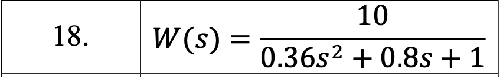
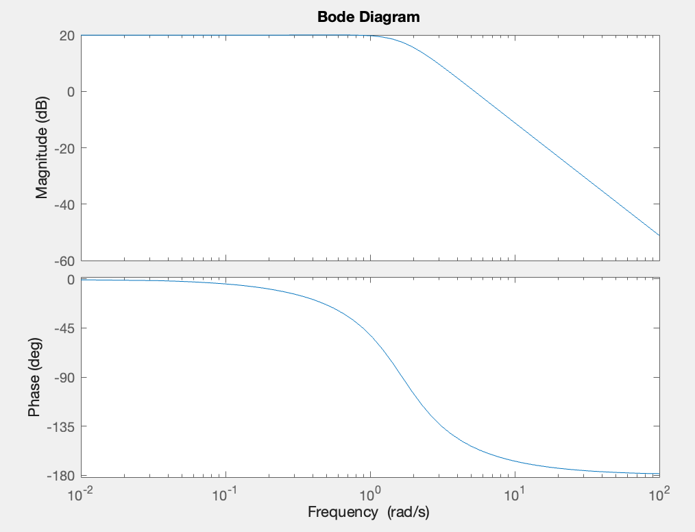

# Лабораторна робота № 2

## Тема

Побудова часових та частотних характеристик об'єктів на основі вхідної
та вихідної змінних

## Мета

Дослідити побудову часових і частотних характеристик
об'єктів на основі вхідної і вихідної матриць [1-5]. Промоделювати весь
процес в середовищі MATLAB.

## Варіант

## Виконання

### Побудова схеми

Побудуємо схему згідно варіанту вказавши задану передавальну функцію.

### Аналіз

Вхідні дані для аналізу

## Висновок

На цій лабораторній роботі я дослідив побудову часових і частотних характеристик об'єктів на основі вхідної і вихідної матриць. Промоделювати весь
процес в середовищі MATLAB.