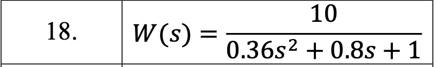
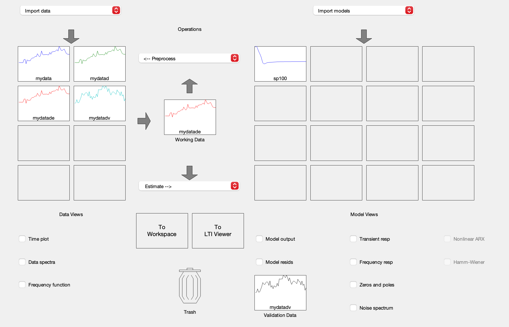
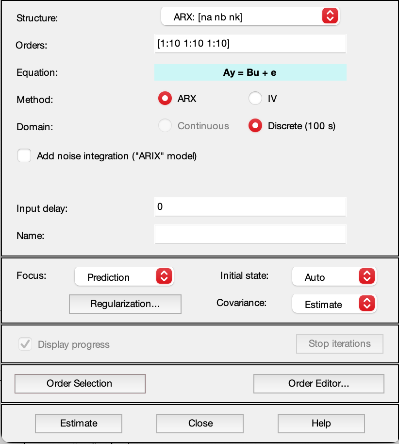
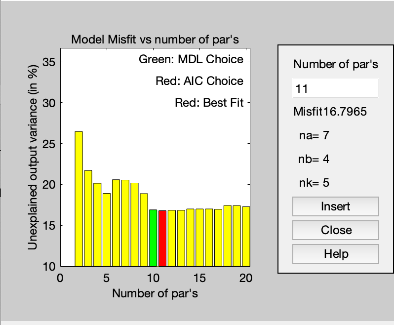
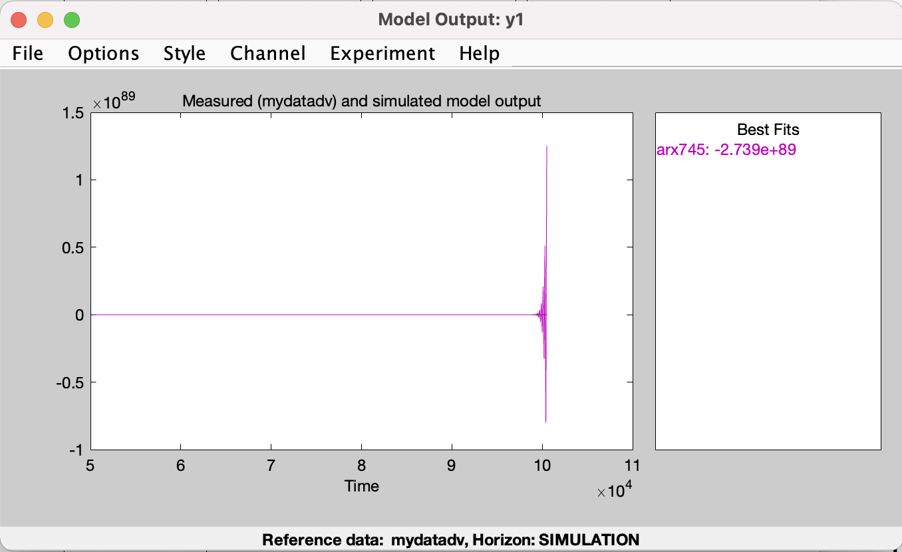
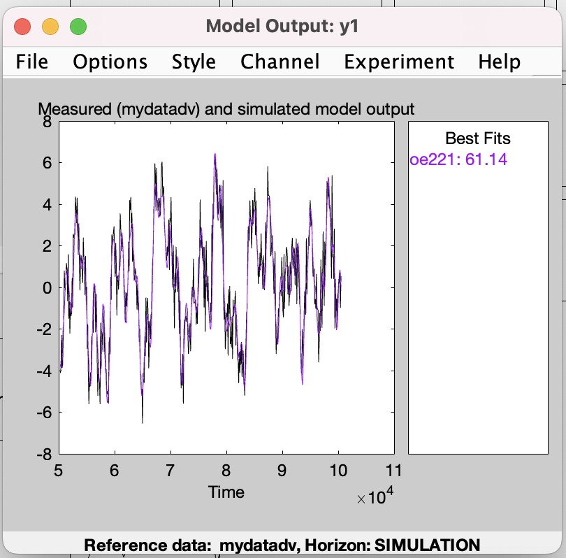
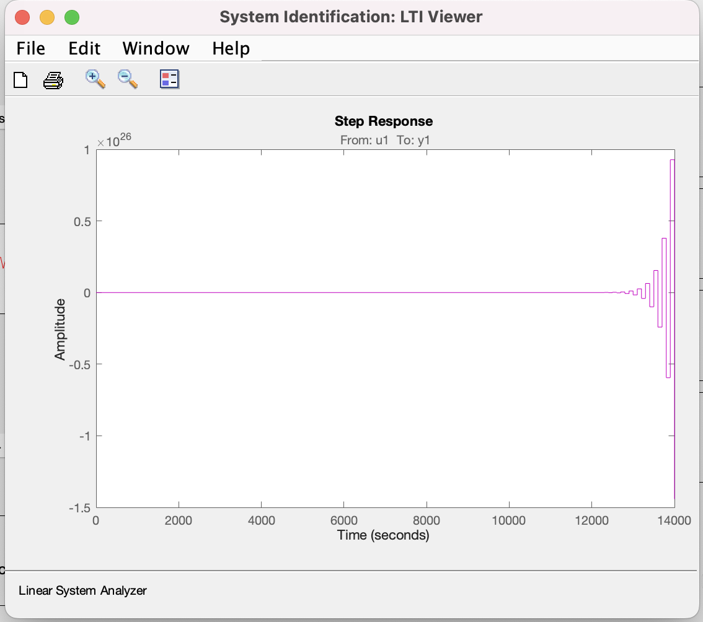
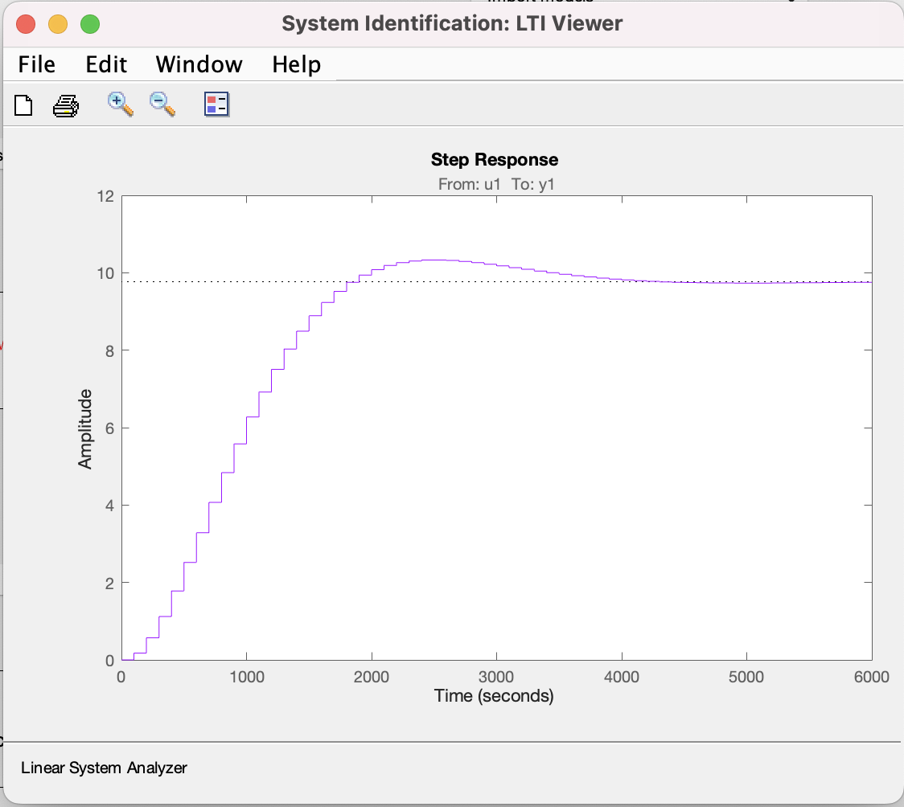

# Лабораторна робота №3

## Тема

фива

## Мета

фива

## Варіант



## Виконання















Виконаємо перетворення

```matlab
>> sys_d = oe221

sys_d =
Discrete-time OE model: y(t) = [B(z)/F(z)]u(t) + e(t)
  B(z) = 0.1787 z^-1 + 0.07501 z^-2                  
                                                     
  F(z) = 1 - 1.769 z^-1 + 0.795 z^-2                 
                                                     
Name: oe221
Sample time: 100 seconds
  
Parameterization:
   Polynomial orders:   nb=2   nf=2   nk=1
   Number of free coefficients: 4
   Use "polydata", "getpvec", "getcov" for parameters and their uncertainties.

Status:                                            
Estimated using PEM on time domain data "mydatade".
Fit to estimation data: 79.49%                     
FPE: 1.205, MSE: 1.186                             
 
Model Properties
>> sys_c = d2c(sys_d, 'zoh')

sys_c =
Continuous-time OE model: y(t) = [B(s)/F(s)]u(t) + e(t)
  B(s) = 0.0005284 s + 2.846e-05                       
                                                       
  F(s) = s^2 + 0.002295 s + 2.914e-06                  
                                                       
Parameterization:
   Polynomial orders:   nb=2   nf=2   nk=0
   Number of free coefficients: 4
   Use "polydata", "getpvec", "getcov" for parameters and their uncertainties.

Status:                                                         
Created by direct construction or transformation. Not estimated.
 
Model Properties
>> [num,den] = th2tf(sys_c)

num =

   1.0e-03 *

         0    0.5284    0.0285


den =

    1.0000    0.0023    0.0000

>> w2 = tf(num,den)

w2 =
 
    0.0005284 s + 2.846e-05
  ----------------------------
  s^2 + 0.002295 s + 2.914e-06
 
Continuous-time transfer function.
Model Properties
```
