# Лабораторна робота №4

## Тема

Моделювання систем керування з ПІД-регулятором

## Виконання

### ПІД-Регулятор

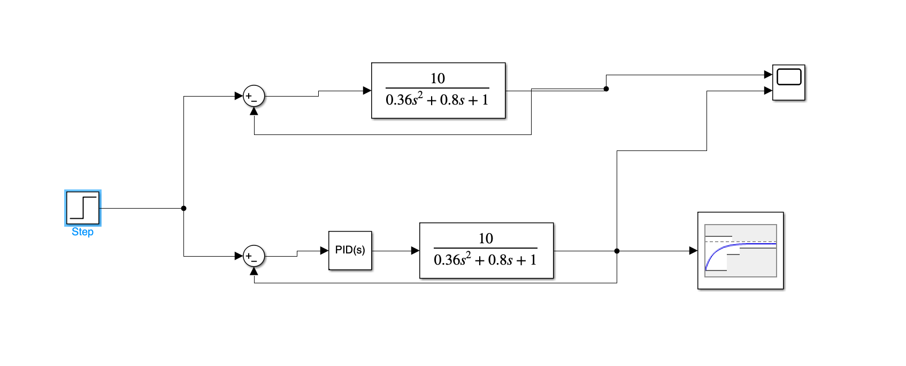

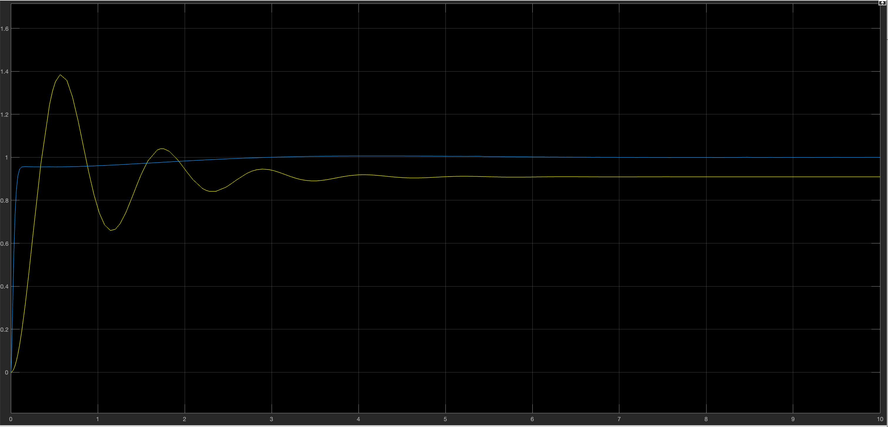

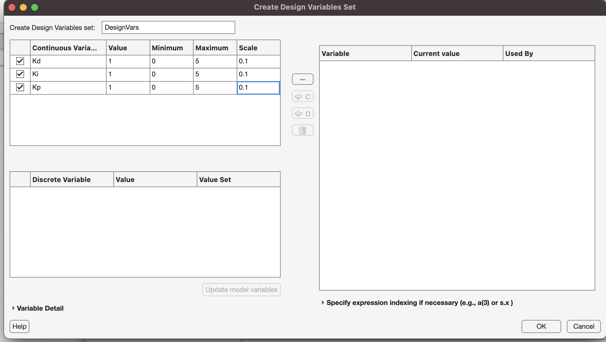

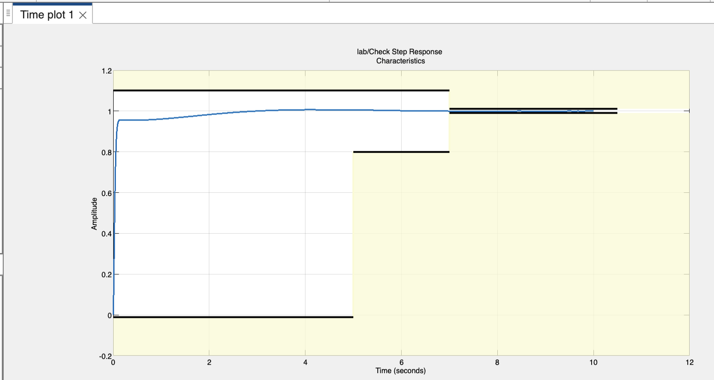

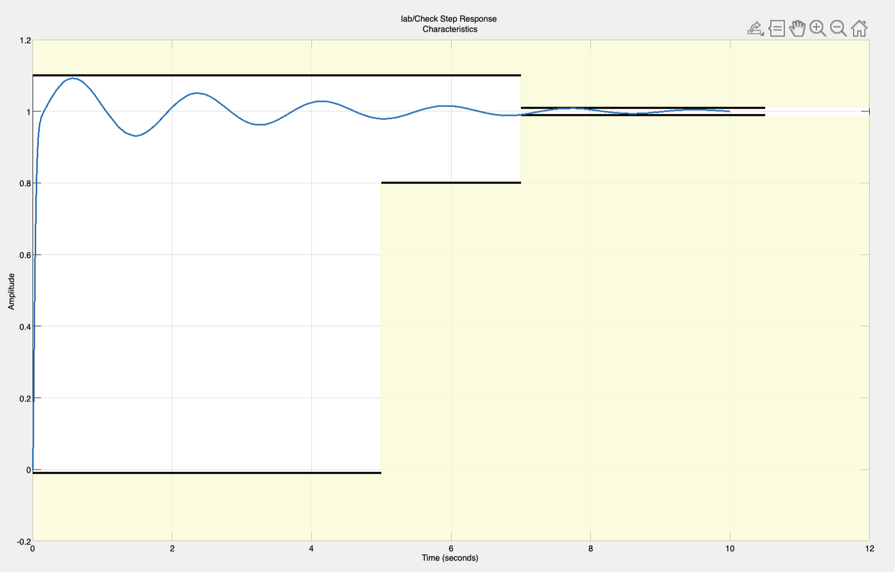

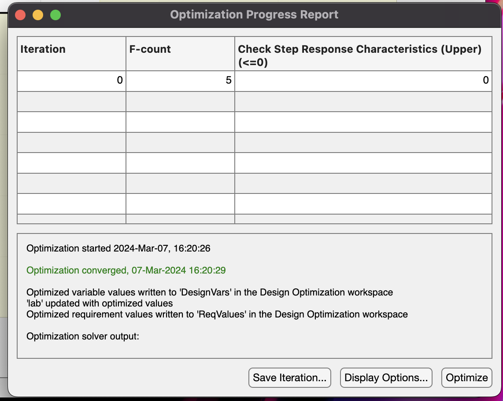

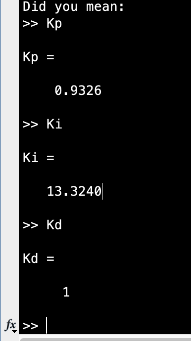

### ПД-Регулятор

Щоб отримати ПД-регулятор, потрібно вимкнути інтегральну ланку, тобто зробити з Ki = 0, щоб вона не впливала на значення. Та повторимо дії для оптимізації.

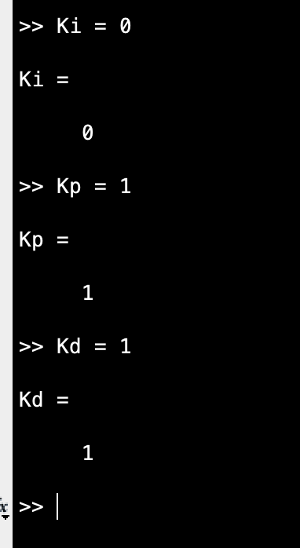

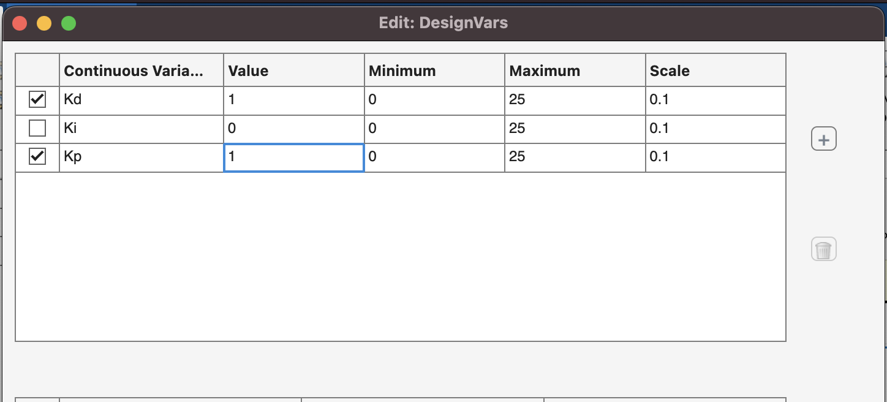

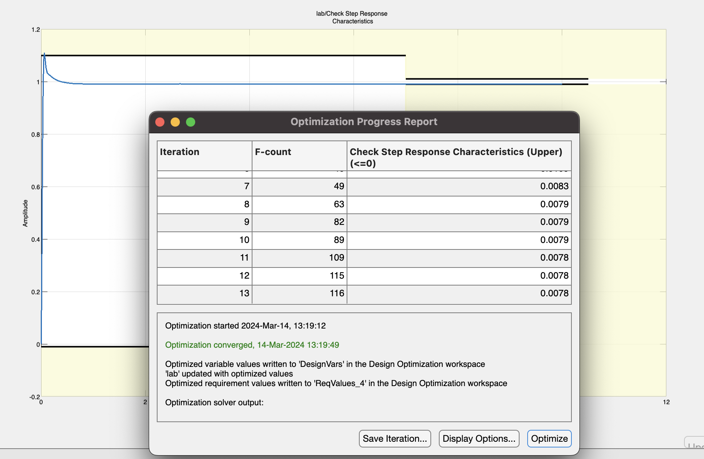

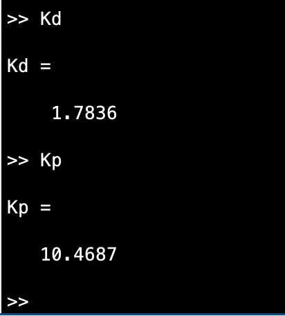

### ПІ-Регулятор

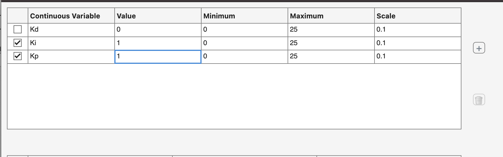

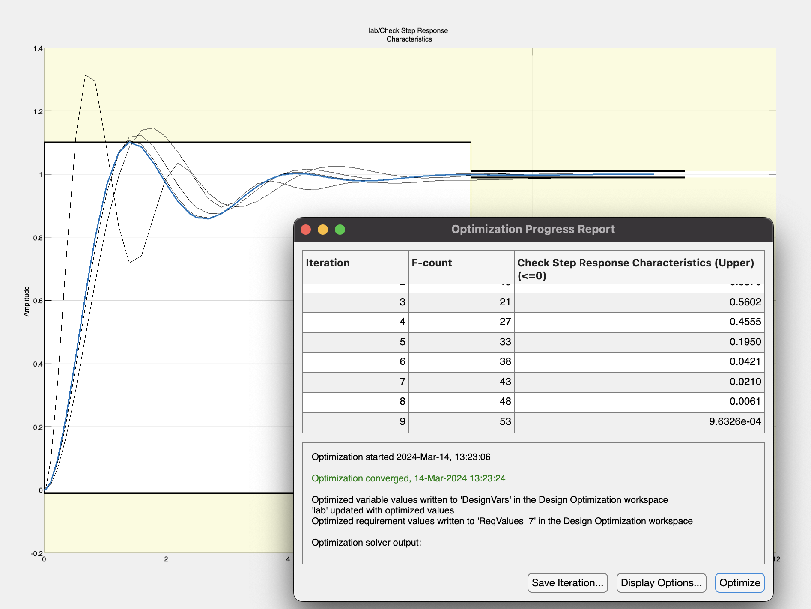

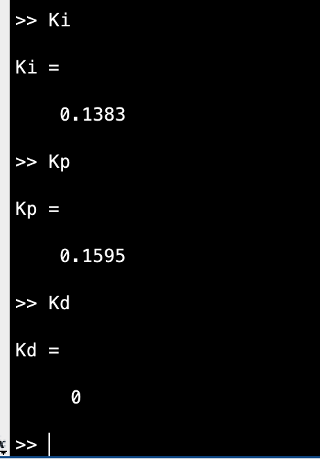

### ІД-Регулятор

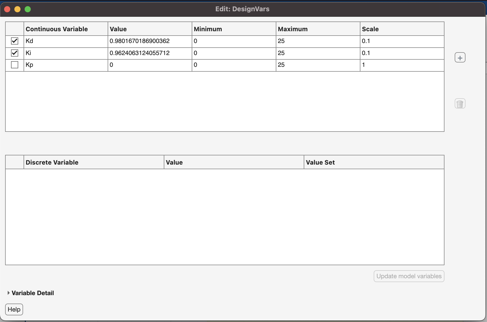

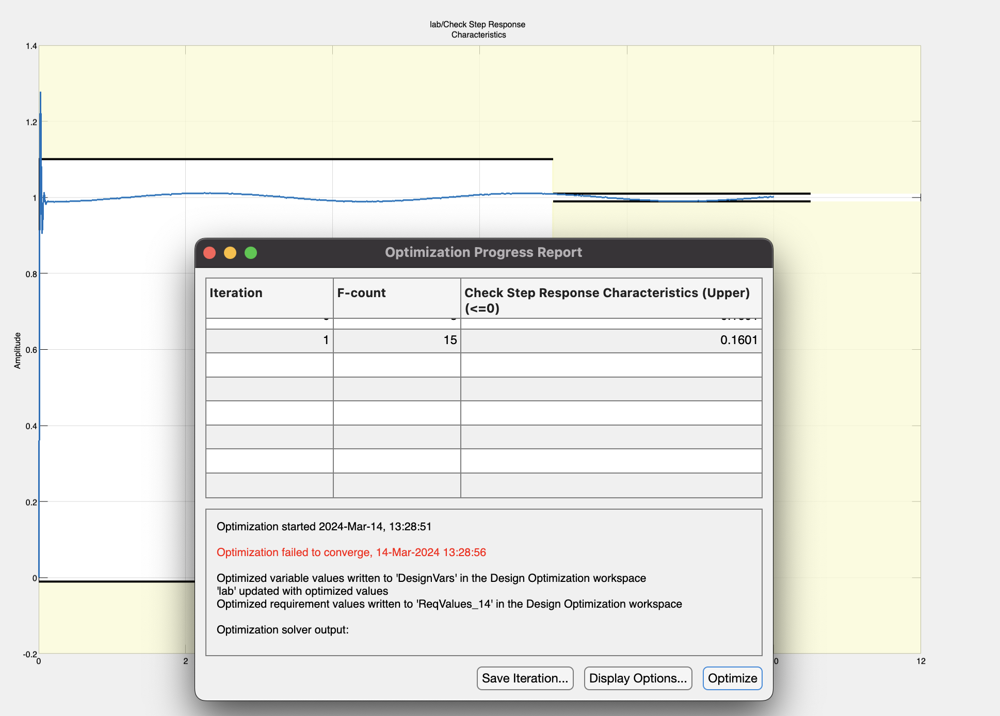

В мене не вийшло оптимізувати ІД-регулятор

## Висновок

На цій лабораторній роботі я навчився працювати з оптимізацією різних видів регуляторів, дізнався як саме пропорційна, інтегральна та диференціальна ланки впливають на роботу регулятора. Оптимізував деякі типи регуляторів.
