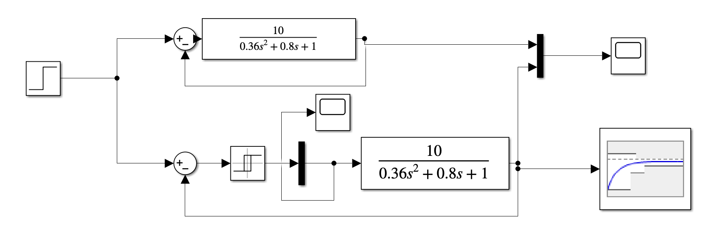
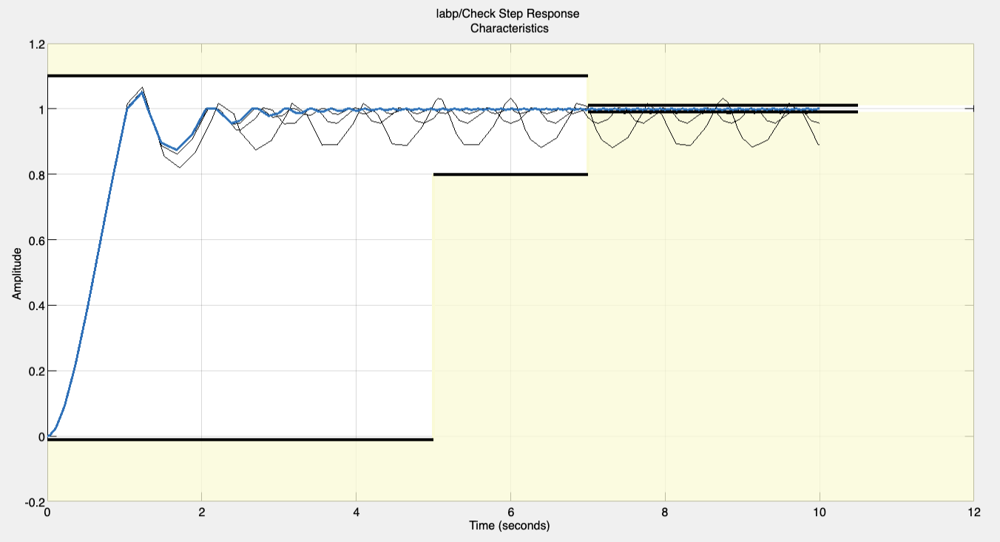
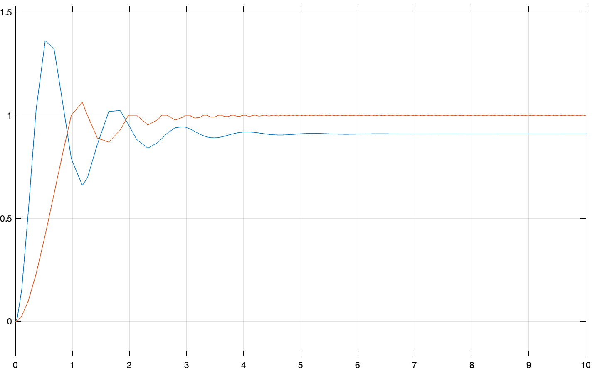
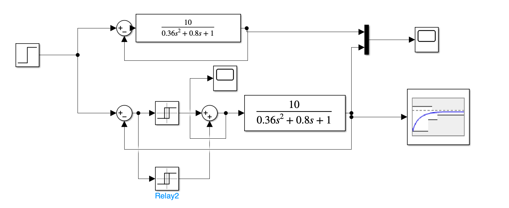
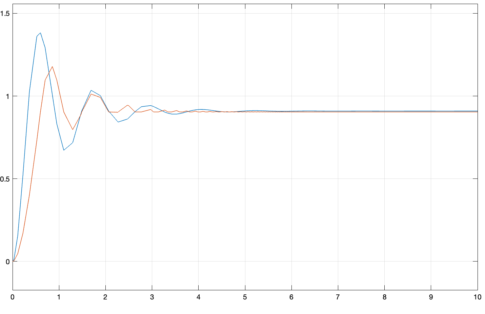

# Лабораторна робота №5

## Тема

Моделювання систем керування з релейними регуляторами

## Мета

Ознайомитись з призначенням, областями застосування та різновидом релейних регуляторів

## Виконання

## Висновок

На цій лабораторній роботі ми познайомились з регуляторами з реле.