# Лабораторна робота №6

## Тема

потім

## мета

зх

## Виконання

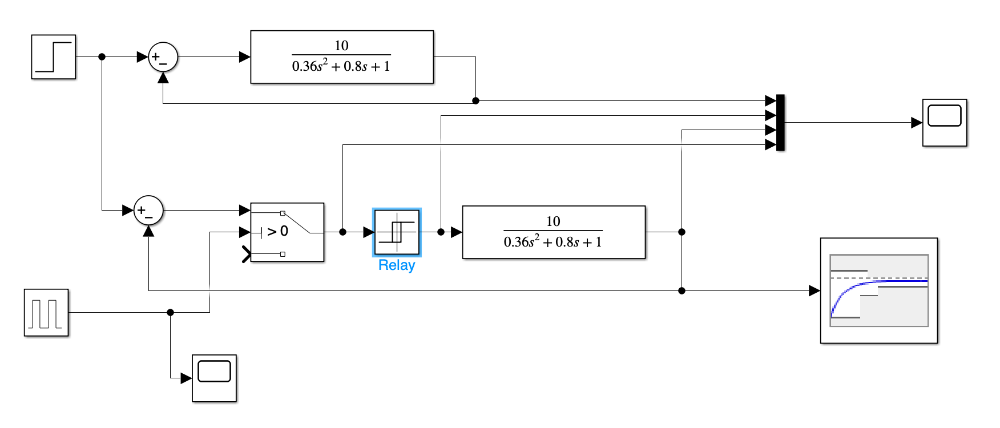

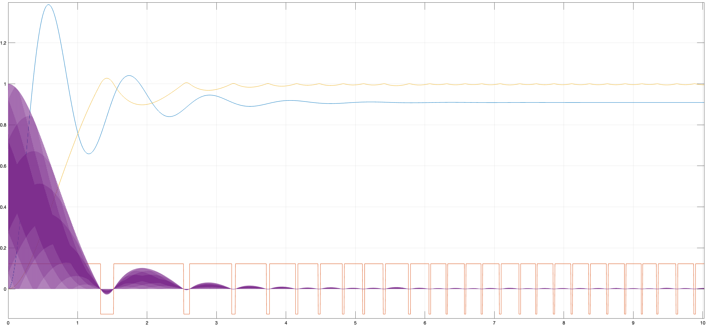

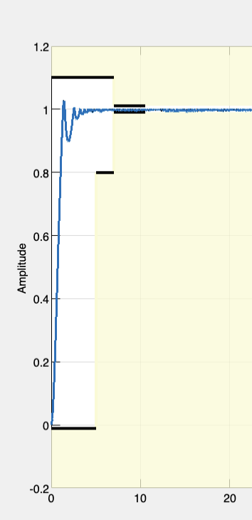

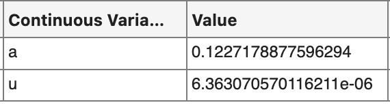

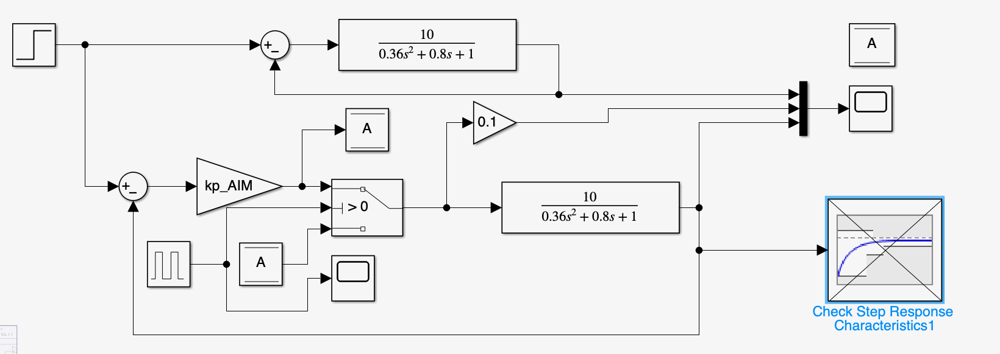

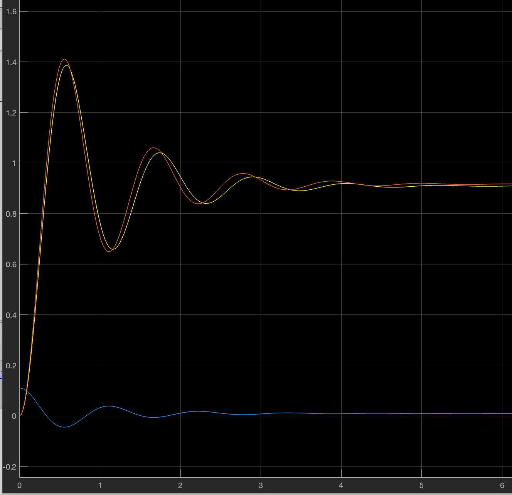

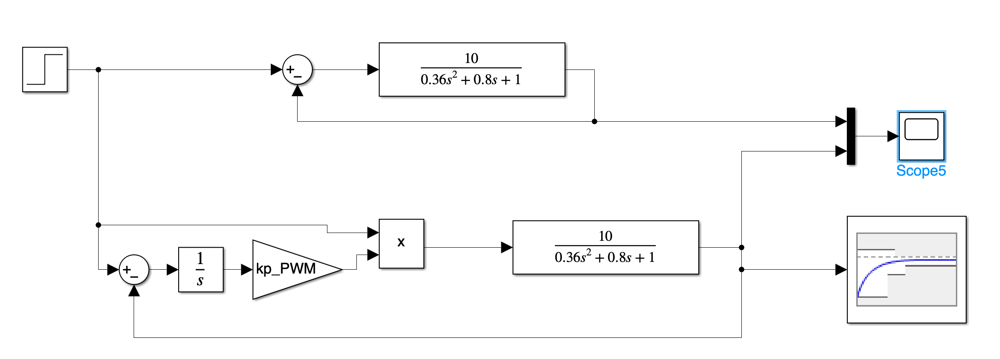

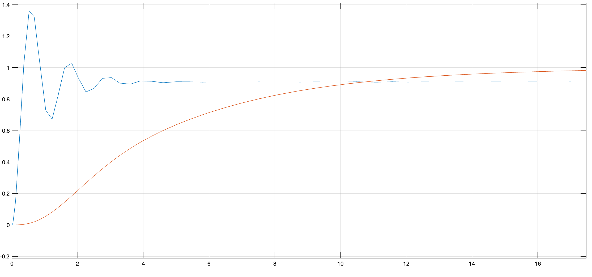

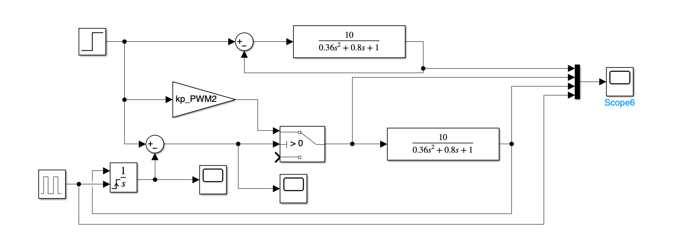

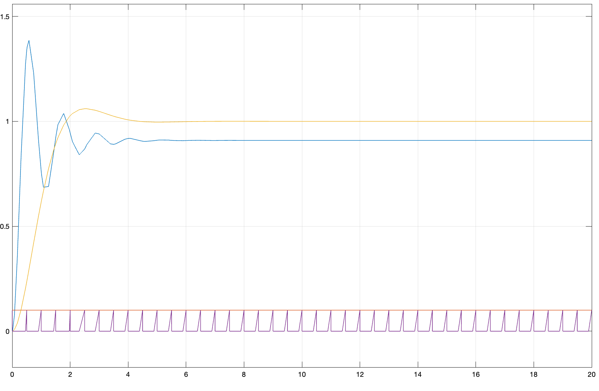

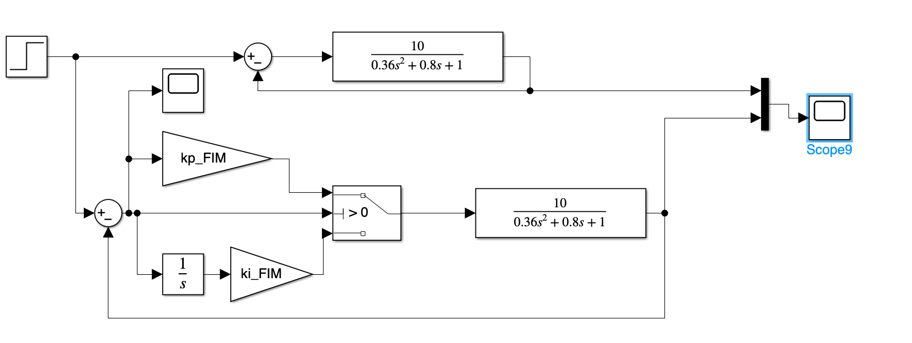

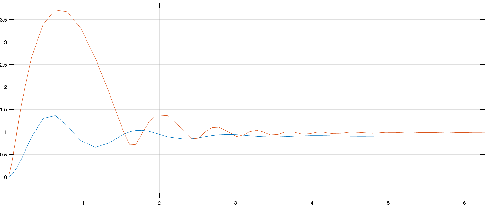

## Висновок

У ході цієї лабораторної роботи ми досліджували ключові аспекти функціонування імпульсних регуляторів, зокрема, їхні схематичні побудови, різноманіття технічних рішень для їх втілення, типи імпульсних регуляторів, доступні на промисловому ринку, та сфери їх застосування.