# Лабораторна робота №7

## Тема

Моделювання систем керування з цифровими регуляторами

## Мета

Дослідити різновиди цифрових регуляторів та розрахувати їх коефіцієнти вручну та за допомогою пакета Signal Constraint Matlab.

## Виконання

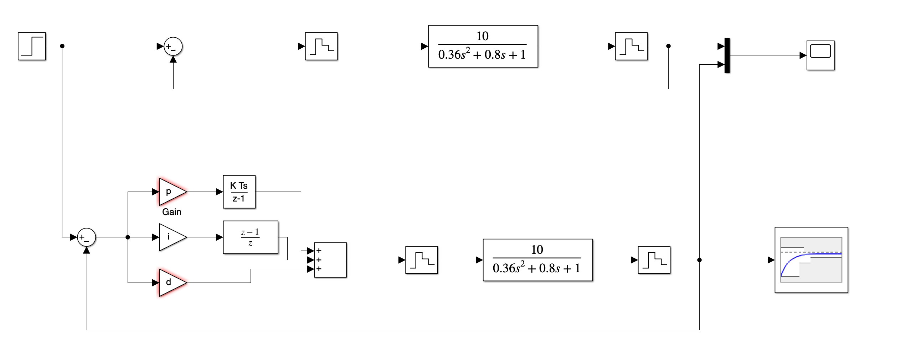

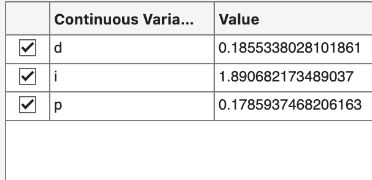

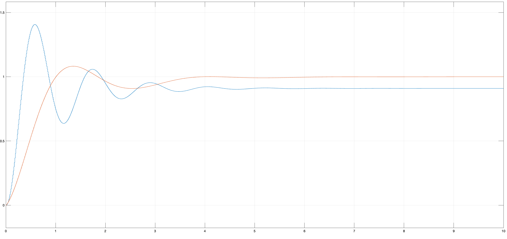

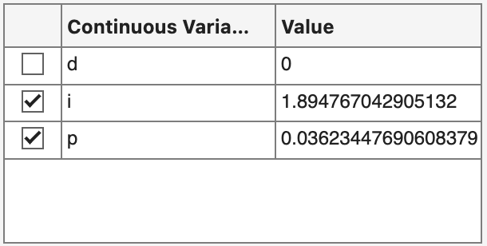

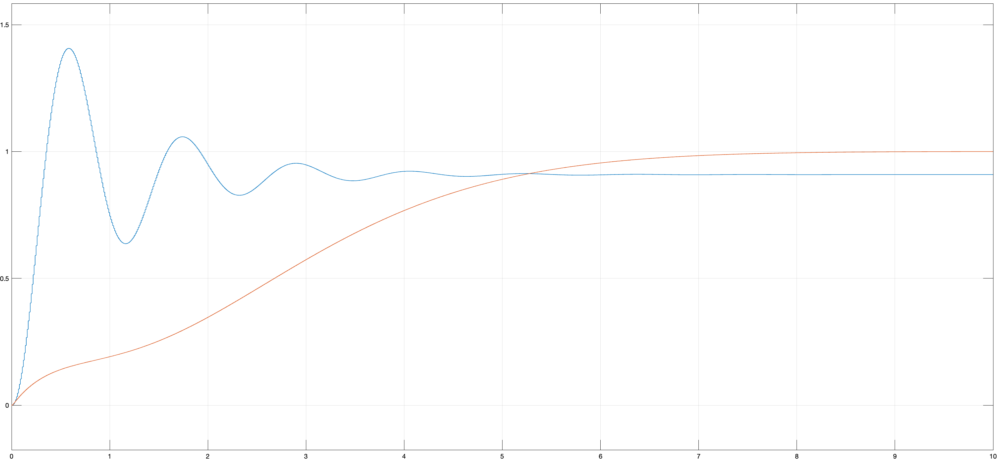

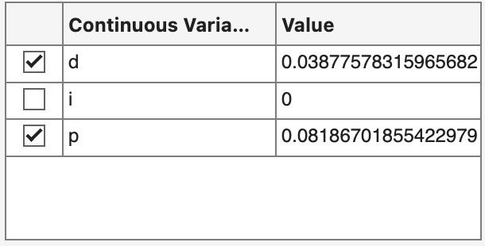

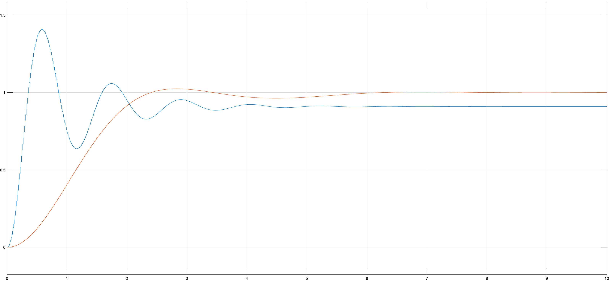

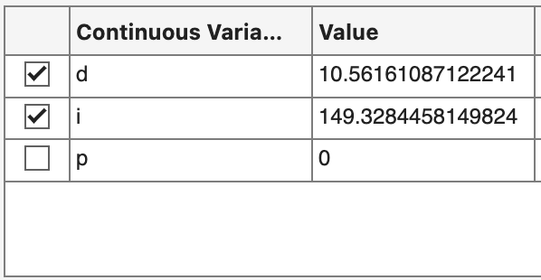

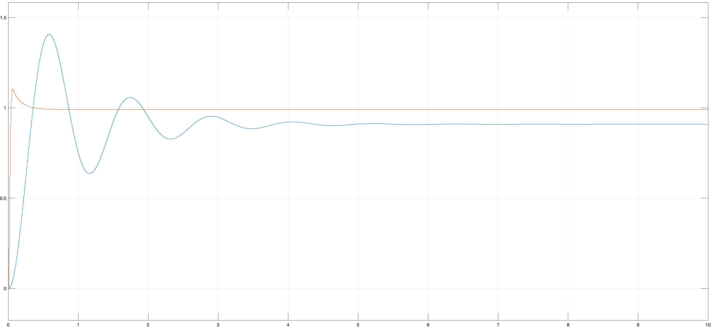

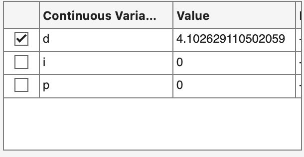

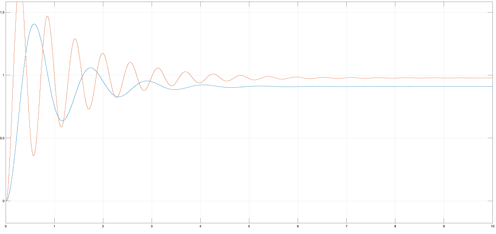

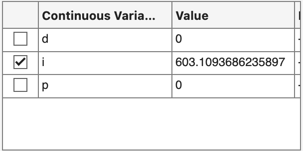

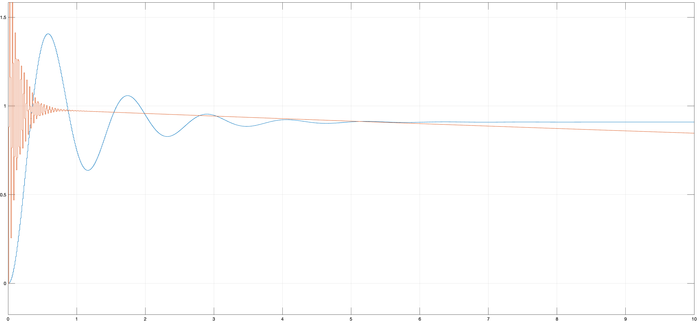

## Висновок 

На цій лабораторній роботі я дослідив різновиди цифрових регуляторів та розрахувати їх коефіцієнти вручну та за допомогою пакета Signal Constraint Matlab.