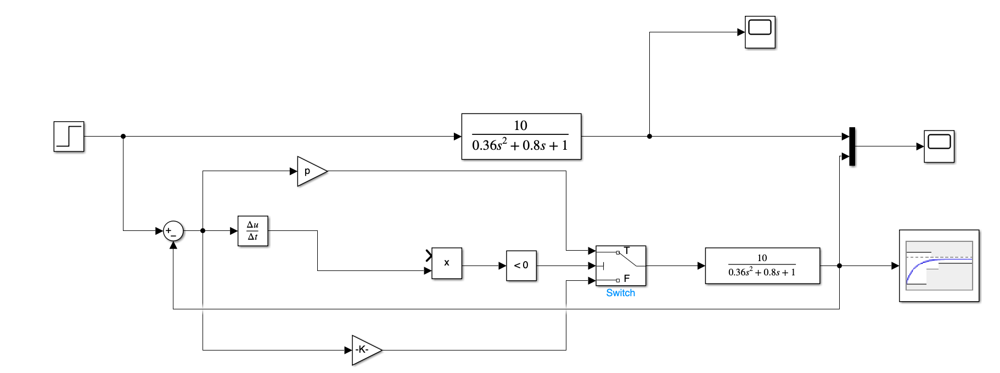
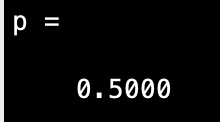
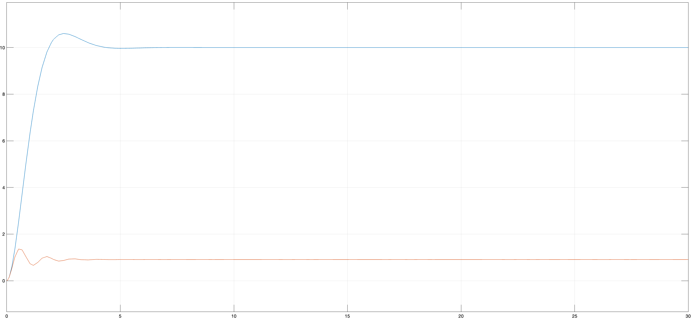
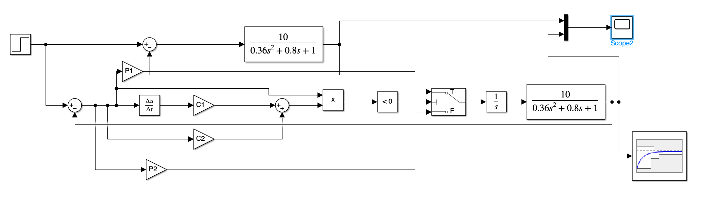
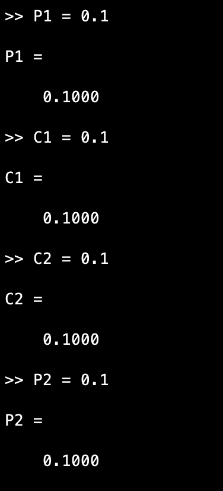
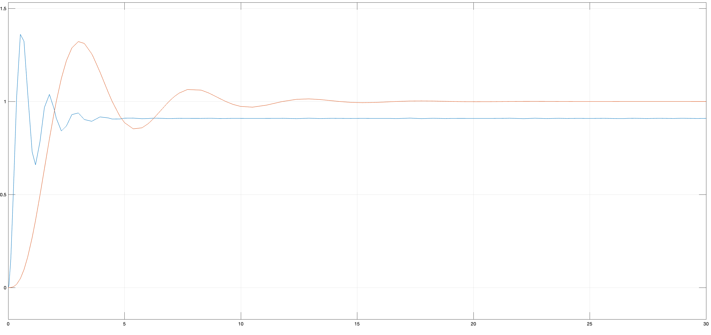
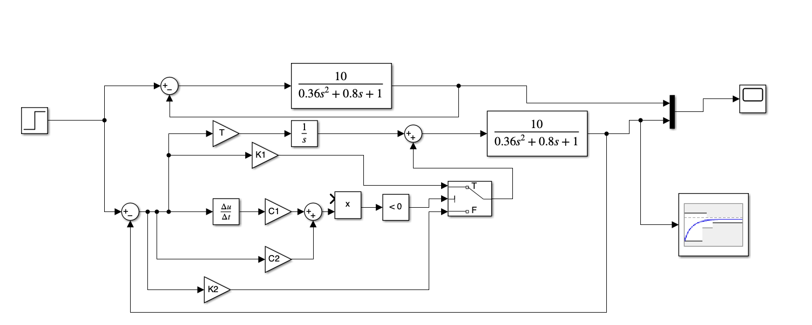
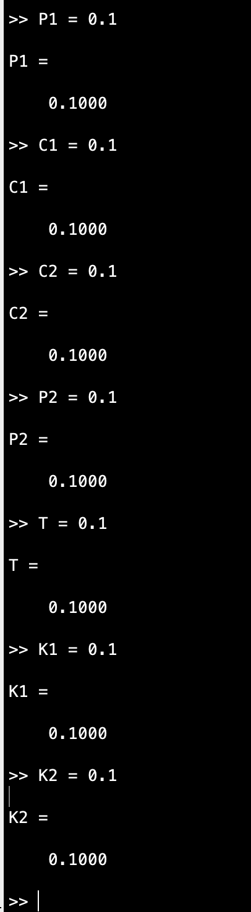
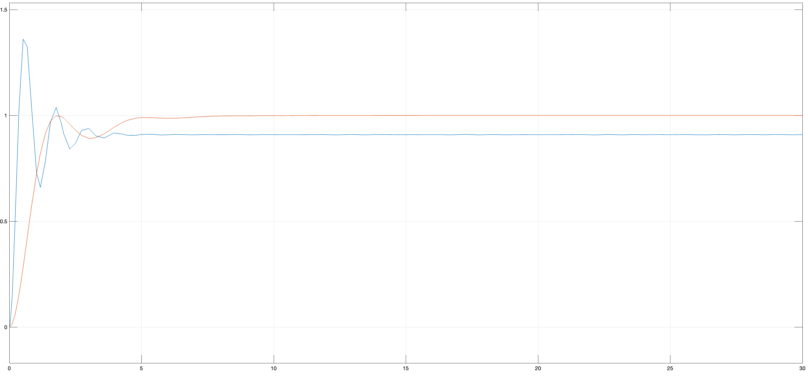

# Лабораторна робота №8

## Тема

Моделювання систем керування з регулятором змінної структури

## Мета

Ознайомитись з принципами побудови та функціонування регуляторів зі змінною структурою.

## Виконання

## Висновок

На цій лабораторній роботі я ознайомився з принципами побудови та функціонування регуляторів зі змінною структурою.
