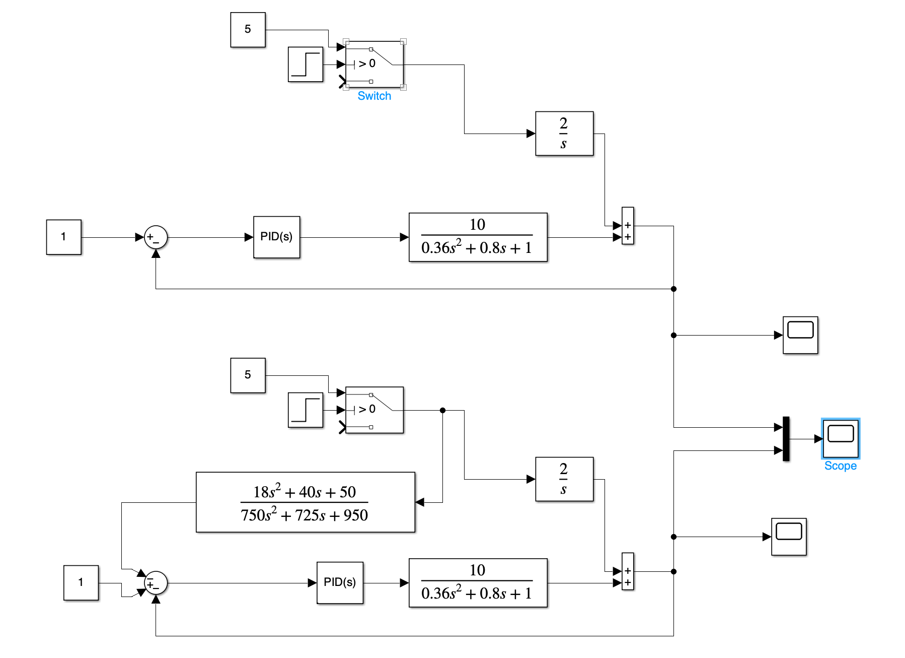
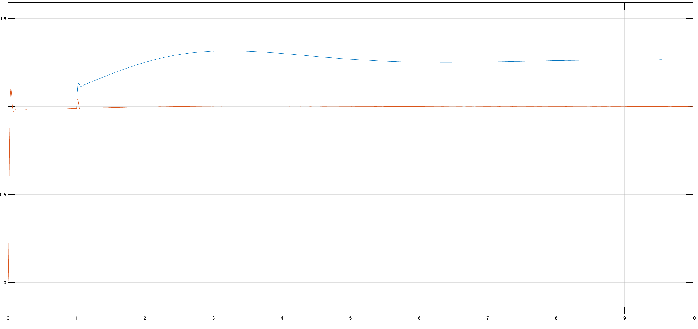

# Лабораторна робота №9

## Тема

Інваріантні системи автоматичного керування

## Мета

Вивчення принципів побудови та властивостей інваріантних систем автоматичного управління.

## Виконання

## Висновок

На цій лабораторній роботі я вивчив принципи побудови та властивості інваріантних систем автоматичного управління.
