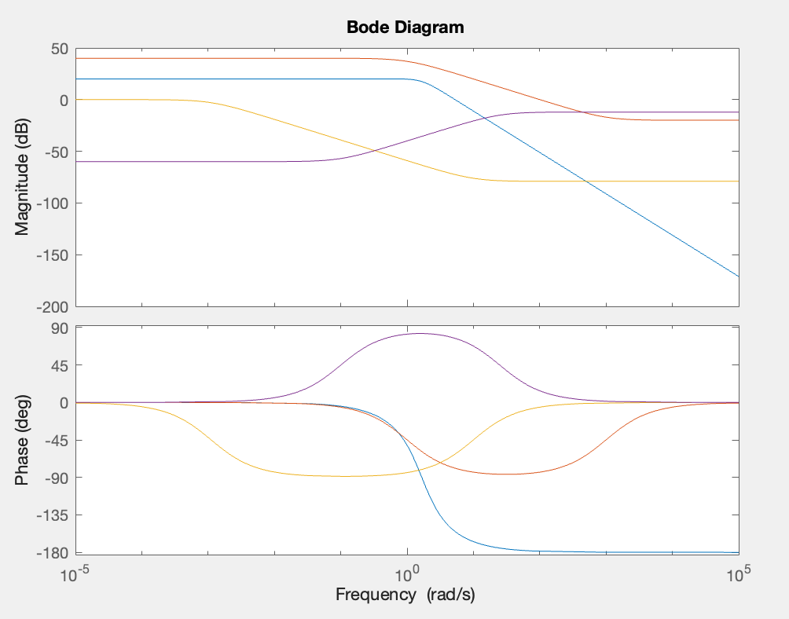
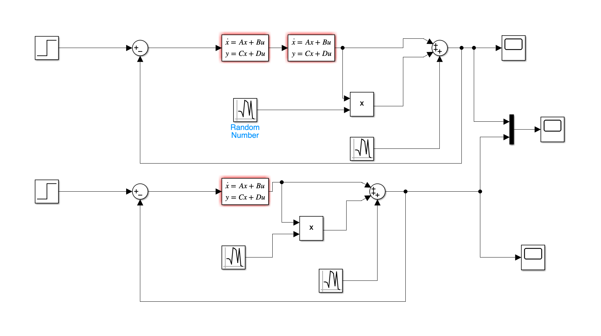

# Лабораторна робота №14

## Тема

Побудова робастних систем управління за методом ЛАХ

## Мета

Навчитися будувати робастні системи управління за методом ЛАХ.

## Виконання

```matlab
w = tf([10],[0.36 0.8 1])

ws = ss(w)

bode(w)

w1=tf([0.1 100],[1 1])

a = ws.A
b = ws.B
c = ws.C
d = ws.D

bode(w,w1)

w2=tf([0.1 1],[900 1])

bode(w,w1,w2)

w3=tf([10 1],[40 1000])

bode(w,w1,w2,w3)

num1 =[1 1]

den1=[0.1 100]

num2 =[0.1 1]

den2 = [900 1]

num3 = [40 1000]

den3 = [10 1]
```






## Висновок

На цій лабораторній роботі я еавчитився будувати робастні системи управління за методом ЛАХ.