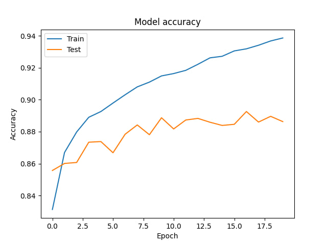

# Лабораторна робота № 1

## Тема

Моделі машинного навчання

## Мета

ознайомитись з принципами функціонування, створення,
навчання та використання моделей машинного навчання.

## Варіант 2

| №   | Датасет       | Модель                   |
| --- | ------------- | ------------------------ |
| 2   | Fashion MNIST | Багатошаровий персептрон |

## Виконання

### Засоби виконання

Код було написано на мові Python в [цій директорії](./fashion-model/).

Для роботи з моделю було використано бібліотеку tensorflow.

Оскільки все доволі просто, запускати буду на локальному ком'ютері

### Набір даних

Fashion MNIST - це набір даних, який містить 70,000 чорно-білих зображень розміром 28x28 пікселів, поділених на 10 категорій одягу. Це один з датасетів за замовчуванням, тому його не потрібно завантажувати

```python
fashion_mnist = tf.keras.datasets.fashion_mnist
(train_images, train_labels), (test_images, test_labels) = fashion_mnist.load_data()
```

Це підготує дані датасету та занесе їх в відповідні змінні.

### Задача

Задачею є класифікація зображень одягу до однієї з десяти можливих категорій.

### Попередня обробка даних

ППопередня обробка включала нормалізацію зображень, де значення пікселів діляться на 255 для перетворення їх у діапазон від 0 до 1. Це підвищує ефективність навчання моделі.

```python
train_images = train_images / 255.0
test_images = test_images / 255.0
```

### Модель машинного навчання

Модель багатошарового перцептрону була побудована за допомогою API keras, яке є частиною бібліотеки tensorflow. Модель містила вхідний шар для вирівнювання зображень(бо модель працює з одномірними даними), один прихований шар з 128 нейронами та функцією активації ReLU, та вихідний шар для класифікації зображень у 10 можливих категорій.

В основі моделей машинного навчання, зокрема багатошарового перцептрону, лежать нейрони - основні одиниці обчислення. Кожен нейрон отримує вхідні дані, виконує над ними лінійну трансформацію за допомогою ваг та зсувів, а потім застосовує нелінійну функцію активації до результату. Функція активації дозволяє нейронним мережам апроксимувати довільні нелінійні залежності між вхідними та вихідними даними.

Однією з найпопулярніших функцій активації є ReLU (Rectified Linear Unit). Ця функція пропускає через себе лише додатні значення, а всі від'ємні замінює на нуль.

```python
model = Sequential([
    Flatten(input_shape=(28, 28)),
    Dense(128, activation='relu'),
    Dense(10)
])
```

### Навчання моделі

Модель навчалась використовуючи алгоритм стохастичного градієнтного спуску. Функція втрат, яка використовувалась, була перехресна ентропія, це по суті дефолт для таких задач, оскільки вона добре працює з імовірностями. В якості метрики було обрано точність (accuracy), бо це найпростіше та логічніше рішеня.

Думаю 10 епох буде достатньо для такого простого датасету та моделі.

```python
model.fit(train_images, train_labels, epochs=20)
```

### Результати навчання

Останнє що залишилось - протестувати модель та переглянути наскільки вона була успішною

```python
test_loss, test_accuracy = model.evaluate(test_images, test_labels, verbose=2)

print(f'\nTest accuracy: {test_accuracy * 100:.2f}%')
```

Після навчання на 20 епохах модель впоралась з 88% тестового набору даних.



На цьому рисунку зображена точність моделі відповідно до епохи, проаналізуємо його детальніше.

1. Точність на тренувальному наборі даних (синя лінія) постійно зростає від початку до кінця процесу навчання, що свідчить про те, що модель ефективно вчиться та адаптує свої ваги для кращого визначення класів.

2. Точність на тестовому наборі даних (оранжева лінія) також зростає, але з певними коливаннями. Після певного моменту точність на тестовому наборі стабілізується, тут з перенавченням треба обережно

3. Розрив між тренувальною та тестовою точністю показує різницю в загальній здатності моделі до узагальнення. Чим більший розрив, тим більша ймовірність перенавчання

### Оцінка результатів навчання

Оцінка результатів навчання:

Чи вдалось навчити модель? Чому так вважаєте?
На основі графіка модель точно була навчена, бо на рисунку точність зростає, та точність на тестовому наборі показує що вона доволі гарна.

Чи є перенавчання? Чому так вважаєте?
На графіку видно, що існує розрив між точністю на тренувальному та тестовому наборах даних, причому тренувальна точність вища. Це дзвіночок номер один про перенавчення, але оскільки точність на тестових все ще висока, воно невелике, та можна сказати що його нема

Чи добре підходить модель для задачі/датасету?
Багатошаровий персептрон зазвичай добре підходить для задач класифікації зображень. Та точність моделі це тільки підтверджує

Як можна покращити результати у вашому випадку?
Ну, поїхали, зараз буде.

Можна:

- Збільшити кількість даних для навчання, можливо, методом створення нових з вже існуючих
- Використати наприклад, Dropout щоб не перенавчитись
- Поекспериментувати з різними архітектурами мережі, але краще просто подивитись на глибші моделі.

Інші думки щодо результатів
Як для першої лаби і кількості коду дуже добре, але якщо треба ще більша точність тут вже більше думати та писати треба

## Висновок

На цій лабораторній роботі я ознайомився з принципами функціонування, створення навчання та використання моделей машинного навчання.
