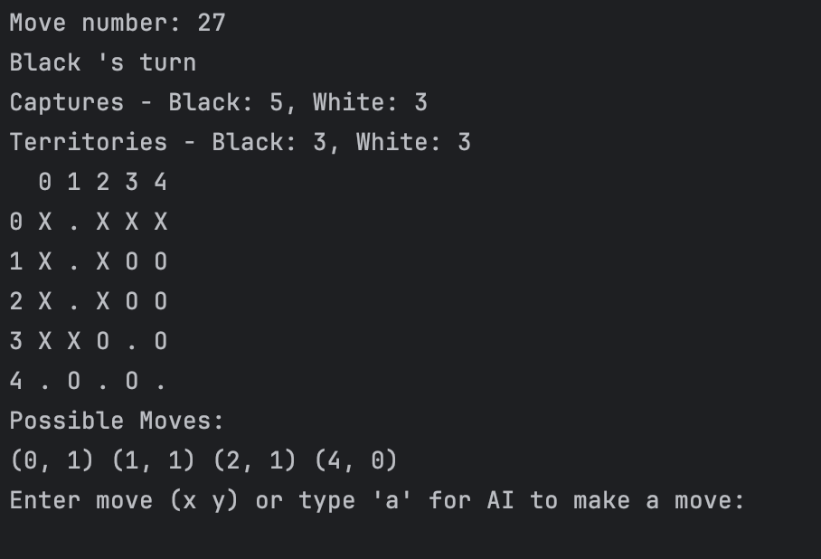
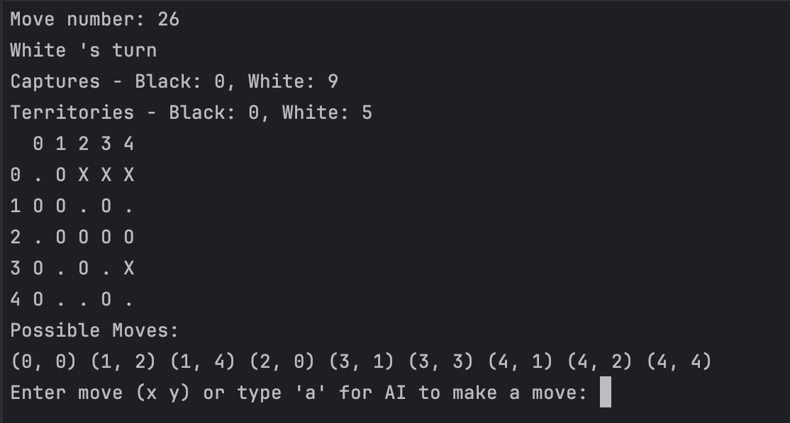
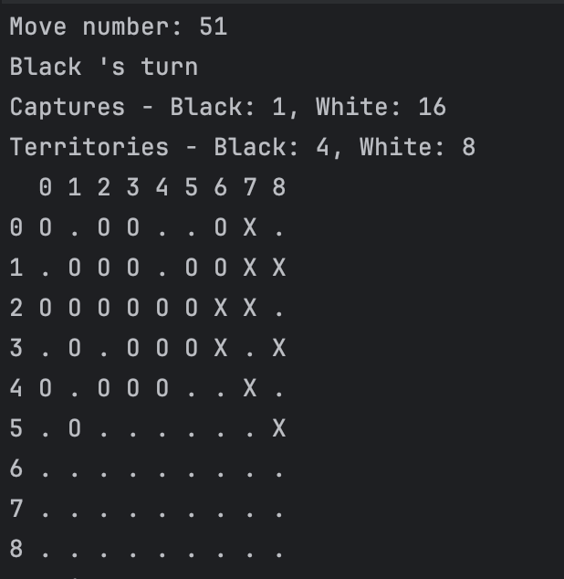
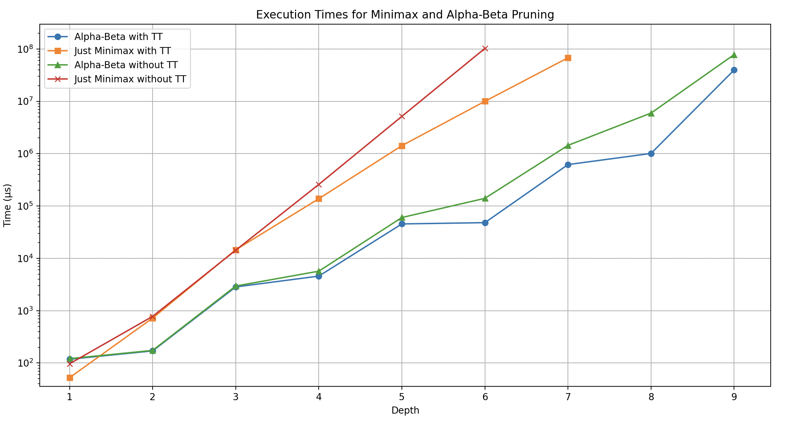
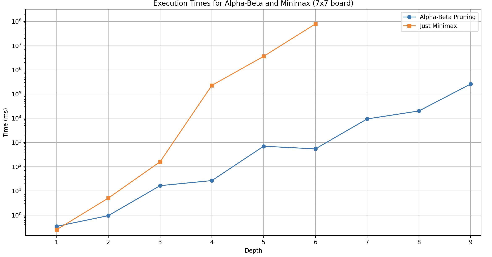

# Комп’ютерний практикум №4

Репозиторій: <https://github.com/kiIIer/kpi-6/tree/main/neuro/lab/lab-04-01.04.2024/go-max>

## Тема

Методи пошуку в умовах протидії

## ПІБ

Молчанов Михайло Валерійович

## Група

ІА-12

## Мета роботи

ознайомитись з методами пошуку в умовах протидії та
дослідити їх використання для інтелектуального агента в типовому ігровому
середовищі.

## Завдання

обрати середовище, що моделює гру з нульовою сумою, та задачу,
що містить декілька агентів, які протидіють один одному. В обраному
середовищі вирішити поставлену задачу, реалізувавши один з методів пошуку
в умовах протидії. Реалізувати власну функцію оцінки станів. Виконати
дослідження впливу деякого фактору середовища.

## Номер варіанту

2

## Завдання для варіанту

| Номер студента/бригади | Метод            | Задача дослідження        |
|-------------------------|------------------|----------------------------|
| 2                       | Альфа-бета відсікання | Вплив глибини пошуку       |

## Середовище і задача

коротко опишіть обране середовище. Формалізуйте середовище в термінах агентів, станів, можливих дій агентів, переходів і винагород

Для середовища була обрана гра Go, яку можна технічно вважати solved game, але через поле 19 на 19 її прорахувати дуже важко. Але оскільки в нашій бригаді нам обом подобається ця гра, ми вирішили все одно її обрати, та наша задача дослідження - вплив глибини пошуку, тобто ми зможемо обмежити глибину, щоб пришвидшити розрахунки та спостерігати що відбувається.

### Середовище

Середовище для нашої реалізації Мінімаксу є класична гра Го. Гра відбувається на квадратній дошці з лініями, які утворюють сітку. Сітка може бути різного розміру, стандартно 19x19, але для спрощення та швидкості алгоритму Мінімакс ми можемо використовувати дошку меншого розміру, наприклад, 9x9 або 5x5 при великій глибині. Гравці по черзі розміщують камені (чорний та білий) на перетині ліній, намагаючись оточити та захопити територію противника та його камені. Ця гра здається простою, але вважається однією з найскладніших стратегій, що дозволить нам потренуватись грати проти нашого штучного інтеллекту та дізнатись хто сильніший. Цікава частина Го - це те, що нема перемоги, два опоненти повинні домовитись завершити гру, коли для них наступні ходи будуть тільки заважати, тобто умовно можна гради нескінченно, але в рамках агенту, він завжди буде намагатись зробити ход.

### Формалізація середовища

- Агенти: У грі Го є два агенти, один грає за чорних, інший - за білих. У нашій реалізації ми можемо змусити агента зробити ход і за чорних і за білих, щоб можна було дивитись як вони грають один з одним або пробувати самому.

- Стани: Стан дошки - це розміщення всіх каменів на дошці в будь-який момент гри. Стартовий стан - пуста дошка. Кожен хід агента змінює стан дошки(1 - чорний, -1 - білий).

- Можливі дії агентів: Кожен агент може вибрати дію з розміщення каменя на будь-яке вільне місце на дошці, що не порушує правила гри (наприклад, правило "ко" або самовбивства).

- Переходи: Перехід з одного стану дошки в інший відбувається через ходи агентів. Кожен хід може захопити камені противника та/або розширити власну територію.

- Винагороди: Винагорода визначається кількістю території. Оскільки Мінімакс - це алгоритм для прийняття рішень, то в проміжних станах винагорода може бути оцінена через евристичну функцію, яка оцінює потенційну вигоду від кожного ходу. В нашому випадку винагорода це кількість каменів кольору агента та кількість захоплених ним територій, відняти кількість каменів супротивника та його територій.

У контексті Мінімаксу, винагорода (або оцінка стану) максимізується для чорних (максимізуючого гравця) та мінімізується для білих (мінімізуючого гравця) з метою знайти оптимальний хід, який призводить до найкращого можливого результату для максимізуючого агента з урахуванням можливих відповідей мінімізуючого агента.

### Метод вирішення задачі

#### Опис Методу Мінімакс

Метод Мінімакс - це популярний алгоритм для визначення найкращого ходу в іграх з двома гравцями, які грають під нульовою сумою (коли виграш одного гравця є втратою для іншого). Мінімакс розглядає всі можливі ходи гравця (максимізуючого агента) та його противника (мінімізуючого агента), враховуючи всі можливі варіанти розвитку подій в ігрі.

Умови використання Мінімаксу ідеально підходять для ігор:

- З двома гравцями.
- Де існує чітко визначений набір правил і можливих ходів.
- Що мають визначену кінцеву мету, наприклад, перемогу, поразку чи нічию.
- Що не містять випадкових елементів чи інформації, яка прихована від гравців.

#### Приклад застосування в Хрестики-Нулики

Розглянемо гру "Хрестики-Нулики" на полі 3x3. Мінімакс буде систематично перебирати всі можливі ходи ("X" та "O"), які можуть бути зроблені від поточного стану гри. Для кожного можливого ходу алгоритм буде розглядати всі можливі відповіді опонента, а потім їх відповіді на ті відповіді і так далі, аж до досягнення кінцевого стану гри (перемога, поразка чи нічия). Кожному стану буде присвоєно значення, в залежності від того, наскільки він вигідний для максимізуючого гравця.

#### Альфа-Бета Відсікання

Альфа-бета відсікання є оптимізацією методу Мінімакс, яка значно зменшує кількість станів, що їх необхідно оцінювати. Ця техніка працює, ігноруючи ті ходи, які не можуть покращити результат, вже отриманий для попередніх ходів.

Альфа є найкращою оцінкою (найвищим значенням), яку максимізуючий гравець може гарантувати на даному рівні або вище, а бета - найгіршою оцінкою (найнижчим значенням), яку мінімізуючий гравець може змусити максимізуючого гравця прийняти.

Під час перебору станів, якщо знаходиться хід, який веде до результату, гіршого за поточне значення альфа для максимізуючого гравця, або кращого за поточне значення бета для мінімізуючого гравця, ця гілка ходів може бути відсічена, оскільки опоненти не дозволять досягти цього стану.

Використовуючи альфа-бета відсікання, можна значно збільшити швидкість Мінімакс алгоритму без втрати точності. Таким чином, альфа-бета відсікання робить Мінімакс практичним для використання в більш складних іграх, як-от Го.

## Реалізація методу

Оскільки Python славиться своєю швидкістю, але тільки не в контексті, де необхідно виконувати обчислення великої складності, ми вирішили відступити від його використання на користь мови програмування Go. Мова Go, розроблена компанією Google, є компільованою та ефективною, пропонуючи чистоту і простоту в реалізації алгоритмів, таких як Мінімакс. Об'єктно-орієнтовані можливості Go реалізуються через інтерфейси, а Garbage Collector сприяє вирішенню проблем управління пам'яттю без значної втрати продуктивності. Це робить Go значно швидшим у порівнянні з Python, особливо для інтенсивних обчислювальних задач, які є характерними для алгоритмів штучного інтелекту в іграх.

Виконуючи Мінімакс для Го на 9x9 дошці, ми маємо розглядати (49^5) потенційних станів (для п'яти ходів вперед), що є значним обчислювальним викликом. Мова Go дозволяє нам оптимально впоратися з такою кількістю ітерацій завдяки швидкості виконання та можливості багатопоточності.

Щодо програмної реалізації, ось основні компоненти нашого алгоритму, який знаходиться у файлі [ai.go](./ai/ai.go):

- MinimaxDecision: Функція, яка ініціює процес пошуку, встановлюючи вихідні параметри і запускаючи рекурсивний алгоритм Мінімакс.

- Minimax: Серце алгоритму, рекурсивна функція, що моделює всі можливі ходи і повертає найкращий результат, оцінений за допомогою альфа-бета відсікання для оптимізації швидкості.

- Evaluate: Функція оцінки стану дошки, яка враховує такі фактори, як територія та захоплені камені, щоб надати кількісне значення кожному можливому стану.

- TranspositionTable: Механізм кешування для зберігання вже обчислених станів, що значно зменшує кількість обчислень, які потрібно виконувати.

Цей набір функцій реалізує ідею, що наш Мінімакс не просто прогнозує ходи, але й "пам'ятає" попередні стани, уникаючи повторних розрахунків, що дозволяє нам обробляти значну кількість можливих ходів і забезпечити стратегічну глибину грі Го.

## Результати застосування розробленого методу

Спочатку я зіграю на дошці 5 на 5 проти мінімаксу, з глибиною пошуку в 10 ходів. Це мала дошка, але глибина пошуку повинна зробити дійсно страшного опонента.

В обох випадках я зміг перемогти правильно зробивши перші кілька ходів, що дозволило мені перевернути гру на 15-16 ході, так далеко вперед мінімакс не заходив, тому я його переграв, тепер переглянемо гру самім з собою.

Як видно на цій грі, вони протистояли доволі сильно але майже не віддали жодного каменя опоненту, та побудували "фортецю 2 ока", що є однією з фігур яких не можна захопити, це говорить, що опоненти дійсно обирали доволі оптимальні кроки. Тепер зменшемо глибину та збільшемо дошку, я зможу перемогти нашого анегта, але цікаво подивитись їх один проти одного.

А тепер давайте переглянемо швидкість обрахунків з та без альфа бета прунінгу. Оберемо поле 5 на 5, щоб можна було дійсно позмінювати глибину

| Depth | Alpha-Beta with TT (µs) | Just Minimax with TT (µs) | Alpha-Beta without TT (µs) | Just Minimax without TT (µs) |
|-------|-------------------------|---------------------------|----------------------------|-----------------------------|
| 1     | 118.208                 | 52.542                    | 121.125                    | 96.75                       |
| 2     | 170.458                 | 722.792                   | 174.334                    | 779.417                     |
| 3     | 2,844.333               | 14,540.375                | 2,958.291                  | 14,299.833                  |
| 4     | 4,574.125               | 137,728.25                | 5,684                      | 258,252.167                 |
| 5     | 45,438.459              | 1,421,276.208             | 60,223.375                 | 5,153,755.875               |
| 6     | 48,063.042              | 10,007,307.042            | 140,073.75                 | 102,641,163.0               |
| 7     | 618,192.875             | 67,845,335.292            | 1,440,595.25               | N/A                         |
| 8     | 1,009,847.042           | N/A                       | 5,959,130.458              | N/A                         |
| 9     | 39,589,914.75           | N/A                       | 77,967,410.375             | N/A                         |

## Аналіз результатів

Оцінюючи отримані результати з графіку, можемо зробити декілька важливих спостережень щодо ефективності алгоритмів Мінімакс з альфа-бета відсіканням та впливу транспозиційної таблиці на час виконання.

Перш за все, ми бачимо, що альфа-бета відсікання значно покращує час виконання порівняно з чистим Мінімакс алгоритмом на кожному рівні глибини. Це відбувається тому, що альфа-бета відсікання дозволяє алгоритму "відкинути" гілки дерева пошуку, які не можуть вплинути на остаточне рішення, тим самим скорочуючи кількість необхідних обчислень.

Використання транспозиційної таблиці ще більше знижує час виконання для альфа-бета алгоритму, особливо на вищих рівнях глибини. Транспозиційна таблиця зберігає результати попередніх обчислень і дозволяє алгоритму використовувати ці дані, замість того, щоб повторно обчислювати вже відомі стани. Це значно знижує не тільки час виконання, але й загальну обчислювальну складність алгоритму.

З тенденції видно, що час виконання для обох алгоритмів зростає експоненціально зі збільшенням глибини пошуку. Однак, зростання часу виконання для чистого Мінімаксу є значно більш стрімким, що вказує на його непрактичність для глибокого аналізу без оптимізацій. У той же час, зростання для альфа-бета відсікання помітно поміркованіше.

Щодо альфа-бета алгоритму без транспозиційної таблиці, хоча він і показує кращий час виконання, ніж Мінімакс, його продуктивність також погіршується зі збільшенням глибини. Це підтверджує важливість використання кешування у вигляді транспозиційної таблиці, особливо для глибших рівнів аналізу.

Отже, альфа-бета відсікання разом з транспозиційною таблицею становить оптимальний підхід до реалізації Мінімакс алгоритму в грі, що вимагає інтенсивного обчислювального аналізу, як, наприклад, гра Го.

## Висновок

На цій лабораторній роботі ми ознайомились з методами пошуку в умовах протидії та дослідити їх використання для інтелектуального агента в типовому ігровому середовищі. Дослідили вплив глибини пошуку та використання оптимізаційних стратегій таких як альфа бета відсікання та транспозиційна таблиця, щоб пришвидшити пошук.
