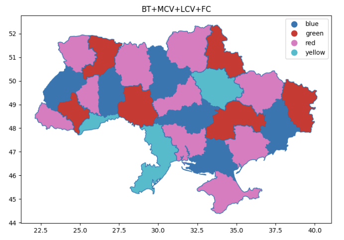
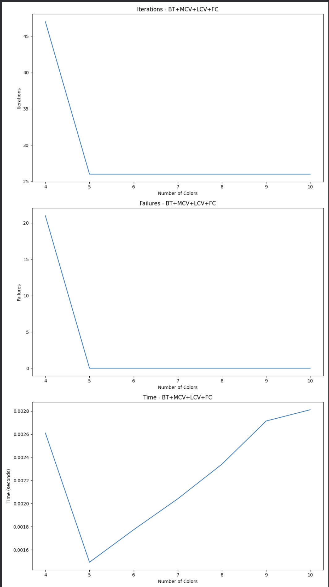
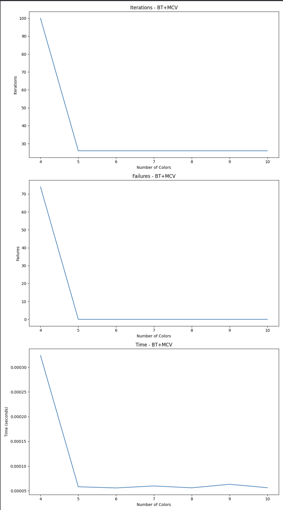
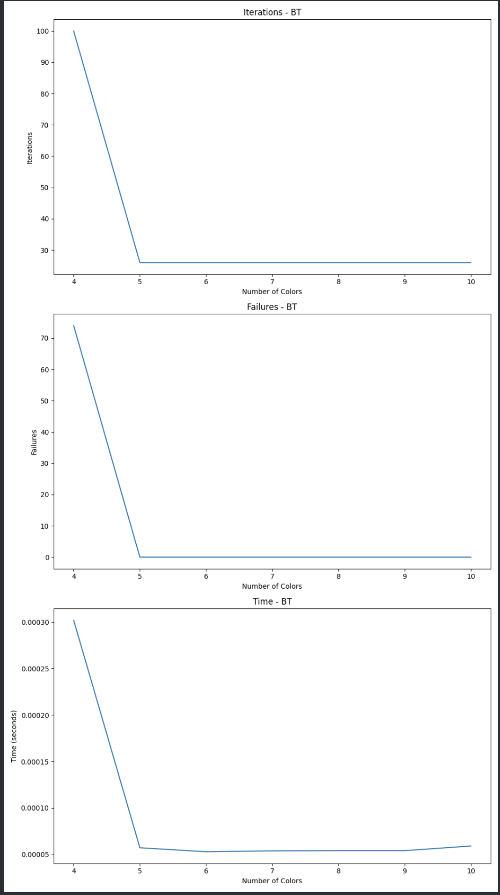

# Комп’ютерний практикум №5

## Тема

Моделі на основі змінних в задачах задоволення обмежень

## ПІБ

Молчанов Михайло Валерійович

## Група

ІА-12

## Мета

ознайомитись з методами пошуку рішень в моделях ШІ на
основі змінних.

## Завдання

розв’язати задачу задоволення обмежень згідно варіанту в
обраному середовищі, реалізувавши запропоновані методи пошуку. Порівняти
реалізації між собою та з базовим алгоритмом пошуку з поверненням.
Виконати міні-дослідження впливу параметру задачі. Підготувати звіт

## Номар Варіанту

2

## Завдання для варіанту

| Номер бригади | Задача        | Метод 1       | Метод 2 |
| ------------- | ------------- | ------------- | ------- |
| 2             | Карта України | BT+MCV+LCV+FC | BT+MCV  |

## Задача

### Формалізація задачі

Змінні:
Змінні в даній задачі представляють області України. Кожна змінна відповідає конкретній області на карті.

Області значень:
Області значень для кожної змінної – це кольори, які можуть бути призначені відповідній області. Ми використовуємо чотири кольори: червоний, зелений, синій та жовтий.

Обмеження:
Обмеження накладаються на сусідні області таким чином, що ніякі дві сусідні області не можуть мати однаковий колір.

### Характеристика обмежень

Обмеження в задачі є бінарними, тобто вони діють між парами змінних. Кожне обмеження вказує на те, що дві сусідні області повинні мати різні кольори. Це гарантує, що жодні дві сусідні області на карті не будуть пофарбовані однаково, що є необхідною умовою для коректного розв'язання задачі розфарбування карти.

## Середовище

Середовище для виконання задачі – це просто мова програмування Python. Основні бібліотеки, які використовувались, включають `geopandas` для роботи з географічними даними та `matplotlib` для візуалізації результатів. Ми обрали саме це, бо нам не потрібно нічого більше ніж `matplotlib` для візуалізацій

## Методи вирішення задачі

### Метод 1: BT+MCV+LCV+FC

Опис:

- BT (Backtracking): Основний рекурсивний алгоритм пошуку з поверненням. Алгоритм працює, призначаючи значення змінним одне за іншим, перевіряючи узгодженість кожного призначення з обмеженнями. Якщо призначення веде до конфлікту, алгоритм відкидає його і повертається назад (backtracking), пробуючи інше значення для змінної.
  
- MCV (Minimum Remaining Values): Вибір змінної з найменшою кількістю допустимих значень. Ця евристика допомагає зменшити кількість можливих конфліктів у майбутньому, дозволяючи швидше знаходити рішення або виявляти конфлікти.
  
- LCV (Least Constraining Value): Вибір значення, яке найменше обмежує вибір для інших змінних. Ця евристика сортує значення домену змінної за кількістю конфліктів, які вони викликають, обираючи ті, що викликають найменше конфліктів.
  
- FC (Forward Checking): Перевірка і скорочення областей значень сусідніх змінних після кожного призначення. Ця техніка зменшує області значень для сусідніх змінних, виключаючи значення, які ведуть до конфліктів, тим самим скорочуючи простір пошуку і зменшуючи кількість необхідних повернень.

Характеристика:

- Працює з частковими присвоюваннями.
- Детермінований метод.
- Глобальний підхід.
- Знаходить оптимальне значення.

### Метод 2: BT+MCV

Опис:

- BT (Backtracking): Основний рекурсивний алгоритм пошуку з поверненням. Працює аналогічно до методу, описаного вище, але без використання додаткових евристик LCV та FC.
  
- MCV (Minimum Remaining Values): Вибір змінної з найменшою кількістю допустимих значень. Ця евристика допомагає зменшити кількість можливих конфліктів у майбутньому, дозволяючи швидше знаходити рішення або виявляти конфлікти.

Характеристика:

- Працює з частковими присвоюваннями.
- Детермінований метод.
- Глобальний підхід.
- Знаходить оптимальне значення.

### Базовий алгоритм: Тільки BT

Опис:

- BT (Backtracking): Основний рекурсивний алгоритм пошуку з поверненням без використання додаткових евристик. Алгоритм просто перебирає всі можливі значення для змінних, повертаючись назад при виявленні конфліктів. Цей метод працює значно повільніше, оскільки не використовує додаткових оптимізаційних технік.

Характеристика:

- Працює з частковими присвоюваннями.
- Детермінований метод.
- Глобальний підхід.
- Знаходить оптимальне значення.

## Реалізація методу

### Програмна реалізація методів

Для розв'язання задачі розфарбування карти України були реалізовані три методи: базовий алгоритм пошуку з поверненням (BT), BT з евристикою мінімального залишкового значення (BT+MCV) та BT з евристиками мінімального залишкового значення, найменш обмежуючого значення і перевірки наперед (BT+MCV+LCV+FC).

### Основні компоненти коду

#### Клас Constraint

- Опис: Базовий клас для всіх обмежень.
- Метод satisfied: Перевіряє, чи виконане обмеження для поточного призначення змінних.

#### Клас CSP

- Опис: Клас для представлення задачі задоволення обмежень. Містить змінні, області значень для змінних та обмеження між змінними.
- Метод init: Ініціалізує змінні, області значень і обмеження.
- Метод add_constraint: Додає обмеження до задачі.
- Метод consistent: Перевіряє узгодженість призначення змінної.
- Метод backtracking_search: Реалізує алгоритм пошуку з поверненням.

#### Клас CSP_BT_MCV

- Опис: Розширює базовий клас CSP для реалізації BT з евристикою мінімального залишкового значення (MCV).
- Метод select_unassigned_variable: Вибирає змінну з найменшою кількістю допустимих значень.

#### Клас CSP_BT_MCV_LCV_FC

- Опис: Розширює клас CSP для реалізації BT з евристиками MCV, LCV та перевірки наперед (FC).
- Метод order_domain_values: Впорядковує значення домену на основі кількості конфліктів (LCV).
- Метод forward_checking: Здійснює перевірку наперед, скорочуючи області значень сусідніх змінних після кожного призначення.
- Метод backtracking_search: Додає підтримку перевірки наперед до базового алгоритму пошуку з поверненням.

#### Клас MapColoringConstraint

- Опис: Реалізує обмеження для задачі розфарбування карти.
- Метод init: Ініціалізує обмеження між двома областями.
- Метод satisfied: Перевіряє, чи обидві області мають різні кольори в поточному призначенні.

### Використання методів

1. BT+MCV+LCV+FC: Поєднання всіх евристик для досягнення найкращих результатів. Використовує евристики MCV, LCV та перевірку наперед (FC).
2. BT+MCV: Використання евристики мінімального залишкового значення (MCV) для покращення результатів базового алгоритму пошуку з поверненням.
3. Тільки BT: Базовий алгоритм без додаткових евристик, що реалізує стандартний пошук з поверненням.

## Результати застосування розробленого методу

### Результати роботи програми

| Метод                  | Ітерації | Невдачі | Час (секунди) |
|------------------------|----------|---------|---------------|
| BT+MCV+LCV+FC          | 29       | 3       | 0.0025        |
| BT+MCV                 | 100      | 74      | 0.0003        |
| Тільки BT              | 100      | 74      | 0.0003        |

### Детальний аналіз результатів

#### BT+MCV+LCV+FC

Результати:

- Ітерації: 29
- Невдачі: 3
- Час: 0.0025 секунд

Метод BT+MCV+LCV+FC показав найменшу кількість ітерацій і невдач завдяки поєднанню трьох евристик. Це свідчить про ефективне скорочення простору пошуку та оптимальне розподілення значень. Однак, час виконання був дещо більший, ніж у інших методів. Це може бути пов'язано з додатковими витратами на обчислення евристик, особливо з урахуванням того, що в даній задачі порівняно мала кількість змінних.

#### BT+MCV

Результати:

- Ітерації: 100
- Невдачі: 74
- Час: 0.0003 секунд

Метод BT+MCV використав лише евристику мінімального залишкового значення. Це дозволило дещо зменшити кількість ітерацій і невдач у порівнянні з базовим алгоритмом, але не настільки ефективно, як комбінація всіх трьох евристик. Час виконання був меншим, оскільки метод використовує менше обчислювальних ресурсів.

#### Тільки BT

Результати:

- Ітерації: 100
- Невдачі: 74
- Час: 0.0003 секунд

Базовий алгоритм BT показав такі самі результати з точки зору кількості ітерацій і невдач, скоріше за все, бо йому пощастило обирати в такому ж порядку що і при використанні метрик. Час виконання був найменшим, що може пояснюватися відсутністю додаткових витрат на обчислення евристик.

### Аналіз результатів

Результати показують, що використання евристик значно покращує ефективність алгоритму розв'язання задачі задоволення обмежень. Метод BT+MCV+LCV+FC демонструє найкращі результати, зменшуючи кількість ітерацій та невдач, що свідчить про ефективне скорочення простору пошуку та оптимальне розподілення значень.

Однак, на малій кількості змінних додаткові евристики можуть створювати оверхед, що призводить до збільшення часу виконання. На більших наборах даних метод BT+MCV+LCV+FC, ймовірно, покаже значно кращі результати, оскільки додаткові евристики зможуть значно скоротити простір пошуку та зменшити кількість необхідних ітерацій та невдач.

Таким чином, вибір методу залежить від розміру та складності задачі. Для менших задач може бути достатньо базового методу або методу з однією евристикою, тоді як для більших задач доцільно використовувати комбінацію евристик для покращення ефективності.

## Міні-дослідження

### Графіки для методу BT+MCV+LCV+FC

#### Ітерації

На першому графіку зображено кількість ітерацій для методу BT+MCV+LCV+FC при різній кількості кольорів. Видно, що з чотирьох кольорів кількість ітерацій становила понад 45, але з додаванням п'ятого кольору кількість ітерацій різко знизилася і стабілізувалася приблизно на рівні 25 ітерацій.

#### Невдачі

Другий графік показує кількість невдач для методу BT+MCV+LCV+FC. Спостерігається схожа тенденція з кількістю ітерацій: з чотирьох кольорів кількість невдач була понад 20, але з додаванням п'ятого кольору кількість невдач різко знизилася до нуля.

#### Час виконання

Третій графік ілюструє час виконання методу BT+MCV+LCV+FC. На початку, з чотирма кольорами, час виконання був найвищим, але з додаванням п'ятого кольору час значно зменшився і почав поступово зростати з додаванням кольорів.

### Графіки для методу BT+MCV

#### Ітерації

На першому графіку зображено кількість ітерацій для методу BT+MCV при різній кількості кольорів. Кількість ітерацій значно знизилася з додаванням п'ятого кольору і стабілізувалася на рівні приблизно 25 ітерацій.

#### Невдачі

Другий графік показує кількість невдач для методу BT+MCV. Подібно до попереднього методу, кількість невдач різко знизилася з додаванням п'ятого кольору і стабілізувалася на рівні нуля.

#### Час виконання

Третій графік ілюструє час виконання методу BT+MCV. Час виконання значно знизився з додаванням п'ятого кольору і залишався стабільним, з невеликими коливаннями, при додаванні наступних кольорів.

### Графіки для базового методу BT

#### Ітерації

На першому графіку зображено кількість ітерацій для базового методу BT при різній кількості кольорів. Кількість ітерацій різко знизилася з додаванням п'ятого кольору і стабілізувалася на рівні приблизно 25 ітерацій.

#### Невдачі

Другий графік показує кількість невдач для базового методу BT. Кількість невдач значно знизилася з додаванням п'ятого кольору і стабілізувалася на рівні нуля.

#### Час виконання

Третій графік ілюструє час виконання базового методу BT. Час виконання значно знизився з додаванням п'ятого кольору і залишався стабільним, з невеликими коливаннями, при додаванні наступних кольорів.

### Аналіз

З проведеного міні-дослідження можна зробити наступні висновки:

1. Методи з використанням додаткових евристик (BT+MCV+LCV+FC та BT+MCV) показують кращу продуктивність, ніж базовий метод BT.
2. Кількість ітерацій та невдач значно знижується з додаванням п'ятого кольору у всіх трьох методах.
3. Час виконання також значно знижується з додаванням п'ятого кольору, але з невеликими коливаннями при додаванні наступних кольорів.
4. На невеликій кількості змінних оверхед від додаткових евристик може перевищувати їх користь особливо це видно при збільшенні кольорів, бо треба більше прораховувати, але по суті ці еверистики зменшують кількість станів що треба розлядати.

## Висновок

На цій лабораторній роботі ми використали моделі на основі змінних для розв'язку задачі з задоволенням обмежень. Використали geojson, для зображення мапи.
