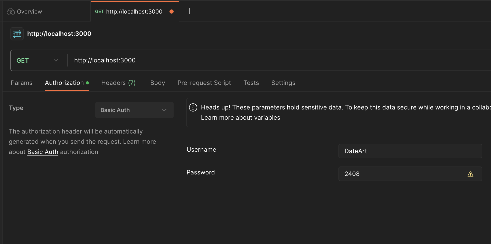
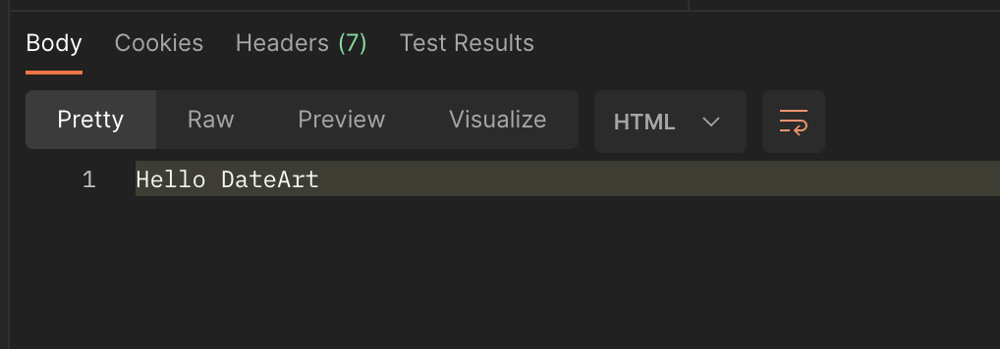
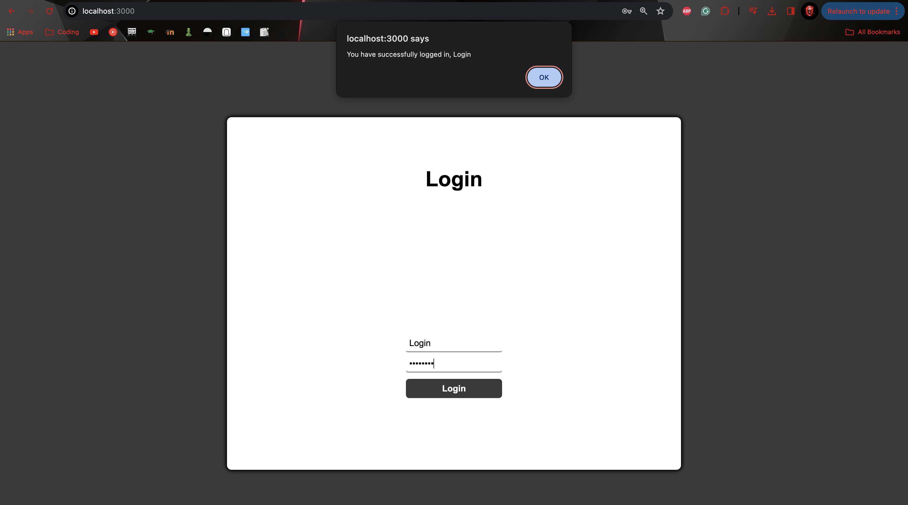
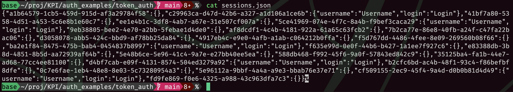
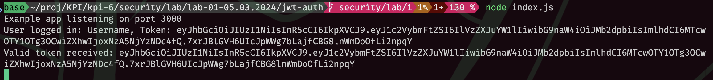
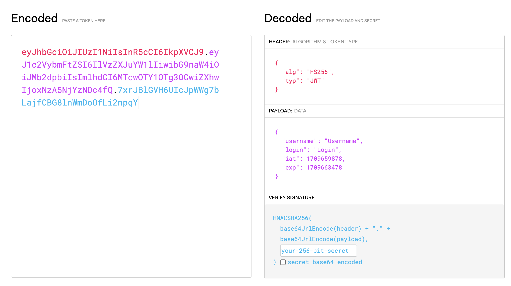

# Лабораторна робота №1

## Тема

Роздивитись основні методи авторизації

## Виконання

### Застосунок 1

Розглянемо код застосунку, щоб зрозуміти, як відбувається логін. Ось основні моменти, на які варто звернути увагу:

```javascript
app.use((req, res, next) => {
    const authorizationHeader = req.get('Authorization');
    ...
    const decodedAuthorizationHeader = Buffer.from(authorizationBase64Part, 'base64').toString('utf-8');
    const login = decodedAuthorizationHeader.split(':')[0];
    const password = decodedAuthorizationHeader.split(':')[1];
    ...
    if (login == 'DateArt' && password == '2408') {
        req.login = login;
        return next();
    }
    ...
});
```

З цього коду видно, що для авторизації використовується заголовок `Authorization`, де очікується Basic Authentication. Заголовок декодується з base64, і з нього витягуються логін та пароль. Якщо логін відповідає 'DateArt' і пароль '2408', запит пропускається далі.

Запустимо застосунок, для цього зробимо наступне:

1. Перевіримо що в мене встановлено node.js за допомогою `brew`
2. Створимо пакетик `npm init -y`
3. Поставимо експресс `npm install express`
4. Та запустимо сервер `node index.js`
5. Бачимо, що все запустилось `Example app listening on port 3000`

Використаємо постман, щоб залогінитись.



У відповіді бачимо, що ми залогінились.



Ми залогінились до першого застосунку успішно.

### Застосунок 2

Запустили його так само як і перший, але ще додали більше залежностей, бо там вони використовуються.



Використали саме таке, бо в нас у файлі ось що записано:

```javascript
const users = [
    {
        login: 'Login',
        password: 'Password',
        username: 'Username',
    },
    {
        login: 'Login1',
        password: 'Password1',
        username: 'Username1',
    }
]
```

### Застосунок 3

Запустимо 3 застосунок. Так само заходимо з тим самим логіном та паролем.




### Додаткове завдання

Переробимо це все тепер з jwt

1. Треба встановити для цього бібліотечку `npm install jsonwebtoken`
2. Та імпортувати `const jwt = require('jsonwebtoken');`
3. Далі я замінив всі токени на jwt токени підписані з моїм секретним ключем
4. Та додав трохи логування, щоб бачити їх в терміналі



Далі я на сайті <https://jwt.io/> його розшифрував, щоб подивитись що в ньому.



## Висновок

На цій лабораторній роботі я розглянув кілька застосунків з різними формами аутентифікації та модифікував один з них, щоб той використовував JWT token.
