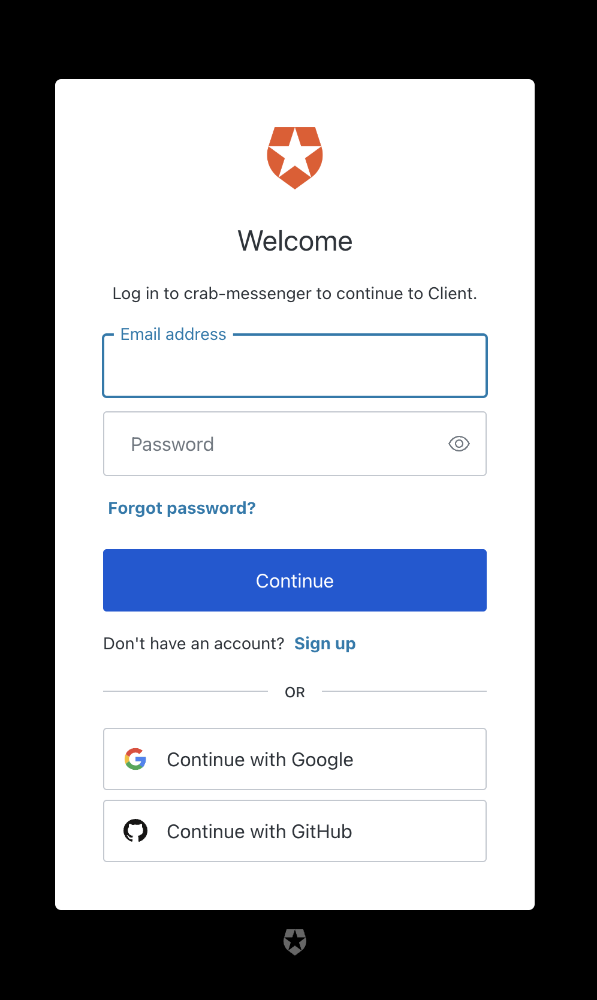

# Лабораторна робота №2

## Тема

Засвоювання базових навичок OAuth2 авторизаційного протокола

## Виконання

Ви можете переглянути цей звіт у маркдаун форматі <https://github.com/kiIIer/kpi-6/tree/main/security/lab/lab-02-18.03.2024>

### Створення запиту на отримання токеру

Для надсилання цього запису використаємо постман.


А тепер внесемо значення вказані в звіті.


Як видно у відповіді, щось пішло не так, а саме, цей сервіс вимкнено для цього домену. Тому я вирішив описати тут щось цікавіше.

### Щось цікавіше

Замість завдання цієї лабораторної та додаткового завдання я вирішив розписати інший процес отримання токенів, а саме  Device Authorization Flow.

Device Authorization Flow є частиною OAuth 2.0 і представляє собою протокол для авторизації пристроїв, які не мають можливості безпосереднього вводу облікових даних користувача, таких як смарт-ТВ, ігрові консолі або пристрої з обмеженим інтерфейсом користувача. Цей протокол забезпечує безпечний спосіб для користувачів надати свої облікові дані через веб-браузер на іншому пристрої, такому як смартфон або комп'ютер.

Коли користувач хоче увійти у додаток на пристрої, додаток запитує у сервера авторизації спеціальний користувацький код. Сервер авторизації повертає цей код разом із URL-адресою, куди користувач має перейти для входу в систему. Користувач вводить отриманий код на цій веб-сторінці у своєму браузері на іншому пристрої, що має повноцінні можливості вводу. Після вводу коду та успішної авторизації користувача, сервер авторизації надсилає access token на пристрій, який тепер може використовувати цей токен для доступу до захищених ресурсів. Така схема входу є безпечною, оскільки користувацькі облікові дані не передаються через менш захищений пристрій, і не вимагає від користувачів запам'ятовувати та вводити складні паролі на пристроях з обмеженим інтерфейсом. Замість цього, вони використовують знайомий і безпечний інтерфейс веб-браузера на своєму основному пристрої. Це також знижує ризик фішингу, оскільки користувачі можуть бути більш впевнені у легітимності веб-сторінки авторизації, яку вони вже знають і довіряють.

Я вже робив це, тому тут розпишу як само було зроблено цей флоу. Розглянемо приклад використання.

Спочатку користувач відкриває мій застосунок, та потрапляє на сторінку логіну, де йому повідомляється що потрібно ввести наданий код на заданій сторінці, та що ця сторінка автоматично відкриється. Ось як це виглядає.


Доступ до інших сторінок вимкнений, доки відбувається вхід, давайте переглянемо як саме було отримано код, який потрібно ввести на сторінці.

```rust
 async fn start_device_flow(&self) -> Result<StartFlowResponse, AuthError> {
        let client = Client::new();
        let url = format!("https://{}/oauth/device/code", self.domain);

        let form_params = [
            ("client_id", &self.client_id),
            ("audience", &self.audience),
            ("scope", &"profile openid offline_access email".to_string()),
        ];

        let response = client
            .post(url)
            .header("content-type", "application/x-www-form-urlencoded")
            .form(&form_params)
            .send()
            .await
            .map_err(|err| AuthError::Other {
                description: err.to_string(),
            })?;

        response
            .json::<StartFlowResponse>()
            .await
            .map_err(|_| AuthError::Other {
                description: "Failed to parse JSON response".to_string(),
            })
    }
```

Ця функція описує початок флоу авторизації пристроя. Де на заданий в змінних оточення при компіляції домен, а саме шлях для отримання девайс кодів, надсилається запит з вказаними id клієнта, це id цього застосунку, audience та нам потрібно отримати профіль, id токен, email та refresh токен. З додатковими хедерами це відправляється як пост запит та у відповідь ми отримаємо `StartFlowResponse`

```rust
#[derive(Debug, Deserialize, Clone)]
pub struct StartFlowResponse {
    pub device_code: String,
    pub user_code: String,
    pub verification_uri: String,
    pub interval: i32,
}
```

Ось він, в ньому є код девайсу(тимчасовий ідентифікатор цього пристроя, який ми потім використаємо для отримання токенів), код який користувач має ввести, посилання на яке користувач має перейти та з яким інтерфалом робити опитування.

Мій застосунок автоматично відкриває посилання в браузері за замовчуванням, де користувач попадає на ту сторінку.

Ось як виглядає ця сторінка


Після підтвердження що код саме такий, якщо користувач вже входив у свій аккаунт в цьому браузері, він підтвердиться, а ні, то потрібно буде зайти знову.



Я використаю свій google профіль.


Це все що відбувається для клієнту, давайте переглянемо як це праціє для застосунку.

Після початку процесу, застосунок запитує з інтервалом та кодом цього пристрою чи було підтверджено його.

```rust
 async fn poll_access_token(
        &self,
        device_code: &str,
        interval: i32,
    ) -> Result<AuthState, AuthError> {
        // Define the URL and form parameters for the token request
        let token_url = format!("https://{}/oauth/token", self.domain);
        let form_params = [
            ("grant_type", "urn:ietf:params:oauth:grant-type:device_code"),
            ("device_code", device_code),
            ("client_id", &self.client_id),
        ];

        let client = Client::new();

        loop {
            tokio::time::sleep(Duration::from_secs(interval as u64)).await;

            let response = client
                .post(&token_url)
                .header("content-type", "application/x-www-form-urlencoded")
                .form(&form_params)
                .send()
                .await;

            match response {
                Ok(response) => match response.status() {
                    reqwest::StatusCode::FORBIDDEN => {
                        let error_response: Result<serde_json::Value, _> = response.json().await;
                        match error_response {
                            Ok(json) => match json.get("error").and_then(|e| e.as_str()) {
                                Some("authorization_pending") => continue,
                                Some("access_denied") => return Err(AuthError::AccessDenied),
                                Some("expired_token") => return Err(AuthError::ExpiredToken),
                                _ => {
                                    return Err(AuthError::Other {
                                        description: json
                                            .get("error_description")
                                            .and_then(|e| e.as_str())
                                            .unwrap_or("Unknown error")
                                            .to_string(),
                                    })
                                }
                            },
                            Err(_) => {
                                return Err(AuthError::Other {
                                    description: "Failed to parse error response".to_string(),
                                });
                            }
                        }
                    }
                    reqwest::StatusCode::OK => {
                        let token_response: Result<AuthState, _> = response.json().await;
                        return match token_response {
                            Ok(data) => Ok(data),
                            Err(_) => Err(AuthError::Other {
                                description: "Failed to parse token response".to_string(),
                            }),
                        };
                    }
                    _ => {
                        return Err(AuthError::Other {
                            description: "Unexpected response status".to_string(),
                        });
                    }
                },
                Err(err) => {
                    return Err(AuthError::Other {
                        description: err.to_string(),
                    });
                }
            }
        }
    }
```

Як видно в цьому коді напочатку, готується запит який буде надсилатись, це так званий полінг, ми в тіло запиту додали девайс код наш, який ми отримали до цього, та далі просто надсилаємо запити з інтервалом та оброблюємо що ми отримали. Якщо в нас помилка `authorization_pending`, нам просто потрібно продовжувати робити запити, коли користувач в себе підтвердить, ми отримаємо наступне.

```rust
#[derive(Deserialize, Clone)]
pub struct AuthState {
    pub access_token: String,
    pub refresh_token: String,
    pub id_token: String,
    pub token_type: String,
    pub expires_in: i64,
}
```

Де буде access_token, який ми надаємо серверу для підтвердження того що це дійсно ми, рефреш токен, щоб отримати новий без необхідності повторного входу, та id_token де вказано інформацію про користувача, бо ми це все запитували в скоупі.

Як видно, після підтвердження, в застосунку з'явились наші токени.


Та ми можемо використовувати їх для роботи з сервером


## Висновок

На цій лабораторній роботі я повторив як саме отримувати токени за запитом та детально описав процесс аутентифіцації девайсу
