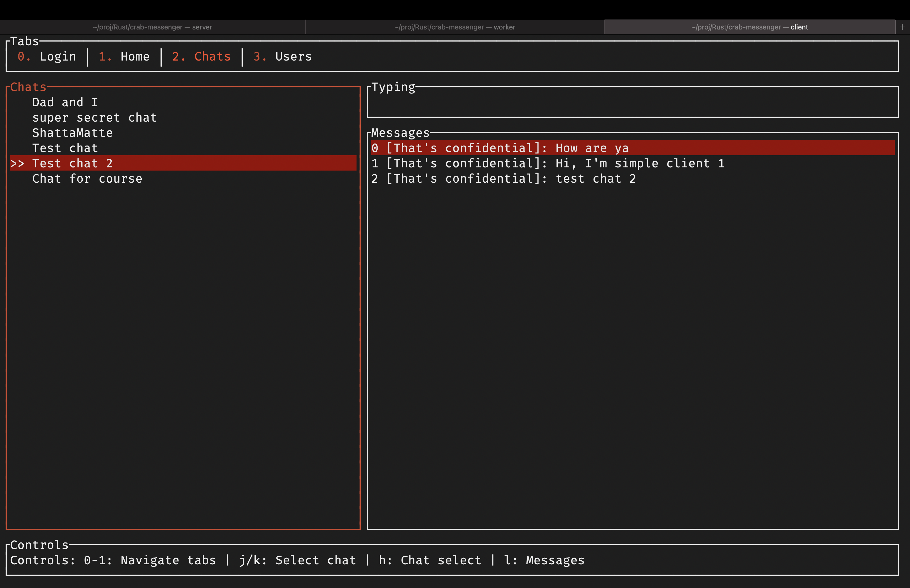
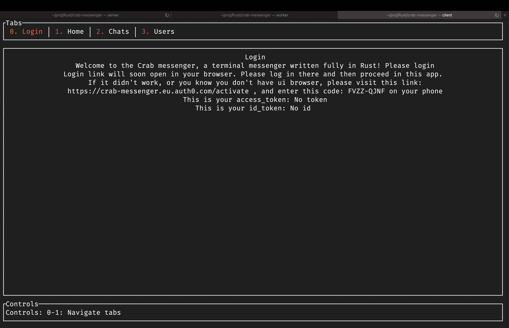
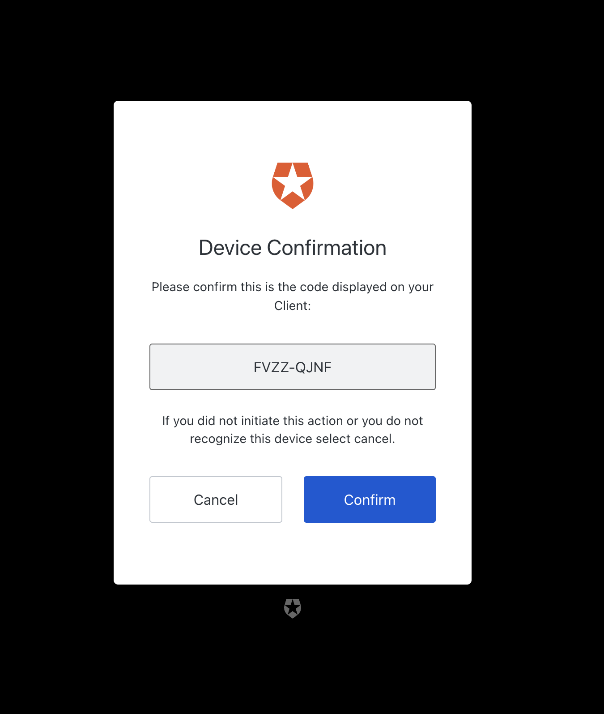
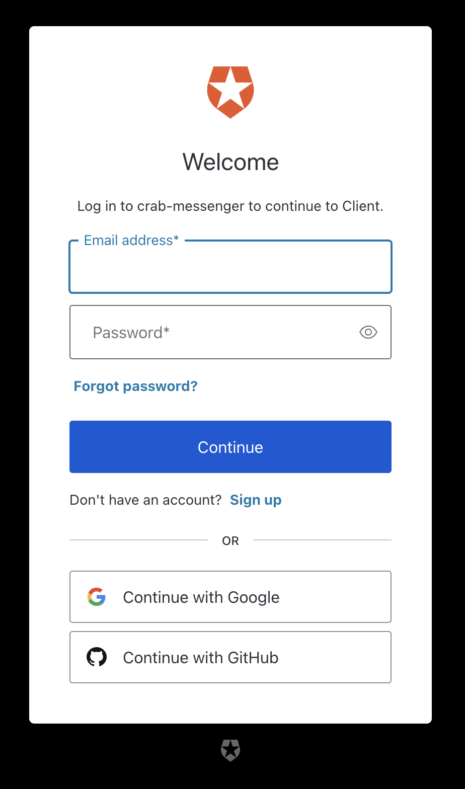
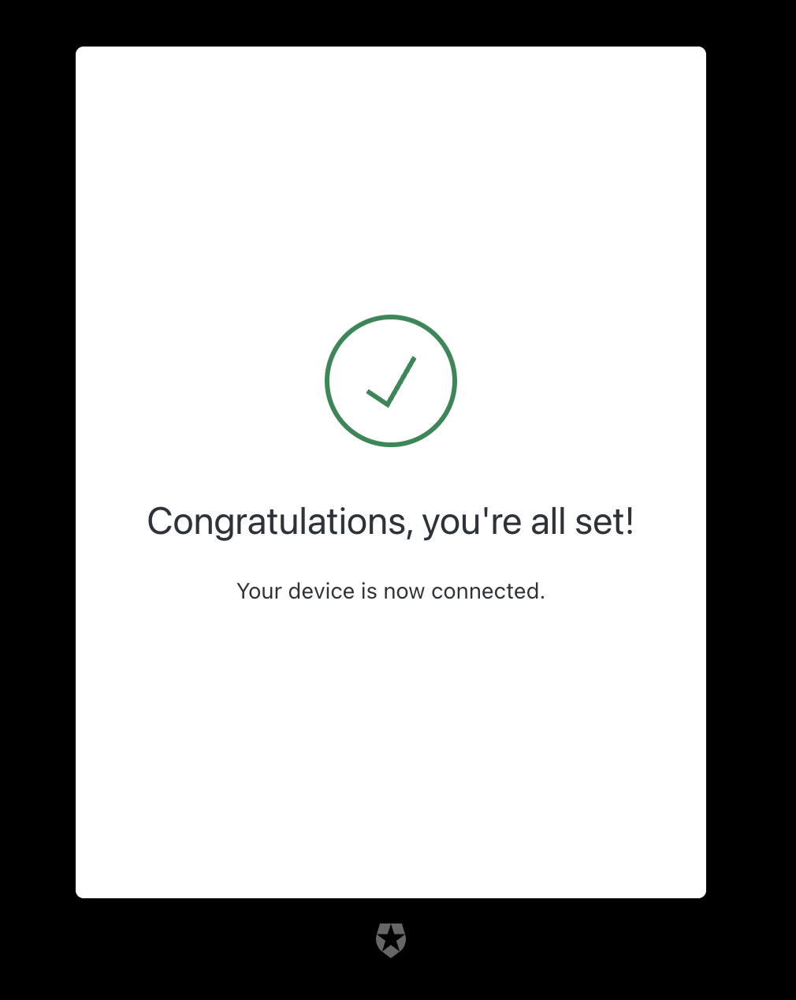
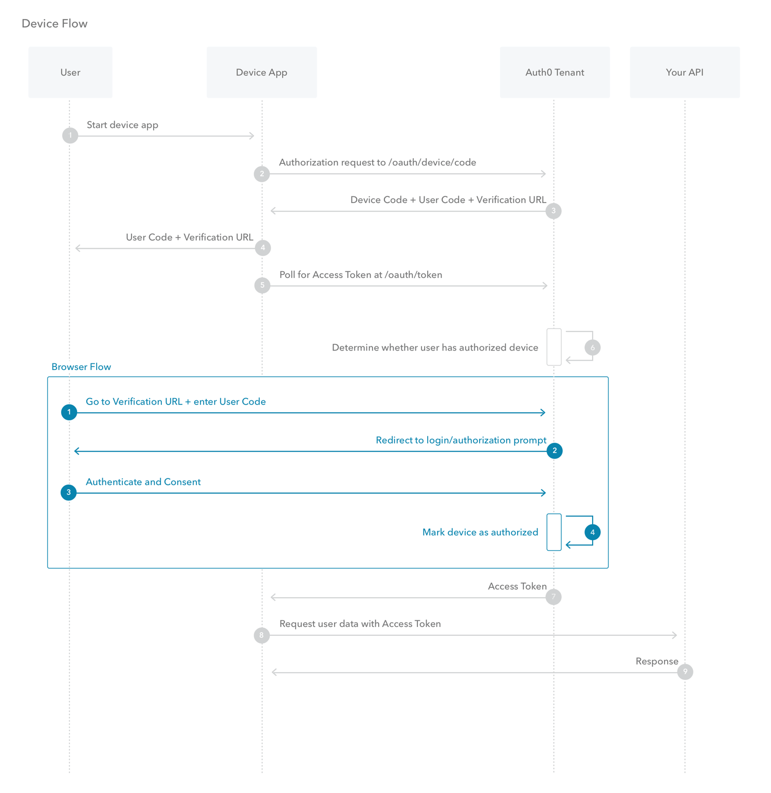

# Лабораторні роботи 3-6

<https://github.com/kiIIer/kpi-6/security/lab/lab-03-06-13.05.2024>

В цьому документі я опишу як само вказані лабораторні роботи були виконані. Оскільки кожна лабораторна була виконана під час розробки моєї курсової роботи, я опишу цей проект в деталях в одному документі, зробивши акцент на частини проекту які реалізовують лабораторні.

## Загальна інформація про проект

Проект - це термінальний месенджер, який дозволяє користувачам з терміналу під'єднуватись до чат каналів та обмінюватись повідомленнями. Користувачі можуть створювати канали, запрошувати інших користувачів до них. Я не буду пояснювати як працюють всі частини застосунку, а тільки сконцентруюсь на частинах про безпеку користувачів.



На рисунку 1 зображено зовнішній вигляд застосунку, замість імен різних користувачів було встановлено заміну, оскільки то адреси електронної пошти, і я не хочу їх показувати. Як ви вже зрозуміли, в мене є багато різних користувачів та в кожного свої можливо приватні чати та моє завдання як розробниа, захистити приватні повідомлення кожного користувача. Для цього потрібно було зробити систему аутентифікації користувачів, створення аккаунтів, зміни паролів користувачів та щоб позбавити мене відповідальності за персональні дані користувачів, я не хочу зберігати паролі користувачів в себе в системі.

## Аутентифікація з точки зору користувача

Для користувача процес аутентифікації виглядає наступним чином, коли користувач заходить до застосунку, він побачить наступне повідомлення:



На цій сторінці, користувача повідомляють, що це термінальний месенджер та щоб залогінитись потрібно перейти за посиланням, ввести код та залогінитись у браузері. Якщо комп'ютер користувача дозволяє, браузер з посиланням відкриється автоматично, якщо ж ні, користувачеві потрібно буде перейти на сторінку з іншого комп'ютера чи телефону.



На цьому рисунку зображено що користувач побачить в браузері після переадресації. Тут йому потрібно буде ввести код з застосунку та підтвердити його.



Після введення коду, користувачеві потрібно буде зайти до свого аккаунту, якщо він цього давно не робив, але якщо це було недавно, Auth0 автоматично зможе залогінити користувача.

Тут користувач може просто залогінитись, створити новий аккаунт, використати інші Identity provider-и такі як Google або GitHub, або змінити пароль, якщо користувач використовував його та забув.



Після вводу даних користувача, він побачить що девайс було аутентифіковано та він може користуватись месенджером в його терміналі.

Весь цей процес з точки зору користувача, більше йому не потрібно нічого робити та він може спокійно використовувати мій застосунок, а тепер розглянемо все це з точки зору розробника та як це все працює "за кулісами"

## Аутентифікація з точки зору розробника

Щоб коритсувачі не надсилали мені свій пароль, щоб він в мене не зберігався і навіть щоб його не було в запитах, я реалізував Device Authorization Flow.

Device Authorization Flow є частиною OAuth 2.0 і представляє собою протокол для авторизації пристроїв, які не мають можливості безпосереднього вводу облікових даних користувача, таких як смарт-ТВ, ігрові консолі або пристрої з обмеженим інтерфейсом користувача. Цей протокол забезпечує безпечний спосіб для користувачів надати свої облікові дані через веб-браузер на іншому пристрої, такому як смартфон або комп'ютер. Оскільки це термінальний застосунок на потенційному сервері без UI частини, цей флоу підходить ідеально для цього проекту.



Розглянемо цю діаграму з [документації Auth0](https://auth0.com/docs/get-started/authentication-and-authorization-flow/device-authorization-flow). Коли користувач хоче увійти у додаток на пристрої, додаток запитує у сервера авторизації спеціальний користувацький код. Сервер авторизації повертає цей код разом із URL-адресою, куди користувач має перейти для входу в систему. Користувач вводить отриманий код на цій веб-сторінці у своєму браузері на іншому пристрої, що має повноцінні можливості вводу. Після вводу коду та успішної авторизації користувача, сервер авторизації надсилає access token на пристрій, який тепер може використовувати цей токен для доступу до захищених ресурсів. Така схема входу є безпечною, оскільки користувацькі облікові дані не передаються через менш захищений пристрій, і не вимагає від користувачів запам'ятовувати та вводити складні паролі на пристроях з обмеженим інтерфейсом. Замість цього, вони використовують знайомий і безпечний інтерфейс веб-браузера на своєму основному пристрої. Це також знижує ризик фішингу, оскільки користувачі можуть бути більш впевнені у легітимності веб-сторінки авторизації, яку вони вже знають і довіряють.

На цьому етапі користувач вже залогінений, та щоб йому не довелось перезаходити, в нас є refresh token, за допомогою якого ми можемо постійно переотримувати access token. Тому в клієнтському затсосунку коли токен майже закінчився ми переотримуємо його.

## Програмна реалізація

Розглянемо тут саме код який виконує всі запити, перевірки і всяке таке.

```rust
 async fn start_device_flow(&self) -> Result<StartFlowResponse, AuthError> {
        let client = Client::new();
        let url = format!("https://{}/oauth/device/code", self.domain);

        let form_params = [
            ("client_id", &self.client_id),
            ("audience", &self.audience),
            ("scope", &"profile openid offline_access email".to_string()),
        ];

        let response = client
            .post(url)
            .header("content-type", "application/x-www-form-urlencoded")
            .form(&form_params)
            .send()
            .await
            .map_err(|err| AuthError::Other {
                description: err.to_string(),
            })?;

        response
            .json::<StartFlowResponse>()
            .await
            .map_err(|_| AuthError::Other {
                description: "Failed to parse JSON response".to_string(),
            })
    }
```

Ця функція описує початок флоу авторизації пристроя. Де на заданий в змінних оточення при компіляції домен, а саме шлях для отримання девайс кодів, надсилається запит з вказаними id клієнта, це id цього застосунку, audience та нам потрібно отримати профіль, id токен, email та refresh токен. З додатковими хедерами це відправляється як пост запит та у відповідь ми отримаємо `StartFlowResponse`

```rust
#[derive(Debug, Deserialize, Clone)]
pub struct StartFlowResponse {
    pub device_code: String,
    pub user_code: String,
    pub verification_uri: String,
    pub interval: i32,
}
```

Ось він, в ньому є код девайсу(тимчасовий ідентифікатор цього пристроя, який ми потім використаємо для отримання токенів), код який користувач має ввести, посилання на яке користувач має перейти та з яким інтерфалом робити опитування.

Після початку процесу, застосунок запитує з інтервалом та кодом цього пристрою чи було підтверджено його.

```rust
 async fn poll_access_token(
        &self,
        device_code: &str,
        interval: i32,
    ) -> Result<AuthState, AuthError> {
        // Define the URL and form parameters for the token request
        let token_url = format!("https://{}/oauth/token", self.domain);
        let form_params = [
            ("grant_type", "urn:ietf:params:oauth:grant-type:device_code"),
            ("device_code", device_code),
            ("client_id", &self.client_id),
        ];

        let client = Client::new();

        loop {
            tokio::time::sleep(Duration::from_secs(interval as u64)).await;

            let response = client
                .post(&token_url)
                .header("content-type", "application/x-www-form-urlencoded")
                .form(&form_params)
                .send()
                .await;

            match response {
                Ok(response) => match response.status() {
                    reqwest::StatusCode::FORBIDDEN => {
                        let error_response: Result<serde_json::Value, _> = response.json().await;
                        match error_response {
                            Ok(json) => match json.get("error").and_then(|e| e.as_str()) {
                                Some("authorization_pending") => continue,
                                Some("access_denied") => return Err(AuthError::AccessDenied),
                                Some("expired_token") => return Err(AuthError::ExpiredToken),
                                _ => {
                                    return Err(AuthError::Other {
                                        description: json
                                            .get("error_description")
                                            .and_then(|e| e.as_str())
                                            .unwrap_or("Unknown error")
                                            .to_string(),
                                    })
                                }
                            },
                            Err(_) => {
                                return Err(AuthError::Other {
                                    description: "Failed to parse error response".to_string(),
                                });
                            }
                        }
                    }
                    reqwest::StatusCode::OK => {
                        let token_response: Result<AuthState, _> = response.json().await;
                        return match token_response {
                            Ok(data) => Ok(data),
                            Err(_) => Err(AuthError::Other {
                                description: "Failed to parse token response".to_string(),
                            }),
                        };
                    }
                    _ => {
                        return Err(AuthError::Other {
                            description: "Unexpected response status".to_string(),
                        });
                    }
                },
                Err(err) => {
                    return Err(AuthError::Other {
                        description: err.to_string(),
                    });
                }
            }
        }
    }
```

Як видно в цьому коді напочатку, готується запит який буде надсилатись, це так званий полінг, ми в тіло запиту додали девайс код наш, який ми отримали до цього, та далі просто надсилаємо запити з інтервалом та оброблюємо що ми отримали. Якщо в нас помилка `authorization_pending`, нам просто потрібно продовжувати робити запити, коли користувач в себе підтвердить, ми отримаємо наступне.

```rust
#[derive(Deserialize, Clone)]
pub struct AuthState {
    pub access_token: String,
    pub refresh_token: String,
    pub id_token: String,
    pub token_type: String,
    pub expires_in: i64,
}
```

Де буде access_token, який ми надаємо серверу для підтвердження того що це дійсно ми, рефреш токен, щоб отримати новий без необхідності повторного входу, та id_token де вказано інформацію про користувача, бо ми це все запитували в скоупі.

Тепер в нас є access_token, refresh_token, та коли його треба оновити, переглянемо як саме відбувається оновлення

```rust
handle.spawn(async move {
                    tokio::time::sleep(Duration::from_secs(expires_in as u64)).await;
                    let result = auth.request_refresh_token(&refresh_token).await;

                    if let Ok(new_auth) = result {
                        tx.send(LoginSuccess(new_auth))
                            .expect("Couldn't send the stuff");
                    }
                });
```

Ця частина запустить код для оновлення токену, це виконує додаткове завдання до лаби 4, та код виглядає наступним чином:

```rust
 async fn request_refresh_token(&self, refresh_token: &str) -> Result<AuthState, AuthError> {
        let token_url = format!("https://{}/oauth/token", self.domain);

        let client = reqwest::Client::new();
        let form_params = [
            ("grant_type", "refresh_token"),
            ("client_id", &self.client_id),
            ("refresh_token", refresh_token),
        ];

        let response = client
            .post(&token_url)
            .header("content-type", "application/x-www-form-urlencoded")
            .form(&form_params)
            .send()
            .await
            .map_err(|err| AuthError::Other {
                description: format!("Request error: {}", err),
            })?;

        if response.status() != reqwest::StatusCode::OK {
            let error_response: ErrorResponse =
                response.json().await.map_err(|err| AuthError::Other {
                    description: format!("Failed to parse error response: {}", err),
                })?;

            match error_response.error.as_str() {
                "authorization_pending" => return Err(AuthError::AccessDenied),
                "access_denied" => return Err(AuthError::AccessDenied),
                "expired_token" => return Err(AuthError::ExpiredToken),
                _ => {
                    return Err(AuthError::Other {
                        description: format!(
                            "{}: {}",
                            error_response.error,
                            error_response
                                .error_description
                                .unwrap_or_else(|| "Unknown error".to_string())
                        ),
                    })
                }
            }
        }

        let poll_response: AuthState = response.json().await.map_err(|err| AuthError::Other {
            description: format!("Failed to parse JSON response: {}", err),
        })?;
        Ok(poll_response)
    }
```

Це по суті виконує лабораторну роботу номер 3, бо ми отримуємо токен, оновлюємо його за допомогою refresh токену та на додатковий бал якщо користувач хоче оновити свій пароль бо він його забув, він може на сторінці натиснути кнопку щоб йому на електронну пошту надійшло повідомлення для зміни пароля, яке можна викликати і з сервера за допомогою

```bash
curl --request POST \
  --url https://YOUR_AUTH0_DOMAIN/api/v2/tickets/password-change \
  --header 'authorization: Bearer ${AUTH0_MANAGEMENT_API_TOKEN}' \
  --header 'content-type: application/json' \
  --data '{
    "result_url": "http://YOUR_APP_CALLBACK_URL",
    "user_id": "auth0|USER_ID",
    "ttl_sec": 86400,
    "mark_email_as_verified": false,
    "includeEmailInRedirect": false
  }'

```

Це як додаткове завдання до лаби 3.

## Серверна частина

А тепер переглянемо серверну частину застосунку, яка відповідальна за перевірку токенів. І тим самим виконує лаби 4 та 5.

```rust
    #[tracing::instrument(skip(self, req))]
    pub async fn intercept(&self, mut req: Request<()>) -> Result<Request<()>, Status> {
        info!("Intercepting request");
        let self_clone = self.clone();

        let headers = req.metadata();
        let token = headers
            .get("authorization")
            .to_owned()
            .and_then(|val| val.to_str().ok())
            .ok_or_else(|| {
                warn!("No authorization token found");
                Status::unauthenticated("No authorization token found")
            })?;

        let mut validation = Validation::new(Algorithm::RS256);
        validation.set_audience(&["crab-api", "https://crab-messenger.eu.auth0.com/userinfo"]);

        let token_message = decode::<AccessToken>(
            &token,
            &DecodingKey::from_rsa_components(&self.server_n, &self.server_e)
                .expect("Failed to decode public key"),
            &validation,
        )
        .map_err(|e| {
            error!("Failed to decode token: {}", e);
            Status::unauthenticated("Failed to decode token")
        })?;

        let access_token = token_message.claims;
        let user_id = &access_token.id;

        match self_clone.check_user(user_id).await {
            Ok(_) => {
                info!("User verified or created successfully");
            }
            Err(e) => {
                error!("Failed to verify or create user: {}", e);
                return Err(Status::internal("Failed to verify or create user"));
            }
        }

        let mut metadata_map = MetadataMap::new();
        let user_id_meta = MetadataValue::from_str(user_id).map_err(|_| {
            error!("Invalid user_id");
            Status::invalid_argument("Invalid user_id")
        })?;

        metadata_map.insert("user_id", user_id_meta);
        *req.metadata_mut() = metadata_map;

        Ok(req)
    }
```

Я використовую зонішню бібліотеку, де після встановлення audience, та задавши серверні частини ключа, я можу перевірити та дешифрувати токен, ця бібліотека автоматично перевірить чи його час ще не вийшов, та що в ньому правильна audience, та після цього я отримаю дані всередині його.

Далі я зможу дістати id користувача та додати її до методати запиту, оскільки це інтерсептор, цей код виконується перед виконанням кожного запиту, а тому неаутентифіковай користувач не зможе навіть потрапити до жодного методу сервера, але якщо він дійшов туди, то він горантовано мав валідний токен.

## Швидке пояснення щодо лаб

Тут я просто скажу чому кожна лаба була виконана.

### Номер 3

Я отримую токен, та оновлюю його за допомогою refresh token, на додатковий бал було надано приклад запиту до менеджменту тенанта, але в системі користувачі можуть тицьнути на сторінці

### Номер 4

Токен я отримую але іншого типу, та на додаткове завдання, клієнт оновлює токен автоматично якщо він майже прострочений

### Номер 5

На сервері виконується перевірка сигнатури токена та якщо вона не співпадає, запит відхиляється

### Номер 6

Я використовую сторінку від Auth0 та в мене отримання токену ще веселіше ніж запропонований code grant type

## Висновок

На цих лабораторних роботах я повторив деталі роботи Auth0 та закріпив навички роботи з токенами. Свої знання я використав в реалізації безпечного для користувачів та їх даних проекту та проаналізував його частини, що відносяться до лабораторних робіт
