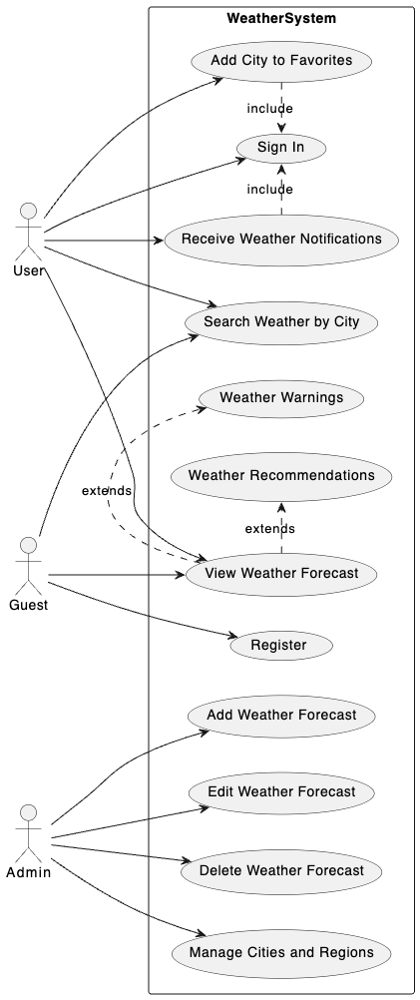

# Лабораторна робота №1

## Зміст

- [Лабораторна робота №1](#лабораторна-робота-1)
  - [Зміст](#зміст)
  - [Тема](#тема)
  - [Мета](#мета)
  - [Варіант](#варіант)
  - [Виконання](#виконання)
    - [Опис системи](#опис-системи)
    - [Актори](#актори)
      - [1. Гість (Guest)](#1-гість-guest)
      - [2. Зареєстрований Користувач (User)](#2-зареєстрований-користувач-user)
      - [3. Адміністратор (Admin)](#3-адміністратор-admin)
    - [Взаємодія з Системою](#взаємодія-з-системою)
    - [Діаграма прецендентів](#діаграма-прецендентів)
      - [Прецендент "Вхід в систему"](#прецендент-вхід-в-систему)
      - [Прецендент "Отримання повідомлень про погоду"](#прецендент-отримання-повідомлень-про-погоду)
      - [Прецендент "Перегляд прогнозу погоди"](#прецендент-перегляд-прогнозу-погоди)
  - [Висновок](#висновок)

## Тема

Побудова діаграми варіантів використання

## Мета

Ознайомлення з методологією моделювання прецедентів з урахуванням мови UML.

## Варіант

| Варіант | Предметна галузь |
| ------- | ---------------- |
| 18      | ІС «Погода»      |

## Виконання

### Опис системи

У високому темпі сучасного світу, де життя бурхливо міняється щомиті, а інформація струменить на нас з усіх боків, здатність швидко та зручно отримувати саме ту інформацію, яка нам потрібна, стає не просто перевагою, а необхідністю. Серед множини важливих даних, які впливають на наше повсякденне життя, прогноз погоди займає особливе місце. Він впливає на наше планування, настрій, здоров'я та багато інших аспектів життя. У світлі цього, значення актуальної та точної інформації про погоду не може бути переоцінено.

Саме тут і вступає в гру наша система - інноваційний веб-сайт прогнозу погоди, що створений, аби задовольнити потреби кожної людини у пошуку інформації про погодні умови в різних куточках світу. Незалежно від того, плануєте ви поїздку в інше місто або хочете знати, чи варто брати з собою парасольку на роботу, наш сайт надає найточніші та найактуальніші прогнози погоди для множини міст та регіонів.

Основне завдання нашої системи - бути максимально зрозумілою та простою у використанні для кожного користувача. Ми розуміємо, що у світі, де кожна хвилина на рахунку, немає часу на довге освоєння складних інтерфейсів. Тому наш сайт має інтуїтивно зрозумілий дизайн, що дозволяє користувачам швидко отримати потрібну інформацію без зайвих зусиль.

В нас всього 3 суб'єкти: Guest, User та Admin. Розгяльмо кожного з них детальніше.

Guest - це користувач без аккаунту, який вперше зайшов на наш сайт. Він може тільки шукати прогнози за містами та регіонами. Надавши назву міста де він хоче переглянути прогноз, на сайті з'являться міста які мають ту назву, щоб користувач міг обрати яке потрібне саме йому, там він зможе переглянути новітній прогноз прогоди в тому місті, чи буде дощ, рекомендації щодо одягу, парасольки, попередження про сильні вітри або штом, тощо. Але щоб отримати доступ до всіх послуг нашої системи необхідно створити аккаунт.

Для створення аккаунту, потрібно ввести свою електронну пошту та пароль, або обрати одиного з identity провайдерів, такі як Google, Microsoft, Github. Створивши акаунт, в користувача буде його домашня сторінка зі сповіщеннями про погоду в його обраних містах. Щоб додати місто до обраного потрібно буде натиснути спеціальну кнопку на відповідному місті. Ця опція буде зручною для користувачів які постійно користуються нашим застосунком, бо вони будуть одразу бачити прогноз в їх містах та попередження, якщо в одному з них буде дощ.

Прогнози додаються до сайту адміністраторами, в них є нова особлива сторінка для додавання прогнозу погоди до міста. За допомогою зручного інтерфейсу, можна буде швидко додавати прогнози та зберігати їх. Це забезпечить наш сайт новітньою інформацією про прогнози.

### Актори

Для технічного опису акторів у системі прогнозування погоди, ми можемо структурувати інформацію наступним чином, щоб згодом легко перенести її у діаграми використання UML.

#### 1. Гість (Guest)

- Опис: Користувач, який не має облікового запису та відвідує сайт вперше або без входу в систему.
- Можливості:
  - Пошук прогнозу погоди за назвою міста або регіону.
  - Перегляд детального прогнозу погоди для обраного міста, включаючи інформацію про можливі осадки, рекомендації щодо одягу, попередження про екстремальні погодні умови.

#### 2. Зареєстрований Користувач (User)

- Опис: Користувач, який створив аккаунт на сайті, використовуючи електронну пошту та пароль або обравши одного з зовнішніх постачальників ідентифікації (наприклад, Google, Microsoft, Github).
- Можливості:
  - Всі можливості Гостя.
  - Додавання міст до списку обраних для швидкого доступу до прогнозів.
  - Отримання сповіщень про погодні умови в обраних містах.

#### 3. Адміністратор (Admin)

- Опис: Користувач з правами адміністратора, відповідальний за управління контентом сайту.
- Можливості:
  - Додавання, оновлення та видалення прогнозів погоди.
  - Управління обліковими записами користувачів.
  - Моніторинг та вирішення технічних проблем сайту.

### Взаємодія з Системою

- Гість має обмежений доступ до функціоналу сайту, але може безперешкодно переглядати основну інформацію про погоду.
- Зареєстрований Користувач отримує персоналізований досвід з можливістю налаштування сповіщень та швидкого доступу до інформації про погоду в обраних містах.
- Адміністратор забезпечує актуальність та точність даних на сайті, а також підтримує його безперебійну роботу.

Ця структура допоможе чітко визначити ролі та відповідальності кожного актора в системі, що є ключовим для подальшого аналізу та проектування системи.

### Діаграма прецендентів

Діаграму прецендентів було виконано мовою plantuml та її можна переглянути у файлі [use-case.puml](./use-case.puml), ось як виглядає намальована діаграма

Як видно на діаграмі, ми зобразили всіх прецендентів і як вони пов'язані з користувачами та іншими прецендентами.

Розгляньмо деяких з них детальніше.

#### Прецендент "Вхід в систему"

| Аспект | Деталі |
| --- | --- |
| Назва прецеденту | Вхід в систему |
| Стислий опис | Дозволяє користувачу увійти в систему "Погода" для доступу до персоналізованих сервісів, таких як управління обраними та отримання повідомлень про погоду. |
| Суб'єкти | Користувач, Система "Погода" |
| Передумови | Користувач раніше створив обліковий запис у системі "Погода". |
| Основний потік | 1. Користувач обирає опцію "Увійти" на сайті чи в додатку. 2. Система відображає форму для введення даних для входу (наприклад, електронна пошта та пароль). 3. Користувач вводить свої дані та подає форму. 4. Система перевіряє дані проти бази даних користувачів. 5. У разі успішної перевірки користувач отримує доступ до своїх персоналізованих сервісів. 6. Користувач входить до системи і може керувати своїми обраними та налаштувати повідомлення про погоду. |
| Альтернативний потік | 1. Якщо дані не співпадають, система інформує користувача про невдалий вхід. 2. Якщо користувач забув свій пароль, він може запросити скидання паролю. 3. Якщо здійснено кілька невдалих спроб входу, система може тимчасово заблокувати обліковий запис або вимагати додаткової верифікації. |
| Післяумови | Користувач увійшов в систему "Погода" і має доступ до додаткових функцій та персоналізованого вмісту. |

#### Прецендент "Отримання повідомлень про погоду"

| Аспект | Деталі |
| --- | --- |
| Назва прецеденту | Отримання повідомлень про погоду |
| Стислий опис | Дозволяє користувачу отримувати персоналізовані повідомлення про погоду для обраних міст після входу в систему. |
| Суб'єкти | Користувач, Система "Погода" |
| Передумови | Користувач успішно увійшов в систему і має обрані міста в своєму профілі. |
| Основний потік | 1. Користувач увійшов у свій аккаунт на головній сторінці системи "Погода". 2. Система автоматично перевіряє наявність нових погодних повідомлень для обраних міст користувача. 3. Якщо є нові повідомлення, система відображає їх на головній сторінці користувача. 4. Користувач може переглянути деталі повідомлень, включаючи попередження про негоду, прогнози та рекомендації. |
| Альтернативний потік | 1. Якщо нових повідомлень немає, користувач інформується про це на головній сторінці. 2. Користувач може змінити обрані міста, щоб отримувати або не отримувати повідомлення про певне місце |
| Післяумови | Користувач інформований про актуальні погодні умови в обраних містах і може вжити необхідних заходів на основі отриманої інформації. |

#### Прецендент "Перегляд прогнозу погоди"

| Аспект | Деталі |
| --- | --- |
| Назва прецеденту | Перегляд прогнозу погоди |
| Стислий опис | Надає користувачеві можливість переглядати прогноз погоди для будь-якого міста. |
| Суб'єкти | Гість, Користувач, Система "Погода" |
| Передумови | Немає обов'язкових передумов для гостей; користувачі повинні бути увійшли в систему для доступу до розширених функцій. |
| Основний потік | 1. Суб'єкт (гість або користувач) вибирає місто для перегляду прогнозу погоди. 2. Система відображає загальнодоступний прогноз погоди для обраного міста. 3. Якщо суб'єкт є гостем, пропонується зареєструватися або увійти для отримання додаткової інформації та персоналізації. |
| Розширення | 1а. Попередження про погоду:   - Якщо для вибраного міста є попередження про погоду, система відображає їх разом із прогнозом. 1б. Рекомендації щодо погоди:   - Система може надавати рекомендації залежно від погоди, наприклад, одяг, заходи безпеки тощо. |
| Альтернативний потік | 1. Користувач може додати місто до обраних для швидкого доступу до прогнозів у майбутньому. |
| Післяумови | Суб'єкт отримав інформацію про погоду, необхідну для планування своїх дій. |

## Висновок

На цій лабораторній роботі ми познайомились з методологією моделювання прецедентів з урахуванням мови UML, обговорити нашу систему та створити діаграму прецендетів для неї. Детально описали кільки прецендентів.
