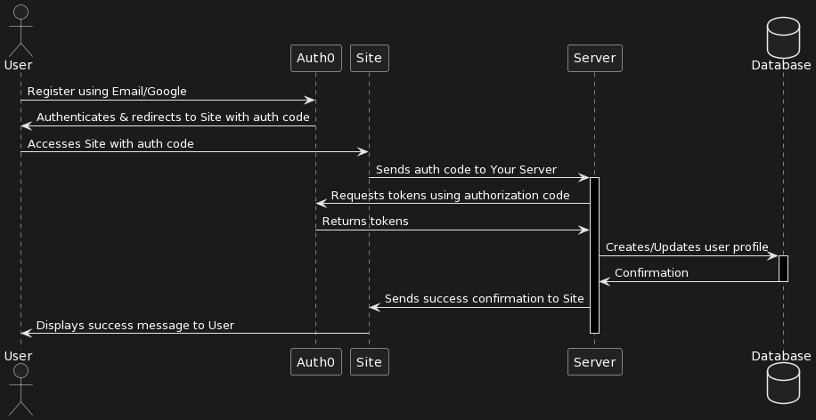

# Лабораторна робота №2

## Тема

Побудова діаграми послідовності

## Виконання

### Частини системи

Для ефективного початку будівництва діаграм послідовності, важливо зрозуміти, які компоненти системи будуть взаємодіяти між собою. Розглянемо детальніше кожну з частин.

#### Site

Single Page Application (SPA) на Angular – це клієнтська частина нашої системи, яка дозволяє користувачам взаємодіяти з нашим сервісом через зручний і інтуїтивно зрозумілий веб-інтерфейс. SPA забезпечує швидке оновлення контенту без потреби перезавантаження сторінки, що робить взаємодію з сайтом більш гладенькою та приємною для користувача. Angular допомагає в структуруванні клієнтської частини за допомогою компонентів, сервісів та модулів, що спрощує розробку та подальшу підтримку веб-додатку.

#### Server

Для коректної роботи сайту, нам потрібно мати REST сервер, з яким той буде комуніковати. Цей сервер написано на мові Golang, що забезпечує високу продуктивність та легкість у розробці масштабованих веб-додатків. Golang має потужну стандартну бібліотеку, що включає засоби для роботи з HTTP запитами, обробки JSON та взаємодії з базами даних, що робить його ідеальним вибором для створення RESTful API.

#### Database

Для зберігання інформації про користувачів, нотифікації та інші дані, нам потрібна надійна система управління базами даних. Для цього була обрана база даних PostgreSQL, яка є відкритим програмним забезпеченням з великою кількістю можливостей та підтримкою складних запитів. PostgreSQL відома своєю високою надійністю, масштабованістю та зручністю у використанні, що робить її відмінним вибором для нашої системи.

#### Auth0

Для безпечної аутентифікації користувачів та адміністраторів ми використаємо Auth0, який є облачною платформою для ідентифікації та аутентифікації, що дозволяє легко інтегрувати різні способи входу, включаючи соціальні мережі та електронну пошту. Auth0 надає гнучкі можливості налаштування та великий набір інструментів для забезпечення безпеки, включаючи двофакторну аутентифікацію та керування сеансами користувача. Це дозволяє нам забезпечити високий рівень безпеки даних користувачів, не ускладнюючи при цьому процес розробки.

### Розробка діаграми послідовностей створення акаунту

Процес створення акаунту є критично важливим для будь-якої системи, що підтримує реєстрацію та аутентифікацію користувачів. Наша система використовує поєднання Auth0 для безпечної аутентифікації та власної бази даних для зберігання специфічної інформації про користувачів. Цей підхід дозволяє нам ефективно управляти користувацькими акаунтами, забезпечуючи високий рівень безпеки і персоналізацію сервісу.

#### Чому саме такий процес?

Використання Auth0 як постачальника ідентифікації дає нам кілька переваг:

1. Безпека: Auth0 спеціалізується на безпеці аутентифікації та ідентифікації, забезпечуючи останні стандарти безпеки.
2. Гнучкість: Можливість інтегрувати різноманітні методи входу (електронна пошта, соціальні мережі, тощо) без необхідності розробки окремої логіки для кожного.
3. Спрощення розробки: Зменшується кількість коду, який потрібно написати та підтримувати для процесів аутентифікації та авторизації.

Водночас, необхідність мати користувача в нашій власній базі даних викликана потребою зберігати специфічну для додатку інформацію про користувача, таку як налаштування профілю, історію дій, персоналізований контент тощо.

#### Процес створення акаунту

1. Реєстрація через Auth0: Користувач обирає метод реєстрації (електронна пошта або через Google) і завершує процес аутентифікації в Auth0.
2. Перенаправлення до сайту з кодом авторизації: Після успішної аутентифікації, Auth0 перенаправляє користувача до сайту (SPA), передаючи у URL код авторизації.
3. Передача коду авторизації серверу: Користувач зі свого браузера (через сайт) передає отриманий код авторизації на наш сервер.
4. Запит токенів від Auth0: Сервер використовує цей код для запиту токенів у Auth0, що включають Access Token, ID Token, та можливо Refresh Token.
5. Створення або оновлення профілю користувача: Використовуючи інформацію з токенів, сервер створює або оновлює профіль користувача в нашій базі даних.
6. Підтвердження успішної реєстрації: Після підтвердження з бази даних про успішне створення або оновлення профілю, сервер повідомляє сайт про успіх операції.
7. Показ повідомлення користувачу: Сайт відображає користувачу повідомлення про успішне створення акаунту.

### Діаграма послідовностей

## Висновок

На цій лабораторній роботі ми відокремили елементи нашої системи та засоби їх взаємодії, детально розглянули процес створення акаунту та розробили діаграми послідовностей для ключових сценаріїв використання нашої системи. Це дозволило нам глибше зрозуміти архітектуру нашої системи та важливість кожного компонента в загальному процесі взаємодії.