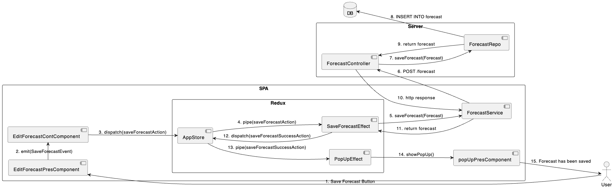

# Лабораторна робота №3

## Тема

ПОБУДОВА ДІАГРАМИ ВЗАЄМОДІЇ

## Мета

Ознайомлення з методологією та інструментальними засобами моделювання взаємодії компонентів системи на основі мови UML.

## Виконання

### Поверхневий опис системи

Для більшого розуміння наступної діаграми взаємодії, ми тут розпишемо з чого складається наша система та яка її загальна структура.

#### Сервер

В рамках нашої системи маємо рест-сервер, який є традиційним компонентом веб-додатків. Він обробляє HTTP-запити та повертає HTTP-відповіді, зазвичай у форматі JSON, що робить його зручним для використання в SPA (Single Page Applications).

На сервері є такі контролери:

- Forecast Controller — відповідає за обробку запитів, пов'язаних із прогнозом погоди.
- Notification Controller — управляє відправленням повідомлень користувачам.
- City Controller — обробляє дані, пов'язані з містами, наприклад, додавання або видалення міста зі списку.

Для кожного контролера існує відповідний репозиторій, який забезпечує взаємодію з базою даних. Репозиторії служать абстракцією, яка дозволяє виконувати складні запити до бази даних, не прив'язуючись до конкретної технології її реалізації.

#### Сайт

Сайт представляє собою односторінковий веб-додаток (SPA), створений на основі фреймворка Angular. SPA характеризується тим, що вся взаємодія користувача зі сторінкою відбувається без перезавантаження сторінки, що забезпечує плавність і швидкість роботи інтерфейсу.

В архітектурі Angular розрізняють такі поняття як:

- Контейнерні компоненти — це компоненти, що зберігають стан додатку та управляють даними. Вони використовують сервіси для взаємодії з сервером та діспатчать дії до стора (AppStore).
- Презентаційні компоненти — відображають дані та інтерфейс, приймають дії користувача у вигляді івентів, які передаються до контейнерних компонентів.

Redux — це паттерн управління станом додатку, який дає можливість вести строгий контроль над зміною даних всередині SPA. Взаємодія зі стором відбувається за допомогою дій (actions), які диспатчаться в стор. Redux дозволяє організувати даний потік так, щоб компоненти мали доступ тільки до тих даних, які їм необхідні, і щоб усі зміни були передбачуваними та послідовними.

Сервіси в Angular забезпечують бізнес-логіку та взаємодію з сервером. Вони використовуються для відокремлення логіки отримання та обробки даних від самого інтерфейсу. Зокрема, ефекти (Effects) в Redux — це сервіси, які слухають дії диспатчені до стору та викликають певну логіку, таку як HTTP запити до сервера через відповідні сервіси.

Ця структура забезпечує ясний розділ обов'язків між компонентами, що дозволяє легко масштабувати додаток та підтримувати його. Загалом, користувач взаємодіє з презентаційними компонентами, які передають івенти до контейнерних компонентів. Контейнерні компоненти далі обробляють ці івенти, взаємодіють зі стором та діспатчать необхідні дії. У свою чергу, стор з допомогою ефектів забезпечує комунікацію з сервером через сервіси.

### Діаграма взаємодії для збереження прогнозу

#### Користувач (User)

Користувач ініціює процес збереження прогнозу, натискаючи кнопку збереження у компоненті `EditForecastPresComponent`.

#### SPA (Single Page Application)

1. `EditForecastPresComponent` — презентаційний компонент, який реагує на дію користувача та викликає подію `SaveForecastEvent`.
2. `EditForecastContComponent` — контейнерний компонент, що приймає подію від презентаційного компонента та диспатчить дію `saveForecastAction` до `AppStore`.
3. `Redux` (в рамках SPA):
   - `AppStore` — централізоване сховище стану додатку, яке отримує дію від контейнерного компонента.
   - `SaveForecastEffect` — ефект, який слухає дії збереження прогнозу, запускається з `AppStore` та використовує `ForecastService` для збереження даних.
   - `PopUpEffect` — ефект для відображення спливаючих повідомлень, активується після успішного збереження прогнозу.
4. `ForecastService` — сервіс, який надсилає запити до сервера, у цьому випадку на збереження прогнозу.

#### Сервер (Server)

1. `ForecastController` — приймає HTTP POST запит від `ForecastService` та використовує `ForecastRepo` для роботи з базою даних.
2. `ForecastRepo` — репозиторій, що взаємодіє з базою даних, виконуючи INSERT операцію та повертає результат збереження.

#### База Даних (DB)

База даних приймає запити на вставку нових записів і відповідає через репозиторій до контролера.

Після збереження даних, взаємодія повертається до SPA, де `AppStore` отримує дію `saveForecastSuccessAction` від `SaveForecastEffect`, відправляє її до `PopUpEffect`, який тоді взаємодіє з `popUpPresComponent` для відображення повідомлення користувачу про успішне збереження прогнозу.

### Взаємодія компонентів

Спілкування між компонентами відбувається через визначені інтерфейси, події, та HTTP-запити/відповіді, забезпечуючи чіткий розділ відповідальності та легку підтримку коду. Вся взаємодія організована послідовно та структуровано, що дозволяє з легкістю відстежувати потік даних і подій у додатку.

## Висновок

На цій лабораторній роботі ми ознайомилися з методологією моделювання взаємодії компонентів системи на основі мови UML.
