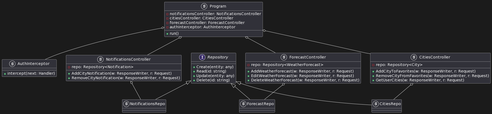

# Лабораторна робота №4

## Тема

ПОБУДОВА ДІАГРАМИ КЛАСІВ ТА ДІАГРАМИ ПАКЕТІВ

## Мета

Ознайомлення з методологією та інструментальними засобами моделювання класів моделі системи на основі мови UML.

## Виконання

### Навіщо потрібна діаграма класів

Діаграма класів є ключовим елементом в об'єктно-орієнтованому моделюванні та одним з основних видів діаграм UML (Unified Modeling Language). Ось основні причини, чому створення діаграми класів є важливим:

1. Структурна організація: Діаграма класів дає змогу візуалізувати структуру системи, показуючи класи, їх атрибути, методи та відносини між класами, такі як асоціації, агрегації, композиції та наслідування.
2. Документація: Це стає частиною документації проекту, що полегшує розуміння архітектури та дизайну системи, особливо для нових розробників, що приєднуються до проекту.
3. Планування: Допомагає в плануванні розвитку системи та в ідентифікації можливих проблем з дизайном на ранніх етапах розробки.
4. Комунікація: Служить зручним інструментом комунікації між членами команди та зацікавленими сторонами, такими як аналітики, дизайнери, розробники та менеджери проекту.
5. Масштабування: Підтримує масштабування системи шляхом забезпечення чіткого розуміння відносин і залежностей.
6. Повторне використання: Сприяє повторному використанню коду та знижує ризики введення помилок при зміні чи розширенні системи.

### Складнощі з Single Page Application

Single Page Application - основна частина цього проекту, розміри нашого сайту в рази більші ніж сервера, але без нього все що залишається, простий REST сервер, який не зручний для користування. Але створити діаграму класів на щось настільки комплексне як Single Page Application неймовірно складно, оскільки це веб сайт в першу чергу а не об'єктно орієнтований сервіс. Ми проектували з використанням фреймворка Angular, та патерном Redux.

Redux є популярним патерном управління станом, який найчастіше використовується в додатках, побудованих за допомогою бібліотеки React, хоча він не обмежений лише React і може бути застосований в інших JavaScript-фреймворках або бібліотеках.

### Основні концепції Redux

Односторонній потік даних: Redux використовує строгий односторонній потік даних, що робить логіку додатку передбачуваною і легкою для розуміння.

1. Store (Сховище): Єдине місце, де зберігається весь стан додатку. Це забезпечує централізоване управління станом.

2. Actions (Дії): Єдиний спосіб змінити стан у store. Дії — це прості об'єкти JavaScript, що вказують тип дії та необхідні дані.

3. Reducers (Ред'юсери): Чисті функції, які приймають попередній стан та дію, і повертають новий стан. Вони визначають, як стан змінюється відповідно до кожної дії.

4. Effects: Це точка розширення між диспатчингом дій та моментом, коли дія доходить до ред'юсера. Може використовуватися для логування, затримок, роботи з асинхронними запитами тощо.

### Використання Redux для SPA

Патерн Redux особливо корисний для SPA, тому що він дозволяє керувати складним станом у великих додатках, де багато компонентів потребують доступу до загального стану або повинні викликати зміни в стані. Ред'юсери забезпечують ясне розділення відповідальності за управління різними частинами стану, а middleware дозволяють ефективно обробляти побічні ефекти, такі як асинхронні запити до API.

У SPA, побудованому з використанням Angular, можуть використовуватися аналогічні патерни Redux через бібліотеки, такі як NgRx, які пропонують Redux-подібну архітектуру з його основними принципами управління станом.

Завдяки Redux, SPA стає більш організованим, здатним керувати складними діями та станами, і надає більш простий і ефективний спосіб відстежувати зміни стану через весь життєвий цикл додатку.

### Діаграма класів серверу

На діаграмі класів, яка відображена на зображенні, представлено компоненти серверної частини веб-додатку, що взаємодіють для обробки запитів користувачів.

1. Program: Основний клас, який агрегує контролери та інтерцептор. Це стартовий пункт програми, який ініціалізує контролери та запускає сервер, всі необхідні частини туди інджектуються.

2. AuthInterceptor: Компонент, який відповідає за перехоплення запитів. Його метод `intercept` перевіряє аутентифікацію користувача перед передачею обробки наступним компонентам (`Handler`).

3. NotificationsController, ForecastController, CitiesController: Контролери, які обробляють різні аспекти бізнес-логіки:
   - NotificationsController: Керує сповіщеннями, може додавати або видаляти сповіщення для міст.
   - ForecastController: Відповідає за роботу з прогнозами погоди, включно з їх додаванням, редагуванням та видаленням та переглядом.
   - CitiesController: Керує інформацією про міста, зокрема додаванням міст до обраних, видаленням з обраних та отриманням списку міст користувачем.

4. Repository: Інтерфейс, який описує методи для роботи з базою даних. Це загальний інтерфейс, з яким інтегруються репозиторії для конкретних сутностей.

5. NotificationsRepo, ForecastRepo, CitiesRepo: Конкретні репозиторії, які реалізують інтерфейс `Repository` для сутностей `Notification`, `WeatherForecast` та `City` відповідно. Вони містять методи для створення, читання, оновлення та видалення даних в базі.

Відносити між елементами діаграми вказують, що кожен репозиторій знаходиться у відповідного контроллера, та всі вони реалізують загальний інтерфейс. Також всі контролери та інтерсептор - це частина загальної структури програми, вони інджектуються в неї.

Ця діаграма важлива для розуміння високорівневої структури сервера, взаємодії між його компонентами, та потоків обробки даних і запитів. Вона також може бути використана як основа для розробки та рефакторингу серверної частини додатку.

### Діаграма класів Веб додатку

За допомогою діаграми класів для веб-додатку ми можемо візуалізувати архітектуру фронтенду, організовану за допомогою патерну Redux та структуровану згідно з рекомендаціями Angular щодо розділення компонентів на презентаційні (Pres) та контейнерні (Cont).

#### Презентаційні Компоненти (Pres)

Ці компоненти відповідають за відображення даних та інтерфейсу користувача. Вони не управляють станом напряму, а викликають події, які повинні обробляти контейнерні компоненти. Наприклад:

- CitiesPresComponent: Може генерувати події для додавання міста до улюблених.
- ForecastPresComponent: Показує прогнози погоди та генерує події для навігації.
- NotificationsPresComponent: Відображає сповіщення та ініціює події для їх управління.

#### Контейнерні Компоненти (Cont)

Ці компоненти управляють станом і логікою, часто через взаємодію з Redux. Вони підписуються на зміни в стані в AppStore і диспатчать дії на основі подій отриманих від презентаційних компонентів:

- CitiesContComponent: Управляє станом міст.
- ForecastContComponent: Управляє станом прогнозів погоди.
- NotificationsContComponent: Контролює сповіщення.

#### Сервіси

Сервіси — це класи, які забезпечують бізнес-логіку та взаємодію з бекендом:

- CityService, ForecastService, NotificationsService: Взаємодіють з бекендом для отримання та відправлення даних.

#### Гарди

Гарди застосовуються для певних маршрутів або функціональностей і перевіряють, чи може користувач або система отримати доступ до ресурсу або виконати певну дію:

- CitiesGuard, ForecastGuard, AuthenticationGuard: Відповідають за завантаження необхідних даних перед переходом на компонент або виконанням дії.

#### AppStore

AppStore — це централізоване сховище стану для всього додатку, яке використовує Redux патерн. Він зберігає весь стан додатку і є ін'єктованим у більшість компонентів, дозволяючи їм реагувати на зміни стану або ініціювати зміни. Також в ньому знаходяться ред'юсери та ефекти, за допомогою яких він змінює стан та викликає сервіси.

#### Ефекти (Effects)

Ефекти використовуються в Redux для реагування на дії, що диспатчаться у сторі, і виконують побічні ефекти, такі як асинхронні запити до сервера:

- RouterEffects, CitiesEffects, ForecastEffects, NotificationsEffects: Підключаються до потоків дій і можуть запускати відповідні сервіси для здійснення запитів або обробки даних.

#### Відсутність Ред'юсерів та Екшнів

На діаграмі не зображені ред'юсери та екшни, оскільки вони не представляють класи в традиційному сенсі. В Redux, ред'юсери — це функції, а екшни — це об'єкти, які не містять методів чи властивостей, тому на діаграмі класів їх зазвичай не показують. Замість цього вони реалізовані як константи і функції-перетворювачі, що взаємодіють зі стором.

Ця діаграма дає змогу розуміти логіку взаємодії між компонентами SPA, їх структуру та поведінку у відповідності до архітектурних патернів використовуваних у додатку.

## Висновок

На цій лабораторній роботі ми виконали значний шмат роботи, що включав в себе планування та аналіз архітектури нашого веб-застосунку. Ми визначили ключові компоненти системи, такі як контролери, сервіси, репозиторії та ефекти, і встановили, як вони будуть взаємодіяти між собою у відповідності до бізнес-логіки та користувацьких сценаріїв.

Розглянувши патерн Redux, ми змогли глибше зрозуміти, як цей патерн застосовується для управління станом у великомасштабних SPA, підвищуючи ефективність та простоту управління станом додатку. Redux сприяє чистоті коду та внесенню легкості в трасування та відстеження змін стану, що важливо для забезпечення передбачуваної поведінки додатку і полегшує дебагінг та тестування.

Діаграма класів, створена нами, виступає як потужний інструмент для візуалізації та документування архітектури системи, що стане в нагоді при подальшому проектуванні, реалізації та масштабуванні застосунку. Ця робота є важливою не лише для актуального стану проекту, але й для забезпечення його гнучкості та адаптивності в майбутньому. Отже, під час виконання цієї лабораторної роботи ми не просто створили теоретичну основу, але й заклали фундамент для розвитку надійного і масштабованого веб-застосунку.
