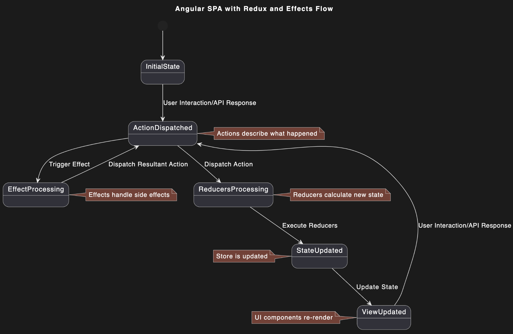

# Лабораторна робота №5

## Тема

ПОБУДОВА ДІАГРАМИ СТАНІВ

## Мета

Ознайомлення з методологією та інструментальними засобами моделювання станів системи на основі мови UML.

## Виконання

### Діаграми станів: загальний огляд

Діаграми станів, відомі також як діаграми машин станів, є одним із видів діаграм, що використовуються в мові моделювання UML (Unified Modeling Language). Ці діаграми призначені для візуалізації поведінки систем, компонентів або бізнес-процесів, зокрема їхніх реакцій на різноманітні події або умови в часі. Діаграма станів дозволяє представити всі можливі стани, у яких може перебувати об'єкт, а також переходи між цими станами, викликані специфічними подіями.

#### Ключові елементи діаграми станів

- Стани: Відображають різні умови або ситуації, у яких може перебувати система або об'єкт. Кожен стан може мати дії, що виконуються при входженні в стан, перебуванні в ньому, або виході з нього.
- Переходи: З'єднання між станами, що представляють реакцію системи на внутрішні або зовнішні події. Перехід відбувається, коли виконуються певні умови або коли відбувається конкретна подія.
- Початковий та кінцевий стани: Особливі стани, що вказують на початок або завершення процесу в діаграмі. Початковий стан зазвичай відзначається як чорна точка, а кінцевий - коло з чорною точкою всередині.

#### Призначення діаграми станів

1. Документація: Діаграми станів допомагають документувати поведінку системи, забезпечуючи чітке зображення того, як система або її компоненти повинні реагувати на різні події або зміни стану.
2. Проектування: Використовуються при проектуванні нових систем або при додаванні нових функціональностей до існуючих систем, забезпечуючи чітке розуміння потребованих станів і переходів.
3. Аналіз: Допомагають аналізувати поведінку системи для виявлення можливих проблем або необхідності в оптимізації.

### Безстанова архітектура нашого проекту

Наш проект розроблений як безстановий (stateless) веб-сервіс, що є стандартним підходом для сучасних веб-додатків, зокрема для систем, які базуються на архітектурі REST. Основні переваги безстанової архітектури включають:

- Масштабованість: Безстанові системи легше масштабувати, оскільки кожен запит обробляється незалежно, що спрощує додавання додаткових серверів та розподіл навантаження.
- Спрощене керування станом: Оскільки стан не зберігається на сервері між запитами, не виникає складнощів з синхронізацією стану між різними запитами та серверами.
- Незалежність запитів: Кожен запит може бути виконаний будь-яким сервером, що підвищує надійність та доступність системи.

Ці особливості роблять безстанові системи ідеальними для середовищ, де важливі висока доступність та ефективне керування ресурсами.

### Діаграми станів для загального розуміння системи

На відміну від традиційних діаграм станів, які фокусуються на поведінці окремих класів, ми створили діаграми, що відображають стани системи в цілому або стани, що відносяться до обробки запитів та взаємодії з Redux в контексті односторінкових застосунків. Ці діаграми допомагають візуалізувати наступне:

- Перехідні стани запитів: Як система обробляє запити від початкового прийому до завершення, з урахуванням аутентифікації, звернення до баз даних та відправлення відповідей.
- Робота з Redux: Як стан застосунка управляється через диспетчеризацію дій, обробку редюсерами та оновлення інтерфейсу користувача, включаючи асинхронні ефекти для обробки складних сценаріїв взаємодії.

Ці діаграми сприяють кращому розумінню системи та підвищують ефективність проектування, тестування та впровадження змін у системі.

### Діаграма станів Redux

Цю діаграму можна переглянути за посиланням: <https://github.com/kiIIer/kpi-6/tree/main/tssa/lab/lab-05-05.05.2024/redux.puml>

На Рисунку 1 представлена діаграма станів, яка візуалізує потік обробки в односторінковому додатку Angular, що використовує Redux для управління станом і Redux Effects для обробки побічних ефектів. Давайте розглянемо кожен компонент діаграми:

#### Початковий стан

- InitialState: Початковий стан застосунку, де ще не відбулися ніякі дії.

#### Дії

- ActionDispatched: Стан, в якому дія була відправлена. Дії можуть бути ініційовані користувачем через UI взаємодії або як відповідь на API запити. Вони описують, що сталося або які дії потрібно виконати.

#### Обробка дій

- EffectProcessing: У цьому стані Effects перехоплюють певні дії для виконання асинхронних операцій або складних синхронних обчислень, що не впливають безпосередньо на стан. Наприклад, здійснення API запиту на отримання даних.
- Dispatch Resultant Action: Як результат обробки Effects, можуть бути відправлені нові дії, які знову попадають у стан ActionDispatched.

#### Редуктори

- ReducersProcessing: Редуктори обробляють дії та обчислюють новий стан додатку на основі існуючого стану і даних з дії.
- StateUpdated: Новий стан, обчислений редукторами, оновлює глобальний стан (store).

#### Оновлення UI

- ViewUpdated: Як тільки стан оновлено, UI компоненти реагують на зміни і відтворюють візуальне представлення на основі нового стану. Цикл може повторюватися з будь-якої точки (наприклад, нові дії можуть бути відправлені користувачем).

Ця діаграма демонструє циклічний і передбачуваний потік управління станом в Redux, який дозволяє легко відстежувати, тестувати та відновлювати стан програми. Такий підхід сприяє створенню стабільних і надійних застосунків.

## Висновок

На цій лабораторній роботі я ознайомився з методологією та інструментальними засобами моделювання станів системи на основі мови UML.
