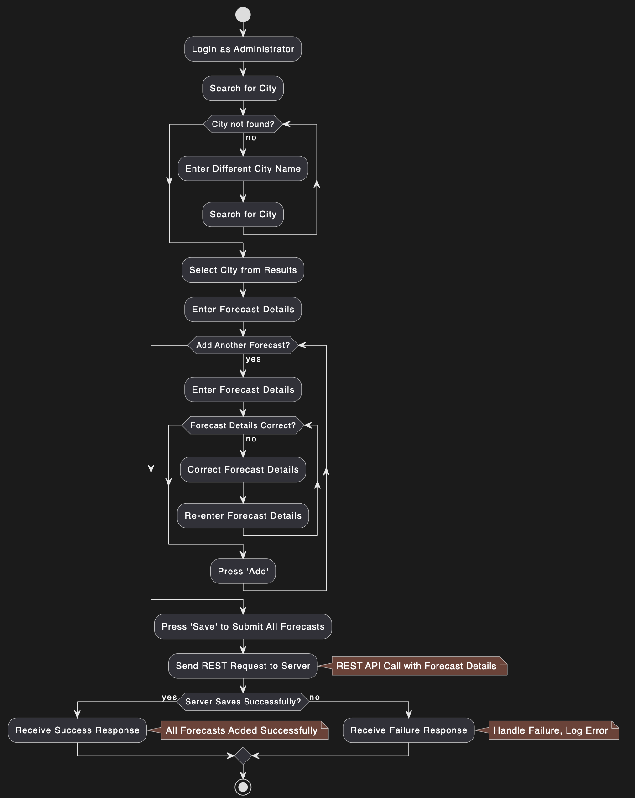

# Лабораторна робота № 6

## Тема

ПОБУДОВА ДІАГРАМИ АКТИВНОСТІ

## Мета

Ознайомлення з методологією та інструментальними засобами моделювання активності системи на основі мови UML.

## Виконання

### Діаграма активності

Діаграма активності є одним із видів діаграм в мові моделювання UML (Unified Modeling Language) і використовується для візуалізації послідовності дій та потоків управління в процесах системи. Ці діаграми ефективно демонструють потік робочих процесів або операцій, що відбуваються в системі.

#### Застосування діаграм активності

1. Моделювання бізнес-процесів: Діаграми активності часто використовуються для зображення бізнес-процесів та робочих процедур, де важливо відобразити послідовність операцій та взаємодію між різними учасниками процесу.

2. Документація та аналіз: Вони допомагають аналізувати та виявляти неефективності в потоках даних або виконанні завдань, що сприяє оптимізації процесів.

3. Розробка програмного забезпечення: У контексті розробки ПЗ, діаграми активності можуть слугувати для специфікації та дизайну поведінки системи, зокрема для визначення алгоритмів або реалізації складних бізнес-правил.

4. Взаємодія між системами: Ці діаграми можуть бути використані для відображення взаємодії між різними системами або компонентами системи, забезпечуючи чітке розуміння потоків та залежностей.

#### Основні елементи діаграми активності

- Початкові та кінцеві точки: Вказують на початок та завершення потоку активності.
- Діяльності: Відображають дії або операції в процесі.
- Рішення/Розгалуження: Діамантоподібні символи, які показують точки ухвалення рішень із двома або більше шляхами потоку.
- Синхронізація та паралельне виконання: Широкі чорні лінії (синхронізатори), які вказують на злиття або розділення потоків в рамках процесу.
- Плавальні доріжки (Swimlanes): Розділяють дії в процесі на різні ролі або відділи, показуючи, хто відповідає за певні дії.

Ці елементи допомагають чітко визначити структуру і послідовність процесів, сприяючи кращому розумінню та ефективному управлінню системними потоками.

### Опис діаграми

Посилання на код для діаграми: <https://github.com/kiIIer/kpi-6/tree/main/tssa/lab/lab-06-06.05.2024/add-forecast.puml>

Рисунок 1 являє собою діаграму активності, що моделює процес додавання прогнозу погоди адміністратором у систему. Ця діаграма відображає кроки, які виконує користувач для успішного додавання інформації про погоду, і включає перевірку вхідних даних та обробку можливих помилок.

### Етапи процесу включають

1. Вхід в систему як адміністратор: Це початковий крок, де користувач авторизується в системі як адміністратор.

2. Пошук міста:
   - Місто не знайдено: Якщо місто не знайдено, адміністратор вводить назву іншого міста і знову робить пошук.
   - Обрати місто з результатів: Якщо місто знайдено, адміністратор обирає місто з результатів пошуку.

3. Введення деталей прогнозу:
   - Додати ще один прогноз?: Після введення деталей прогнозу, є можливість додати ще один прогноз.
   - Перевірка коректності даних прогнозу: Якщо введені дані некоректні, адміністратор коригує деталі і повторно вводить інформацію.

4. Надсилання запиту на сервер:
   - Успішне збереження на сервері: Якщо сервер успішно обробляє і зберігає деталі прогнозу, адміністратор отримує підтвердження успіху.
   - Помилка збереження: У разі помилки, відображається повідомлення про помилку і адміністратор може логувати помилку або повторно обробляти деталі прогнозу.

### Особливості діаграми

- Циклічність: Діаграма включає можливість циклічного повернення до введення деталей прогнозу, що дозволяє багаторазово коригувати та додавати прогнози до остаточного збереження.
- Обробка помилок: Ефективне управління помилками з можливістю корекції даних забезпечує надійність процесу додавання прогнозів.

Ця діаграма активності є корисним інструментом для візуалізації та аналізу потоку робочих процесів у системі, забезпечуючи чітке розуміння кроків, необхідних для ефективного додавання прогнозу погоди.

## Висновок

На цій лабораторній роботі я ознайомився з методологією та інструментальними засобами моделювання активності системи на основі мови UML.
