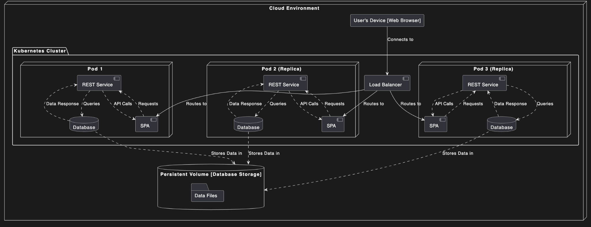

# Лабораторна робота №7

## Тема

ПОБУДОВА ДІАГРАМИ КОМПОНЕНТІВ ТА ДІАГРАМИ РОЗМІЩЕННЯ

## Мета

Ознайомлення з методологією та інструментальними засобами моделювання розміщення компонентів системи на основі мови UML.

## Виконання

### Діаграма компонентів

Діаграма компонентів у UML (Unified Modeling Language) є структурною діаграмою, яка використовується для моделювання фізичної структури системи. Ця діаграма відображає організацію та залежності між різними компонентами, які складають систему. Компоненти на такій діаграмі можуть представляти класи, пакети, бібліотеки або навіть окремі модулі чи програми, що містять в собі код чи дані.

Діаграма компонентів має кілька основних цілей та вигод:

1. Визначення структури: Допомагає архітекторам та розробникам уточнити структуру програмного забезпечення, показуючи, як різні компоненти системи взаємодіють між собою.
2. Модуляризація: Сприяє розумінню модулярності програмного забезпечення, дозволяючи ефективно управляти змінами та спрощувати процес розробки.
3. Повторне використання компонентів: Через визначення чітких інтерфейсів між компонентами, діаграма сприяє повторному використанню коду, зменшуючи затрати та час на розробку.
4. Аналіз та оптимізація: Надає засоби для аналізу залежностей і потенційних проблем в архітектурі, таких як тісне зв'язування, що може негативно вплинути на масштабування та обслуговування системи.
5. Документація: Служить ефективним інструментом для документування архітектури системи, що є корисним при передачі знань новим членам команди або стейкхолдерам.

Застосування діаграми компонентів дозволяє більш ефективно планувати і реалізовувати високорівневі зміни в архітектурі програмного забезпечення, а також служить основою для детальнішого проектування та імплементації.

### Діаграма розгортання

Діаграма розгортання в мові моделювання UML (Unified Modeling Language) відіграє ключову роль у візуалізації архітектури системи, особливо стосовно фізичного розміщення компонентів. Ця діаграма є важливою для зображення того, як елементи або артефакти програмного забезпечення розміщені на апаратних ресурсах. Вона показує конфігурацію обладнання (вузлів), які використовуються в системі, та програмні компоненти, що на них працюють.

Основні аспекти діаграми розгортання:

1. Вузли (Nodes): Фізичні елементи в мережі, такі як сервери, комп'ютери, та інші пристрої, на яких виконуються компоненти програмного забезпечення.

2. Артефакти (Artifacts): Виконувані файли, бібліотеки, або інші фізичні ресурси, які розміщуються на вузлах. Ці можуть включати програмне забезпечення та конфігураційні файли.

3. Комунікації (Communication): Зв'язки між вузлами, що визначають, як вузли взаємодіють один з одним, наприклад, через мережеві з'єднання.

Цілі використання діаграми розгортання:

- Оптимізація ресурсів: Дозволяє аналізувати, чи ефективно використовуються апаратні ресурси.
- Виявлення залежностей: Показує залежності між різними частинами системи, що допомагає у плануванні та впровадженні.
- Підтримка управління конфігурацією: Важлива для планування змін у системі, оскільки допомагає візуалізувати вплив змін на розміщення компонентів.
- Документування: Забезпечує чітке розуміння структури системи, що сприяє кращому зрозумінню та обслуговуванню.

Діаграма розгортання використовується в різних етапах розробки, від проектування інфраструктури до підтримки та розширення існуючих систем. Її можна використовувати для представлення не тільки традиційних десктопних застосунків, але й розподілених систем, таких як веб-додатки та хмарні сервіси.

### Моя діаграма компонентів

<https://github.com/kiIIer/kpi-6/tree/main/tssa/lab/lab-07-06.05.2024/redux.puml>

#### ReduxComponent

- Огляд: Діє як кореневий компонент для архітектури Redux у додатку.
- Підкомпоненти:
  - ActionsComponent: Відповідає за відправлення дій. Дії — це носії інформації, які передають дані з додатка до магазину Redux.
  - SelectorComponent: Використовується для вибору частин стану з магазину. Селектори — це функції, які приймають стан Redux як аргумент і повертають дані, які походять з цього стану.
  - EffectComponent: Ймовірно, обробляє побічні ефекти в архітектурі Redux, подібно до проміжного програмного забезпечення або thunks у Redux. Вони використовуються для управління асинхронними діями або побічними ефектами.
  - ReducerComponent: Визначає, як оновлюється стан. Редюсери — це чисті функції, які приймають попередній стан і дію, а потім повертають новий стан.

#### AppStoreComponent

- Огляд: Центральний елемент для управління станом у додатку Redux. Він зберігає весь стан додатка в одному місці.
- Зв’язки:
  - Пов’язаний з кожним з підкомпонентів у `ReduxComponent` для обробки дій, селекцій, ефектів та оновлень стану.

#### Основні компоненти системи

- AuthenticationComponent: Керує аутентифікацією користувачів.
  - AuthenticationService: Служба, яка обробляє логіку аутентифікації, можливо, звертається до сервера або бази даних для перевірки облікових даних користувача.
- NotificationsComponent: Відповідає за відправлення сповіщень користувачам.
  - NotificationsService: Служба, яка реалізує логіку відправлення сповіщень.
- ForecastComponent: Компонент, який займається погодними прогнозами.
  - ForecastService: Служба для отримання погодних даних, можливо, взаємодіє з зовнішніми API для отримання інформації про погоду.
- CitiesComponent: Управління даними про міста, можливо для налаштувань користувача або вибору міст для погодних прогнозів.
  - CitiesService: Служба, яка обробляє дані про міста.

Ця діаграма демонструє структурований підхід до управління станом і логікою у складних веб-додатках, використовуючи архітектуру Redux для забезпечення однонаправленого потоку даних.

### Діаграма розгортання бригади

<https://github.com/kiIIer/kpi-6/tree/main/tssa/lab/lab-07-06.05.2024/deployment.puml>

На наданій діаграмі розгортання показано архітектуру розподіленої системи в середовищі Kubernetes, яка включає веб-сервер (REST Service), клієнтський додаток (SPA), базу даних, інтегровані через балансувальник навантаження у хмарному середовищі.

#### Компоненти діаграми

1. Cloud Environment (Хмарне середовище): Загальне середовище, в якому розгортаються усі інші компоненти.

2. Kubernetes Cluster (Кластер Kubernetes): У цьому кластері управляються та оркеструються усі поди (контейнери) додатку.

3. Pods (Поди):
   - Pod 1: Включає компоненти REST Service, SPA та базу даних.
   - Pod 2 (Replica): Репліка Pod 1, містить такі самі компоненти.
   - Pod 3 (Replica): Ще одна репліка Pod 1, також містить компоненти REST Service, SPA та базу даних.

4. Load Balancer (Балансувальник навантаження): Забезпечує розподіл навантаження між подами, керуючи запитами від користувача до SPA у відповідних подах.

5. Persistent Volume (Постійний об'єм): Використовується для збереження даних бази даних, доступний з усіх подів. Це гарантує, що дані залишаються збереженими навіть після перезапуску або видалення подів.

#### Зв’язки та взаємодія

- Користувацький пристрій (User's Device [Web Browser]): Здійснює з'єднання з системою через веб-браузер, спочатку звертаючись до балансувальника навантаження.
- Балансувальник навантаження: Розподіляє запити від користувача між трьома подами для забезпечення високої доступності та ефективного балансування навантаження.
- Поди (1, 2, 3): Кожен под виконує однакові компоненти аплікації. REST Service обробляє запити API, SPA забезпечує клієнтський інтерфейс, і база даних управляє збереженням та витягуванням даних.
- База даних: Всі поди взаємодіють з однією базою даних, дані якої зберігаються на постійному об'ємі.

Ця архітектура демонструє типову модель розгортання для високодоступних додатків в хм

арному середовищі, де керування трафіком і збереження даних ефективно організовані для оптимальної працездатності та надійності.
