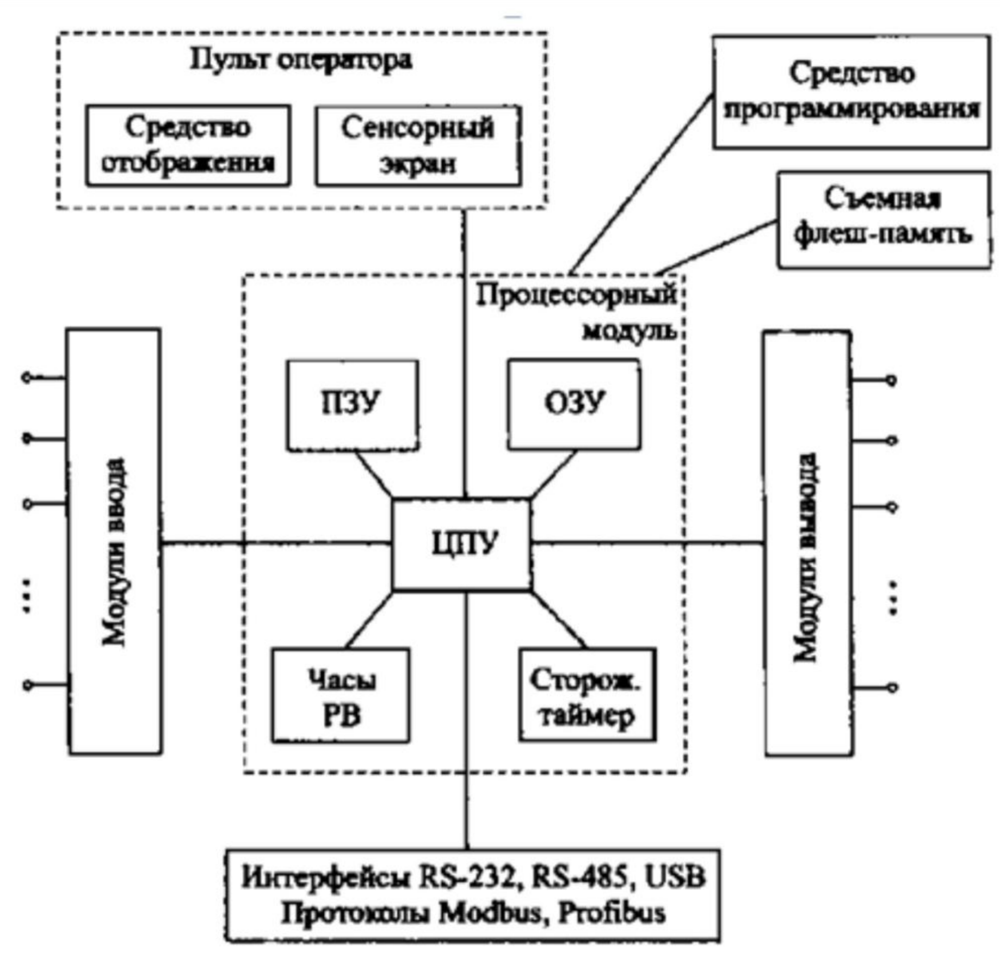
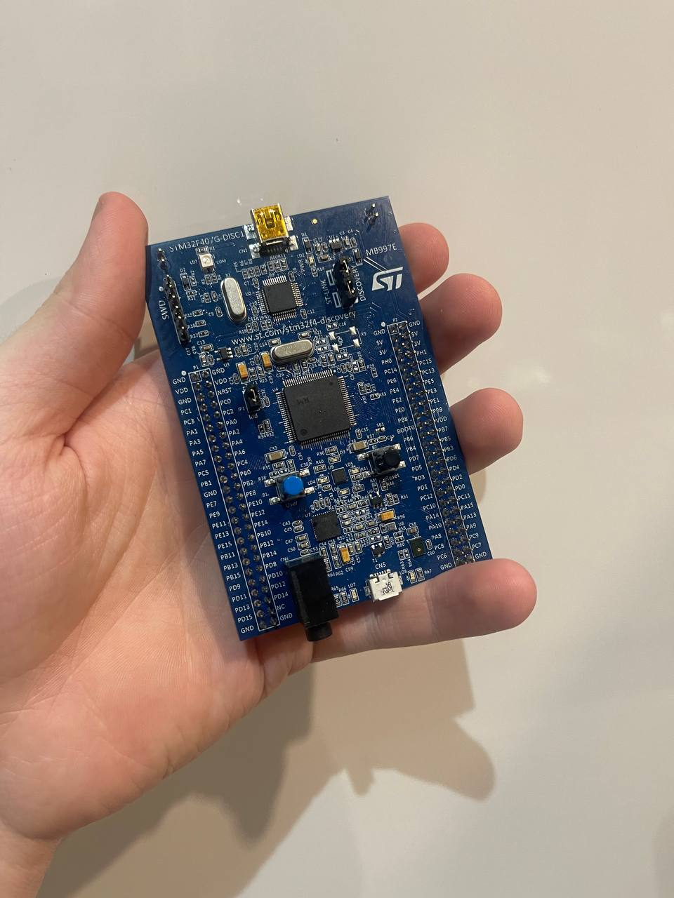
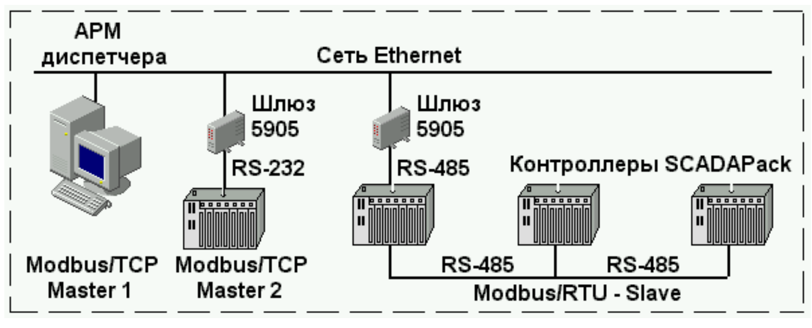

# Модульна контрольна робота

## Виконав

Молчанов Михайло Валерійович, ІА-12

## Завдання

Завдання 18

1. Коротко охарактеризуйте різновиди та особливості програмних засобів ІКС
2. Наведіть та опишіть структуру промислових контролерів та її елементів.
3. Охарактеризуйте інтерфейс RS-485.

## Виконання

### Запитання 1

Програмні засоби інформаційно-керуючих систем (ІКС) включають широкий спектр технологій, які використовуються для різноманітних цілей в автоматизації та управлінні процесами. Вони охоплюють всі від автоматизації технологічних процесів до дистанційного керування та забезпечення безпеки.

Системи управління як АСУ ТП дозволяють контролювати виробничі процеси, виконувати вимірювання та аналізувати дані в реальному часі. Це ключово для забезпечення стабільності і ефективності виробництва. За допомогою цих систем диспетчери можуть взаємодіяти з обладнанням, отримуючи актуальну інформацію про стан машин та процесів.

Крім того, ІКС включають інструменти для забезпечення безпеки, що є критично важливим для захисту інформації та обладнання від несанкціонованого доступу. Системи, які забезпечують сигналізацію та дистанційне керування, дозволяють операторам швидко реагувати на потенційні проблеми та управляти процесами навіть здалеку.

Серед спеціалізованих інструментів для розробки та інтеграції ІКС виступають OPC сервери, які сприяють збору та передачі даних між різними частинами системи. Програми для МЕК-програмування контролерів та пакети SCADA дозволяють створювати детально налаштовані рішення для специфічних потреб заводів та виробництв.

Використання програмувальних інструментів, таких як LabVIEW, MATLAB, та HP-VEE, також є популярним у сфері автоматизації для проведення експериментів, вимірювань та обробки результатів. Ці програми забезпечують велику гнучкість і можливість адаптації до конкретних завдань, значно знижуючи складність і витрати на розробку.

### Запитання 2

Промислові контролери, відомі також як програмовані логічні контролери (ПЛК), є ключовими компонентами в системах автоматизації промисловості. Вони забезпечують надійне управління і моніторинг різних технологічних процесів, таких як виробництво, упаковка, автоматизація будівель та інше.

Структура промислових контролерів:

Промислові контролери складаються з декількох основних елементів, які включають:

1. Процесорний модуль (ЦПУ): Серце ПЛК, що виконує програму користувача, обробляє вхідні дані та видає команди на вихідні пристрої. Воно обробляє логічні, послідовні, таймерні та арифметичні операції, які керують роботою промислового обладнання.

2. Модулі введення/виведення (I/O): Забезпечують інтерфейс між ПЛК і виробничим обладнанням. Вхідні модулі приймають сигнали від датчиків, перемикачів та інших вхідних пристроїв, а вихідні модулі передають команди до виконавчих механізмів, таких як реле, мотори та інші актуатори.

3. Блок живлення: Забезпечує необхідну електричну енергію для функціонування ПЛК та його компонентів, зазвичай перетворюючи змінний струм з мережі в постійний струм, потрібний для внутрішніх схем.

4. Програмне забезпечення: Включає інструменти розробки та діагностики, що використовуються для написання, тестування та відладки програм, які контролюють ПЛК.

5. Комунікаційні модулі: Дозволяють ПЛК взаємодіяти з іншими ПЛК, комп'ютерними системами або мережами, забезпечуючи обмін даними через різні промислові мережі, такі як Ethernet, Modbus, Profibus та інші.

6. Інтерфейс користувача: Може включати дисплеї, кнопки, світлові індикатори та інші елементи для моніторингу та управління станом контролера.

Ці компоненти спільно працюють для забезпечення точного та надійного управління виробничими процесами, знижуючи витрати та підвищуючи ефективність виробництва.

Як бачите на рисунку 1, структура промислового контролера дуже добре ілюструє те, що я описав раніше. На схемі показано основні компоненти, їх взаємозв'язки та інтерфейси, які використовуються в програмованих логічних контролерах (ПЛК).

Центральним елементом системи є процесорний модуль, який координує всі процеси управління і зв'язок між різними частинами контролера. Він з'єднаний з оперативною пам'яттю (ОЗУ) для тимчасового зберігання даних та з постійною пам'яттю, де зберігаються програми користувача та системне програмне забезпечення.

На схемі також зазначено модулі введення та виведення, які забезпечують прийом сигналів від датчиків та інших вхідних пристроїв, а також передачу команд до виконавчих механізмів, таких як клапани, двигуни, реле тощо.

Для взаємодії з оператором передбачено інтерфейс користувача, який включає сенсорний екран та інші засоби відображення інформації, що дозволяють операторам моніторити стан системи та вносити зміни до процесу управління.

Крім того, в системі є інтерфейси для зв'язку, такі як RS-232, RS-485, та USB, а також підтримка протоколів Modbus і Profibus, які забезпечують зв'язок з іншими системами та пристроями, забезпечуючи можливість інтеграції ПЛК в більш широкі автоматизовані системи.

Така структура і взаємозв'язок між компонентами не тільки підкреслює гнучкість та масштабованість промислових контролерів, але й підтверджує їхню критичну роль у сучасних системах автоматизації.

Як видно на рисунку 2, зображено мій контролер, на якому можна ідентифікувати ключові компоненти, типові для програмованих логічних контролерів. У центрі контролера розташований **процесорний модуль**, який є мозком усієї системи, відповідальним за обробку вхідних і вихідних сигналів та виконання завантаженої програми управління.

На контролері також видно **інтерфейси для зв'язку**, включаючи порти, як RS-232 та RS-485, що дозволяють контролеру спілкуватися з іншими промисловими пристроями та комп'ютерними системами. Ці інтерфейси забезпечують взаємодію з вищими рівнями управління та інтеграцію в ширші автоматизовані системи.

**Програматор** на контролері, зазвичай використовуваний для завантаження та зміни програм, є важливим інструментом для налаштування та діагностики системи. Це дозволяє технічним фахівцям адаптувати роботу контролера до специфічних вимог процесу без потреби в постійному фізичному доступі до самого обладнання.

Окрім цього, згадано, що **постійна пам'ять** зберігається на SD-карті, яка знаходиться під платою. Це забезпечує зручне зберігання програмного забезпечення та конфігураційних файлів, які можна легко оновлювати або змінювати, вставляючи нову SD-карту з необхідними налаштуваннями.

### Запитання 3

Інтерфейс RS-485, також відомий як TIA/EIA-485, є стандартом для мережевого зв'язку, що дозволяє здійснювати надійну передачу даних на великі відстані та в умовах, де присутні значні електричні завади. Це важливо, особливо в промислових середовищах.

Основні характеристики RS-485 включають:

1. Диференціальне передавання сигналів: RS-485 використовує два проводи для кожного сигналу, що дозволяє компенсувати зовнішні електричні завади, значно покращуючи надійність передачі даних порівняно з небалансованими системами, такими як RS-232.

2. Мультипойнтова мережа: Інтерфейс дозволяє підключати до 32 пристроїв (стандартно), а за допомогою вдосконалених драйверів кількість може бути збільшена до 128 пристроїв на одну шину, що робить його дуже гнучким для створення розгалужених мережевих систем.

3. Велика відстань передачі: RS-485 може передавати дані на відстані до 1200 метрів, що є значно більшою дистанцією порівняно з більшістю інших мережевих інтерфейсів.

4. Швидкість передачі: Швидкість передачі може сягати до 10 Мбіт/с на коротших відстанях, знижуючись до 100 кбіт/с на максимальній довжині шини.

Завдяки своїм характеристикам, інтерфейс RS-485 активно використовується у промисловій автоматизації, системах управління будівлями, а також у багатьох інших сферах, де потрібна висока надійність зв'язку та здатність підключення значної кількості пристроїв. Цей інтерфейс часто застосовується разом із протоколом Modbus, який є стандартом у промисловому обміні даними. RS-485 ідеально підходить для використання з Modbus завдяки своїй можливості підтримки диференціальної передачі, що значно зменшує ризики збоїв у системах з багатьма підключеними пристроями та в умовах високих електромагнітних завад. Таке поєднання дозволяє реалізувати ефективні та надійні мережі для дистанційного моніторингу та управління обладнанням на значні відстані.

На рисунку 2 представлено схему мережевої конфігурації, яка демонструє використання інтерфейсу RS-485 в контексті промислової автоматизації. Центральний компонент управління - АРМ диспетчера — координує роботу всієї системи і взаємодіє з кількома важливими вузлами через мережу Ethernet та інтерфейси RS-232 та RS-485.

Особливості використання RS-485

1. Шлюз 5905 з RS-485: Цей шлюз використовується для перетворення сигналів між різними частинами системи, забезпечуючи міст між Ethernet та RS-485 мережами. RS-485 дозволяє забезпечити надійне з'єднання на значні відстані, що є критично важливим для промислових застосувань.

2. Контролери SCADAPack з RS-485: Ці контролери використовують RS-485 для взаємодії як Modbus/RTU slaves. Інтерфейс RS-485 забезпечує ефективну і надійну передачу даних між контролерами, дозволяючи розгортати складні системи управління і моніторингу з великою кількістю вузлів.

RS-485 ідеально підходить для використання в системах, де потрібна висока завадостійкість та можливість підключення множини пристроїв до однієї лінії зв'язку, що робить його відмінним вибором для промислових мережевих рішень на великі відстані та в умовах високого рівня електромагнітних завад.
